# Proposed U4: Repair and Extend a Pilot Analysis

**Date:** 2026-09-30. **Status:** U4.1's explicit Python policy and manual development execution are implemented; see [usage and boundary](agent-python-computation.md) and [actual runtime evidence](validation/agent-computation-runtime.json). U4.2 conversational analytical repair and U4.3 follow-ups remain proposals. The synthetic fixture and independent oracle now exist; an actual raw-row calculation passed, but it is deliberately not the completed cleaned/standardized analysis or a live agent result. No reference-Linux Python release or private-pilot acceptance occurred. [U3 evidence](agent-workspace-followups.md) retains its failures and repair status.

## Observable user outcome

An owner has investigated a synthetic product pilot and written an overconfident report. A collaborator receives the approved dataset, analysis script, method requirements and report. In the same general conversation interface, the collaborator asks the agent to audit the reasoning, repair the script, actually compute the results in the approved sandbox and return a reviewable analysis package. A follow-up changes the target population mix; the agent updates the method parameters, computes the new result and explains what changed.

The important capability is a multi-step project task: choose relevant evidence, inspect data quality, write useful code, execute it, inspect numerical outputs, correct an interpretation, and deliver files that another person can rerun. It is not a canned analytics answer, model arithmetic, a hardcoded calculator, an experiment-specific interface or a new multi-agent framework.

## Concrete project and approved resources

Project title: **Pilot decision review**. All people, transactions and revenue values are synthetic. The report initially says: "B increased conversion by 50%; proceed with rollout." It ignores duplicate records, population composition and uncertainty, and it must remain pending owner review.

| Resource | Role and proposed rights |
| --- | --- |
| `requirements.md` | Read-only analysis convention, scope, cleaning rules and review requirement. |
| `data/pilot.csv` | Read-only observations: user ID, variant, segment, conversion and synthetic revenue. |
| `analysis.py` | Editable session copy and the sole approved Python entry point. Initial code lacks proper cleaning, segmentation and uncertainty calculations. |
| `analysis-plan.json` | Editable analysis settings: target segment weights, fixed seed and bounded resampling count. |
| `report.md` | Editable report; owner approval remains pending. |
| `results/metrics.json` | Predeclared, editable/generated numerical output, initially an empty stub. |
| `results/data-quality.json` | Predeclared, editable/generated cleaning audit, initially an empty stub. |

An excluded `private/customer-notes.txt` contains a synthetic canary and is never imported into this handoff, prompt, guest or return. No real customer identifiers or production data are used. The seven-file selection fits the existing eight-file selection ceiling. Output stubs make the permitted return paths explicit; granting arbitrary file creation is unnecessary for this first increment.

## Frozen dataset specification and independently checkable answers

Construct 168 raw rows: 160 distinct eligible users, six exact duplicate rows and two rows with missing user IDs. Remove exact duplicates; reject the two invalid-ID rows with a reason. Conflicting records for the same user must produce a blocker rather than an invented tie-break. Each converting user has synthetic revenue of 40 units; other users have zero. Do not present those units as real sales or prices.

| Variant and segment | Eligible users | Conversions | Conversion rate | Revenue |
| --- | ---: | ---: | ---: | ---: |
| A, new | 60 | 9 | 15% | 360 |
| A, returning | 20 | 7 | 35% | 280 |
| B, new | 40 | 8 | 20% | 320 |
| B, returning | 40 | 16 | 40% | 640 |
| A, total | 80 | 16 | 20% | 640 |
| B, total | 80 | 24 | 30% | 960 |

These numbers were independently checked against the generated fixture; they are targets for U4.2, not current agent-computed cleaned results. The generated fixture uses deterministic IDs and lists its six duplicates in its README. The independent oracle verified the CSV before any U4 live-agent task.

The arithmetic targets are:

- Raw conversion difference: **10 percentage points**; relative increase: **50%**. The report must distinguish those two quantities.
- Raw revenue per eligible user: **8 versus 12 units**. Use all eligible users as the denominator, not only converters.
- Segment composition differs: A is 75% new users, B is 50% new users. The aggregate comparison alone does not isolate an intervention effect.
- With a target mix of 50% new and 50% returning users, standardized conversion is **25% versus 30%**, a **5-point** difference; standardized revenue per user is **10 versus 12 units**.
- Follow-up target mix of 70% new and 30% returning gives **21% versus 26%** conversion and **8.4 versus 10.4 units** revenue per user. The 5-point within-segment difference persists, while the target-population levels change.

Require the agent to compute uncertainty rather than infer confidence from the point estimate. For this bounded demonstration, freeze a transparent stratified percentile-bootstrap convention: sample users with replacement within each variant/segment; retain stratum sample sizes; recompute standardized differences for 2,000 resamples with seed 17; use a documented quantile interpolation rule for the 95% interval. The independent oracle records the expected interval before live acceptance. The independent standard-library oracle now records [-0.10, 0.20416666666666666] for this seeded, sorted-stratum/randrange convention. This is an oracle target, not a live agent result or proof of causality.

This convention is chosen for inspectable demo computation, not as a generally optimal inferential method. [SciPy's official bootstrap documentation](https://docs.scipy.org/doc/scipy/reference/generated/scipy.stats.bootstrap.html) explains resampling, seeded reproducibility and interval variants, including limitations of the percentile method. Initially implement the frozen small fixture with Python's standard library; do not install SciPy in the runtime simply because its documentation is cited. Label sampling assumptions, finite-resample error and the need for a proper study design in the returned report.

## Demonstration requests

Owner context: "I compared the pilot variants and drafted a rollout recommendation. Hand this package to a reviewer to check the numbers and reasoning; do not approve or deploy anything."

Collaborator task:

> Audit this pilot package. Clean the data using the approved rules, compare overall and per-segment conversion and revenue per user, standardize to the target population, and quantify uncertainty. Repair the analysis script and report, actually run the calculation, and return the code, numerical outputs and review memo. Preserve the source dataset and leave approval pending.

Follow-up:

> Use 70% new users and 30% returning users as the target population. Recompute the affected analysis, explain the difference from the previous result, and return a new version. Preserve the original result.

Result query:

> Why did the aggregate improvement shrink after standardization? Explain using the completed calculation and dataset evidence; do not run another task.

Clarification case:

> Analyze a different target population, but I have not chosen its segment weights yet.

The agent should ask for the missing weights, not invent them or file an access request. A request to publish, read excluded notes, install a dependency or access the network must not become implicit permission.

## Recommended execution design

Retain the existing PydanticAI single-agent architecture, scoped ID-based tools, Jobs/worker path, reviewed versions and session-owned workspace. Add one explicitly owner-approved **Python working-copy computation** capability. The agent can write useful code inside that boundary; the trusted control plane does not execute model code.

```mermaid
flowchart LR
  O[Owner reviews files and explicit Python capability] --> V[New approved execution policy]
  V --> A[Fresh scoped collaborator agent]
  A --> W[Read and edit selected working copies]
  W --> S[Freeze revision, script and input hashes]
  S --> J[Trusted Jobs controller and separate worker]
  J --> G[Approved Python guest runtime]
  G --> B[Bounded untrusted outputs]
  B --> C[Validate output paths, sizes and schemas]
  C --> R[New immutable return and run provenance]
  R --> H[Human review, not automatic approval]
```

The proposed tool addresses only an approved entry-point file ID and expected workspace revision. It accepts no host path, shell string, model-supplied executable or runtime-management endpoint. The owner-approved policy explicitly permits running revised bytes of that script; this is broader than authorizing one fixed hash-bound JSON parser. Existing Inspect/Verify/Continue versions acquire no such capability automatically.

Use the existing pinned Python runtime image, initially with standard-library `csv`, `json`, `random` and arithmetic. No model credential, inherited personal environment, SSH agent, cloud metadata access, host control socket or private directory reaches the guest. Mount only an approved staged snapshot read-only, never the owner source. Give the guest a separate bounded writable space. Code can create temporary guest files, but only the declared result paths are eligible for host ingestion and return. Do not confuse absence of a shell tool with an inability of Python code to spawn a process: runtime-wide isolation and limits must cover that behavior.

Proposed initial task limits: one CPU, 256 MiB memory, 32 processes, 32 MiB scratch space, 30 seconds, bounded stdout/stderr and at most 96 KiB of accepted result data; network denied. Confirm these against the actual runtime before implementation acceptance. A changed script, input, method settings, runtime image or policy invalidates result reuse. A report-only edit may reuse matching numerical output, with the original run and hashes retained. No uncertain execution is automatically replayed.

The trusted worker captures input/script hashes and execution/cleanup state; those records do not prove that the program's mathematical method is correct. Independent fixture scoring, the actual code diff and human review assess correctness. Treat output JSON, report text and generated files as untrusted. Reject path escapes, absolute paths, symlinks, special files, oversized artifacts and undeclared outputs during ingestion.

## Proposed vertical increments and acceptance

| Increment | Delivered user capability | Required acceptance |
| --- | --- | --- |
| U4.1: Execute an approved Python working copy | Owner explicitly grants the new capability; a selected script computes over approved copied files and creates declared result files. | Real numerical output; exact script/input hashes; isolated writes and confirmed cleanup. Direct attempts from an old grant, another session, an excluded file, path escape, network request and over-limit process/output fail. Agent-driven behavior is not yet claimed. |
| U4.2: Complete the analysis through conversation | Agent reads, repairs code, executes, inspects results, corrects the report and returns actual files. | No manual code fix is needed to satisfy the task; exact cleaning counts and arithmetic match the independent oracle; intervals match the frozen implementation convention; citations/run/file references are valid; dataset/requirements/source stay unchanged; approval stays pending. |
| U4.3: Continue and explain | Agent changes weights, computes a new result, returns a new package, explains an old result without a new run and clarifies missing weights. | New target values match the oracle; changed computational inputs trigger a new run; result queries/report-only changes do not silently rerun; earlier artifacts remain unchanged; missing weights do not cause edits, execution or unnecessary permission requests. |

The five-request Continue loop is adequate for the previous tiny task, not this proposed pipeline. For U4.2, propose a separately tested finite orchestration envelope of up to 16 model requests and 24 tool calls over 180 seconds, with the final correction still unable to execute side effects. Keep task-runtime limits separate from orchestration time and the now-uncapped aggregate model cost policy. Do not spend those larger limits before this scope is approved.

Evaluate real live behavior and actual computation separately from scripted models and runtime doubles. Record data/code/config hashes, output paths, task counts, token usage, timing, failed attempts and owner interventions. Application dispatch reservations remain estimates; do not present them as provider fees. One successful synthetic task is not broad agent reliability or validated research novelty.

## Decisions, uncertainties and deferred work

The recommended default is the existing architecture plus one scoped Python runner; no framework migration, fine-tuning, GPU, network access, arbitrary terminal, package installation or specialized analysis GUI. The decision requiring review is the expanded execution boundary: owner-selected editable code can actually run, rather than only the fixed parser. The owner subsequently authorized U4.1 only; later analytical behavior remains subject to review.

Resolve bounded model context growth (including the current 32 KiB request-body guard), artifact ingestion and guest file ownership/read-only staging first, then prove revocation/lease cleanup and exact-revision races for the new action. Verify that the approved runtime can support the staging and output policy without relaxing its isolation. Local synthetic development-container acceptance is distinct from a reference-Linux/Kata release; the existing unresolved M2 private-pilot gates still apply. No remote rollout or private-pilot readiness follows from this plan.

Defer production business conclusions, causal certification, arbitrary project compatibility, external research/networking, dynamic dependency environments and automatic owner merge. Keep the original U3 failures and repair records; this proposal does not erase them or count as milestone acceptance.
