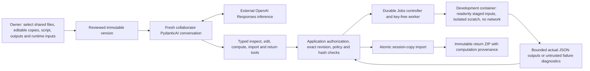

# U4: Conversational Computation and Useful Follow-ups

**2026-09-30 — implemented and self-validated locally; owner review pending.** This milestone extends [U4.1](agent-python-computation.md). The owner authorized continued implementation without per-feature acceptance pauses. It does not deploy Python to the private Linux service, finish M2, or establish private-pilot readiness.

## What the collaborator can actually do

An explicitly authorized Continue agent can read current selected copies, repair a selected Python script, execute its exact saved inputs in the existing bounded development container, import the declared JSON outputs, revise a report and produce an immutable return with actual computation provenance. The owner can separately select runtime inputs: shared report text can remain available to chat without entering the container. Report-only changes retain matching numerical evidence when the report was excluded from execution inputs.

The synthetic **Pilot decision review** is a complete numerical example rather than a JSON-syntax demonstration. The accepted agent generated its own analysis code. Independent scoring verified removal of six excess duplicate rows, rejection of two missing IDs, 160 eligible users, overall and segment calculations, population-standardized A/B means, differences and deterministic 2,000-replicate bootstrap intervals. A 70/30 follow-up changed the plan and generated one additional actual run and a new return; earlier packages stayed byte-identical. Report editing reused the same calculation. Result questions and missing-population clarification caused no edits, jobs or access requests.

At 50/50 weights, standardized conversion was A=25% and B=30%; revenue per user was 10 and 12 synthetic units. At 70/30, conversion was 21% and 26%; revenue per user was 8.4 and 10.4. The difference stayed 5 percentage points and 2 units in this particular dataset, while the conversion interval changed from approximately [-10, 20.42] to [-7.5, 17.92] percentage points. Both intervals include zero. These are synthetic descriptive results pending human review, not a rollout recommendation or causal result.

## Architecture and boundaries



PydanticAI supplies orchestration; application code, the worker and runtime enforce permissions. This follows the application-executed tool loop described by the [OpenAI function-calling guide](https://developers.openai.com/api/docs/guides/function-calling). No terminal, arbitrary host path, network tool, dependency installer or external hosted tool is exposed to the model. `compute_workspace` takes an approved entrypoint ID and exact revision, not a command. Normal completed runs import outputs; optional `prepare_return=true` freezes only a return still matching that computation. A delayed completion can be inspected with `get_run` and imported explicitly.

Workspace policy 4 records explicitly selected input IDs. Policy 3 continues to select all non-output shared files. The computation launcher changed deliberately to expose bounded failure logs after confirmed cleanup: old Python policies with the earlier launcher hash are not silently upgraded and need fresh review/approval. Old editing/JSON permissions do not acquire Python capability. Historical validation records and stored versions are retained.

Failed Python executions retain at most 4 KiB per untrusted diagnostic stream after trusted cleanup; they are never eligible for result import or a successful-run citation. A model can inspect an error and explicitly repair a new saved revision. Uncertain work is blocked; there is no automatic replay. The original source directory is never mounted or overwritten. Runtime limits remain 30 seconds, one CPU, 256 MiB, 32 processes and 32 MiB scratch; inputs are read only and task networking is disabled. A model credential is never passed to the worker/container.

Only Python-enabled collaborator Continue sessions use the larger finite orchestration envelope: 16 model requests, 24 tools, 180 seconds, 6,000 output tokens and 128 KiB request bodies. The same provider/model is retained, with `low` reasoning for this mode; existing modes retain their prior envelope and reasoning setting. The final two requests are reserved for answer/correction without side effects. Strict Python output schemas classify current-copy evidence as `workspace`, completed session execution as `new_run`, and analysis as `interpretation`; file-only versions cannot generate unavailable owner-background claim kinds. Python delivery references must match the current revision. Structural reference validation still cannot prove semantic truth or mathematical correctness.

Computation reuse requires the same execution input hashes, canonical policy, and imported output hashes. An idempotent same-turn/revision request is not reported as a new execution. Atomic computed returns require the exact matching run; an intervening input change is denied. Earlier returns remain downloadable while access is valid, but cannot serve as delivery of a changed current revision.

## Local walkthrough

The maintained local service uses port **8768**, the original `.prism-demo` database and its purpose-specific credential. Do not start another process against that database. On a stopped development demo, the operator can use:

```bash
uv run --no-editable prism demo \
  --data-dir .prism-demo --port 8768 \
  --demo-run-limit 64 --demo-version-limit 64 \
  --no-model-budget-limit --allow-openai \
  --openai-key-file .prism-demo/prism-openai.key \
  --project "$PWD/examples/agent-workspace/.prism-project.json" \
  --project "$PWD/examples/pilot-decision-review/.prism-project.json"
```

The local cost cap remains removed by owner choice. Accounting preserves previous requests and the historical five-cent-per-dispatch estimate; reservations are not provider invoices or a guarantee of cost. The bounded operator run/version options address exhausted lifetime demonstration allowances without deleting any history. Defaults remain 32 total runs and 24 versions; both options accept finite values 1–256 and are local-demo CLI options. Per-session/runtime rights are unchanged. The current demo uses 64/64; private Linux configuration is unchanged.

1. In the owner browser, select **Pilot decision review → Shared projects → New share**. Select all seven configured files and **Read + edit selected copies**.
2. Make `analysis.py`, `analysis-plan.json`, `report.md` and both `results/*.json` files editable. Keep requirements and CSV read only.
3. Select `analysis.py` under **Python execution**, declare both result files, and exclude `report.md` from **Execution inputs**. The remaining inputs are requirements, plan, CSV and script. Inspect all selected content and approve the frozen version.
4. Use the private local reviewer link printed by the service in a separate role browser/profile. Start a fresh session for the approved version and ask:

   > Complete the pilot review according to requirements.md: repair the incomplete analysis script, actually calculate the cleaned segment and standardized results and seeded bootstrap interval, inspect the outputs, revise the report with limitations and pending human review, and prepare a return package. Do not publish or deploy anything.

5. Inspect **Working copies**, **Activity & results**, and the returned ZIP. Verify actual input hashes/revision, exit status, cleanup and both numerical outputs. Runtime completion alone is insufficient; independently check the required arithmetic and report.
6. Ask to use 70% new / 30% returning users and prepare a new return. Observe one new run and a distinct current package. Then ask for a report-only improvement using saved results: computation should be reused.
7. Ask whether the existing interval justifies rollout without recalculating. Ask what is needed for another population when weights are absent. Neither question should execute or expand rights.

The accepted local session can be reopened at `/review?session=ea2cd5ffe2c945fd81318ebce152158e` after local-role authentication. This URL supplies a session ID only, not authentication or permission. Named OIDC mode ignores this local selection and opens only its invitation-bound session. Service role tokens expire on restart and must never be committed or shared publicly.

## Evidence, failures and next work

[Milestone evidence](validation/agent-conversational-computation.json) separates deterministic checks, real model requests, actual development-runtime checks, independent scoring and browser observations. The final five-turn task had no operator-written analytical code or expected answer constants. A bounded final reference correction was needed for the report-only turn; its saved effects were not replayed. A private counterfactual copy containing conflicting rows actually failed with cleanup and untrusted diagnostics, without importing results.

Validation passed 501 backend tests (including 11 focused computation-agent checks), 31 actual development-runtime regression checks, 67 independent numerical/artifact checks and 15 updated-service HTTP/runtime smoke checks. The final updated-service real-model request correctly read saved cleaning counts without changing the workspace, executing or preparing another return. These check counts measure different layers and are not a single reliability score. Chrome displayed the accepted conversations, two actual executions, selected inputs and three computation-bearing return revisions. The new owner input-selector click flow and final post-restart browser regression remain unverified: the Mac locked during computer use. HTTP checks supplement rather than replace those outstanding browser checks.

Earlier attempts remain recorded: invalid file selections, wrong settings keys, missing failure logs, a diagnostic measurement error, an interval targeting observed rather than standardized composition, incorrect duplicate counts, missing comparison fields, stale delivery references, missing schema-4 computation attachments, unavailable-background claim kinds, and incorrect unit/currency wording. Requirements were made explicit and orchestration/output constraints were refined before the accepted sequence. Do not present these attempts as successful autonomous analyses or treat the final synthetic sequence as a reliability rate. Semantic narratives still require review.

Next proposed milestone is a narrowly reviewed **reference-Linux/Kata Python release and acceptance** using these exact staged-input/output boundaries, followed by additional practical tasks and behavior evaluations. It needs a separate milestone decision and actual host verification. Arbitrary projects/dependencies, network access, source merge/writeback, independent handoff images, broader model autonomy and production use remain deferred. `pilot_ready=false`.
