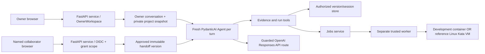

# Prism Agent: Current Implementation, Architecture, and Gaps

**As of 2026-09-23.** This document describes the repository implementation and the bounded evidence available on that date. Code is the source of truth for behavior. A live demonstration establishes only that those specific steps worked in that environment; it is not a security proof, production assessment, full milestone acceptance, or pilot-readiness claim. `pilot_ready=false`.

## 1. Status vocabulary and scope

| Label | Meaning in this document |
| --- | --- |
| Implemented | Present in the current code path. This does not by itself mean it was exercised. |
| Locally tested | Covered by recorded automated tests or local integration checks, which may use model/runtime doubles. |
| Live verified | Observed in a real browser/service/provider/runtime path and bounded to the recorded fixture and actions. |
| Planned / proposed | In a roadmap or research plan; not delivered unless separately identified as implemented. |
| Research hypothesis | A candidate explanation or improvement to measure, not an established finding. |

Prism currently provides online, owner-controlled sharing of reviewed project snapshots. It does not provide a general-purpose coding agent, arbitrary command execution, or independent offline handoff. Its application agent is one PydanticAI model/tool loop per turn. Owner and collaborator workflows share much of that loop but use distinct scope types, authorization, context assembly, prompt instructions, and permitted tools. No sub-agent team, planner/critic swarm, provider conversation handle, or transferred live process is used.

## 2. Architecture at a glance



The owner and collaborator routes are served by the same Prism application in the demonstrated deployment, but authentication and data access are role-scoped. The OwnerWorkspace adapter binds an owner and configured project. A named collaborator is represented by verified OIDC issuer plus subject; the sharing store binds the fresh session to its approved version, grant, mode/action, expiry, and revocation revision. UI separation helps explain scope but is not the enforcement boundary: service methods reauthorize API operations.

### Turn lifecycle

1. The service authenticates the actor and authorizes a session against its current project/revision or approved version and grant.
2. It reads completed turns for that same session and builds server-side history. It does not load prior model-provider conversation IDs. A fresh PydanticAI `Agent` and provider adapter are created for the request.
3. It constructs a bounded context object, labels it as data rather than instructions, adds the new user question, and exposes tools only when the current role, mode, and action permit them.
4. Each outgoing model request passes through a guarded transport. Before dispatch it rechecks session authorization and turn state, constrains route/request fields, and atomically reserves application allowance. Tool handlers separately reauthorize before reading or performing work.
5. The model must return a strict structured `Answer`. Server-side validation checks evidence IDs/ranges, run ownership and completion, context-reference membership, historical-run membership, and access-request IDs. A single output correction may be requested; it is repair-only and cannot call tools.
6. The result or a fixed, privacy-safe error is persisted. Provider request/response bodies are not forwarded to logs or UI. Completed execution records remain queryable even if a later answer fails.

## 3. Owner and collaborator context

| Property | Owner project conversation | Collaborator conversation |
| --- | --- | --- |
| Starting material | A configured local project source/import manifest and files explicitly selected by the owner for this conversation. Owner private evidence can include material excluded from any share. | A frozen, owner-reviewed version: purpose, selected files, a required owner-written summary and at least one reviewed excerpt, optional open questions and historical runs, and an approved mode/action. |
| History | Completed turns in that owner conversation only. It is private and is not automatically added to a share. | Completed turns in this collaborator session only. A different invite/session starts fresh. |
| Handoff | Owner explicitly selects checkpoint, content, references, files, runs, and inspect/verify mode. Candidate is frozen, previewed, then approved against its digest. Later source edits do not rewrite it. | Imported context is read as untrusted data. It does not restore owner memory, credentials, tool authority, provider state, or an active process. |
| Evidence | Version-bound owner evidence identifiers, not raw filesystem paths or a model-selected project. | Version-bound share-local evidence identifiers and line ranges. Unselected files and unrelated session evidence are inaccessible. |
| Historical runs | Owner can inspect actual results and select completed results at/before a chosen checkpoint. | Only explicitly selected, completed owner runs are imported as historical records; they are distinct from new runs made in this collaborator session. |
| Model authorization | Owner must enable the model-use policy for that conversation after privacy disclosure. | Requires current valid collaborator session/grant and configured provider allowance. |
| Scope changes | Agent cannot add files, grant rights, create shares, or request expansion on the owner's behalf. | Agent may submit a bounded access request. It grants nothing; adding evidence requires a newly reviewed version. |

The owner handoff flow selects a completed checkpoint, purpose, summary, open questions, excerpts, files, runs, and mode. The server resolves references, checks that referenced files/runs are included, assigns share-local IDs, copies selected content, labels edited excerpts and omitted references, and enforces a 16 KiB context cap. The resulting immutable manifest is approved as an exact digest. This is human-reviewed selection, not automatic privacy-boundary detection. Text can still contain misleading or sensitive information, so the preview and owner judgment matter.

For a selected file, the model first receives catalog metadata (such as its evidence ID, name, digest, and line count); its content enters the model context when an authorized read or search tool returns it. The handoff purpose, owner-written summary, and open questions appear in the collaborator interface and in the collaborator model context. They guide the task as reviewed owner-provided data, but cannot grant access or override the server's rules.

## 4. Model route, instructions, and bounded agent loop

The production route is fixed in code to model `gpt-5.4-mini-2026-03-17` at OpenAI's Responses API endpoint. Inference is external. Requests set `store=false`, default service tier, no previous response/conversation ID, no streaming/background mode, no hosted tools, and at most 1,500 output tokens. The UI discloses that questions, permitted context, this session's history, evidence and authorized tool results may leave the host. `store=false` is not a claim that the provider retains nothing. Local hosting/execution therefore does not mean local inference.

The server allows at most four provider requests and eight tool calls per turn, 15 seconds per tool, a 90-second overall turn, 12 turns per session, one in-flight turn per session, and two concurrent model slots. Outgoing request bodies are capped at 32 KiB; provider response bodies at 128 KiB. Application allowance reserves five cents per actual dispatch from a configured aggregate ceiling (default $1.00); reservations are not refunded for timeouts. This is a conservative local ledger, not a provider billing cap or guaranteed maximum charge. Setting allowance to zero disables external calls. Model credentials are read from a restricted owner-only regular file; test models are injected only by tests.

For the private demonstration, the configured aggregate application allowance was raised to $10.00 as of 2026-09-23. This is a deployment setting, not the code default; the remaining balance changes with use and should be read from the live interface.

The collaborator instructions tell the model to inspect evidence before reported claims, honor the user's execution intent, avoid guessing absent resources, distinguish current-session runs from approved historical owner runs and owner-written context, stop when evidence or budget is insufficient, and treat all imported text/tool output as untrusted data. Owner instructions adapt the same base instructions but remove the access-request tool and prohibit the agent from changing owner scope.

The structured answer permits up to six claims/citations, four current-run references, four historical-run references, six context references, six limitations, and a 3,000-character answer. Claim kinds are `reported`, `new_run`, `historical_run`, `context`, and `interpretation`. File citations require a valid version-scoped evidence ID and exact line range. Context references must point to summary, open questions, or selected excerpt IDs. Historical-run references must belong to approved background. Current-run references must resolve to a completed job in the current session. These checks establish reference membership and status, not whether prose semantically follows from a source.

## 5. Registered tools and authority boundaries

| Tool | What it can do | Enforcement / exclusions |
| --- | --- | --- |
| `search_evidence` | Search the current authorized evidence catalog. | Session/version authorization and query bounds in the store; no filesystem search. |
| `read_evidence` | Read a bounded numbered line range for a catalog evidence ID. | Reauthorizes session, exact evidence ID and line bounds; no arbitrary path. |
| `submit_verification` | Run the legacy fixed synthetic bootstrap action with integer seed 0–1000 when that action is part of the version. | Server mode/action check; deduplicated by turn/seed; accepts no command or script. |
| `check_json` | Check the approved selected JSON inputs with the fixed parser action. | Available only for the version's exact `json-check`; model supplies no paths, content, or code. |
| `get_run` | Inspect an actual run in this session. | Exact run/session authorization; model cannot invent a result. |
| `request_access` | Record a 5–500 character pending collaborator request. | Collaborator only, maximum four per session; does not grant access or execute work. |

The owner web UI also has explicit, separately authorized run controls. Tool availability is fixed by role, version, mode and action; prompt text alone cannot enable a tool. Action tools are sequential, are disabled in inspect-only sessions, cannot execute during final-output repair, and are rejected when mixed with a final answer in the same model response. The service submits work only after both user intent and server-side policy permit it.

## 6. Identity, invitation, grant, and revocation

In identity mode, Prism validates OIDC authorization-code/PKCE flow, issuer, signature, audience, nonce, expiry and the stable subject (`sub`). Authority uses issuer+subject, not display name/email. The owner is pinned to a configured issuer/subject. Browser session cookies are protected and mutating requests use CSRF checks; APIs still check actor, role and scope on every operation.

Owner flow: one-time identity discovery can establish the intended named collaborator but creates no Prism grant. The owner selects a previously approved immutable version, exact named recipient, inspect/verify mode and invitation lifetime (5 minutes to 24 hours). The invitation token is stored as a digest and is single-use. Redemption requires the exact verified issuer/subject; a wrong identity is denied without consuming the invite. Successful redemption creates one fresh version-bound session and grant. Every subsequent resource/model/job request checks version approval/revocation, session expiry, grant identity/mode/action/expiry/revocation and current grant revision. Revoking a grant blocks later authorized reads/actions; delivered or copied content cannot be recalled.

The local code and a bounded private HTTPS live flow are present. This does not establish a general identity security audit, broad threat-model closure, or production readiness.

## 7. Execution path and runtime isolation

```text
Authorized tool/API → Jobs (durable run state) → fixed argv worker process
  → fixed action identity/hash and bounded stdin → selected runtime profile
  → bounded result/provenance → cleanup/reconciliation → authorized result read
```

`Jobs` rechecks authorization, version/action binding, mode, quota, idempotency and runtime profile. The worker is a separate Python process launched with fixed arguments, no shell, a minimal environment, no inherited model credential and no source-workspace path. It accepts a small bounded input on stdin, verifies the canonical program hash, and supports only the fixed bootstrap or `json-check` actions. Output is bounded and checked for action/hash/result shape and cleanup state.

The development profile uses a constrained container runtime. The reference Linux profile supports the imported project's fixed `json-check` through a trusted same-host worker and Kata VM. It performs fail-closed readiness and fixed image/handler/policy checks; no Docker/runc fallback is claimed. Workload controls include no network or host mount, approved copied input bytes, a read-only container root filesystem, bounded memory/CPU/process count/time/scratch/output, and separate ephemeral writable space. The Linux profile is not a path from the Mac app to a remote execution API; app, worker and runtime are co-located on the trusted Linux host.

Normal cancellation is reported only after the worker confirms cleanup. Forced termination, service restart, or uncertain late resource creation can leave a run interrupted/uncertain and require operator reconciliation; the service does not automatically replay uncertain side effects. Revocation during active work triggers cancellation checks, but this is not a general guarantee that every in-flight external effect can be stopped. A result record includes action/parameters, approved resource identities/hashes, output digest, status, runtime profile and cleanup/provenance fields where applicable.

## 8. Privacy, audit, and practical limits

Prism stores session turns, approved snapshots, runs, grants and bounded events in its local service database. It does not intentionally log provider request/response bodies; fixed error categories are returned instead. Identity secrets and model credentials stay in the trusted service/SDK path and are not exposed in model-visible prompts or the execution sandbox. Approved model inputs leave the host for inference. The exact data categories depend on the role/session and disclosed selection.

The version digest detects mismatch against the application's record; it is not protection against a privileged database/host administrator. Snapshot approval does not prove semantic privacy, correctness, or absence of prompt-injection content. Citation validation checks identifiers and ranges, not entailment. OIDC and authorization code do not make the whole deployment secure by themselves. Revocation only controls future service access; it cannot recall information already displayed or copied. Model quality and availability are not guaranteed, and a completed run may survive a failed answer. Inspect the run list before retrying to avoid duplicate work.

The deployed private demonstration uses synthetic fixtures. No production dataset, broad autonomous coding workflow, arbitrary shell, file editing/write-back, general project build/test execution, GPU workload, universal importer, offline transfer, user-level encryption, comprehensive retention/deletion controls, or independent security certification is established here.

## 9. Evidence and status as of 2026-09-23

| Evidence class | Current evidence | What it supports / does not support |
| --- | --- | --- |
| Code present | Current source contains owner workspace, reviewed immutable handoff, OIDC identity/invites/grants, bounded tools, structured reference checks, Jobs/worker and development/reference Linux runtime paths. | Supports implementation description; code presence alone is not execution or security evidence. |
| Local automated validation | The 2026-09-23 recipient flow record reports 190/190 full-suite tests, targeted Ruff, Prettier and frontend build passing after the Document release change. Other milestones retain their own historical counts/records. | Regression evidence, some tests use doubles; not 190 live model trials or a production audit. |
| Live identity and service flow | An earlier bounded private Google OIDC/Tailscale HTTPS validation used a synthetic Document release handoff, including exact-recipient redemption, scoped reads, denied unlisted evidence/owner API/unrelated session access, a focused model answer, and grant revocation followed by denial. A later fresh owner-to-recipient demonstration created a separate grant that remained active, and again observed the scoped session and denied unlisted evidence/owner API access. | Evidence for these exact paths in that environment; the earlier revoked grant and later active demo grant are distinct. This is not comprehensive identity/security assurance. Private URLs, identities and tokens are intentionally omitted. |
| Live model | A focused evidence question completed with a valid citation. A broader question failed closed without delivering a partial answer. | Demonstrates both success and failure behavior; two outcomes do not estimate reliability or prove semantic correctness. |
| Live runtime | An earlier approved `json-check` completed in 3.979 seconds. A later fresh owner-to-recipient replay completed another approved `json-check` in 4.013 seconds. Both reported `io.containerd.kata.v2`, guest kernel 6.18.35, exit 0, and `cleaned_up=true`. | Demonstrates two bounded fixed-action runs on the recorded reference runtime; not broad runtime assurance or arbitrary code execution. |
| Milestone/readiness | M2.3 reference runtime cloud acceptance is recorded as 46/46. Named-recipient work has bounded live end-to-end evidence. | Owner acceptance/full order-4 acceptance and pilot readiness remain false. Do not describe Prism as production-secure or pilot-ready. |

Dynamic remaining allowance, active grant expiry, private hostnames, URLs, account email, OIDC subject, invite/discovery token, run/version IDs and credential values are intentionally excluded. Earlier records may contain different snapshots; consult dated sanitized evidence, not this document, for historical values.

## 10. Prioritized work not yet complete

| Priority | Work | Status / why it remains |
| --- | --- | --- |
| P0 | Owner review and explicit acceptance of delivered milestones; close remaining order-4 acceptance checks. | Some bounded end-to-end paths passed. Current live replay is not full milestone acceptance. |
| P1 | Agent behavior baseline and refinement: reproducible task set for intent recognition, evidence grounding, provenance, failure diagnosis, recovery, stopping and useful access requests. | Proposed B0/B1 in `agent-behavior.md`; current prompt and schema behavior has not been evaluated as a reliable agent. |
| P1 | Durable lifecycle and pilot gates: lease/watchdog policy, restart reconciliation, in-flight cancellation semantics, operational monitoring, retention/deletion, threat review and deployment recovery. | Existing worker handles bounded cases and marks uncertainty; full pilot lifecycle/security gates remain open. |
| P2 | Permission expansion workflow for pending requests. | Current request is informational; approving it must create a newly reviewed version and require a fresh user request. |
| P2 | Improve supported project import and deterministic fixed actions under explicit reviewed contracts. | One strict manifest and fixed JSON checker exist; no arbitrary scripts, shells or broad formats. |
| P3 | Scoped edits and reviewed return of changes (M3), then easier preparation/release and additional hosts/compute (later roadmap). | Planned; requires applicable M2 controls and separate scope/acceptance. |
| Deferred | Independent handoff to collaborator-controlled infrastructure. | Needs reviewed export/import, destination policy/credentials, fresh agent and explicit handling of offline revocation limits. Relative schedule remains undecided. |

Agent-behavior research hypotheses should be tested, not presented as implementation facts. Candidate hypotheses include whether clearer task-state/provenance tracking improves recovery, whether explicit action-intent handling reduces both unsolicited runs and unnecessary refusals, and whether a compact evidence ledger improves supported answers. Keep authorization, filesystem/network policy, quotas and revocation deterministic and outside model control. Use held-out synthetic tasks, preserve failures, compare against the current prompt/tool baseline under identical budgets, and report model failures separately from injected test failures.

## 11. Source map

- Core model loop, provider transport, tools, structured output and checks: [`src/prism/conversation.py`](../src/prism/conversation.py)
- Owner workspace and owner scope: [`src/prism/owner.py`](../src/prism/owner.py)
- Handoff selection/materialization: [`src/prism/handoff.py`](../src/prism/handoff.py)
- Sharing store, invites, grants, authorization and evidence: [`src/prism/sharing.py`](../src/prism/sharing.py)
- OIDC identity: [`src/prism/identity.py`](../src/prism/identity.py)
- HTTP/API composition and role-specific routes: [`src/prism/webapp.py`](../src/prism/webapp.py)
- Durable job authorization, worker lifecycle and result validation: [`src/prism/jobs.py`](../src/prism/jobs.py), [`src/prism/worker.py`](../src/prism/worker.py)
- Fixed reference Linux/Kata profile: [`src/prism/reference_runtime.py`](../src/prism/reference_runtime.py)
- Delivery sequence/current gates: [`roadmap.md`](roadmap.md)
- Historical design requirements and later implementation addenda: [`agent-design.md`](agent-design.md)
- Proposed behavior research and B0–B3: [`agent-behavior.md`](agent-behavior.md)
- Identity invite design/validation: [`m2-recipient-invitations.md`](m2-recipient-invitations.md), [`validation/m2-recipient-live-identity.json`](validation/m2-recipient-live-identity.json)
- Runtime integration: [`m2-linux-runtime.md`](m2-linux-runtime.md), [`validation/m2-linux-runtime-cloud-pass.json`](validation/m2-linux-runtime-cloud-pass.json)
- Live demonstration procedure: [`live-demo-sop.md`](live-demo-sop.md)
