# U4.1: Approved Python Working-Copy Computation

**Date:** 2026-09-30. **Scope:** Local development implementation. The [U4 proposal](agent-computation-scenario.md) separates this executor from later conversational analysis. No U4.2 task completion, reference-Linux Python release, owner acceptance or private-pilot readiness is established.

## Delivered capability

The owner can select shared files, explicitly designate editable copies, choose one editable `.py` entry point and one or two editable `results/*.json` output paths, inspect the frozen policy and approve a new version. This explicitly permits running revised bytes of that script; an old Inspect, Verify or Continue version does not acquire this right. Existing fixed JSON-check rights are unchanged and mutually exclusive with the new computation capability.

The collaborator manually runs the current saved revision in **Working copies**. Jobs checks the identity, grant, entry-point ID, exact revision, canonical policy and current inputs within the run-reservation transaction, then rechecks access before launching its key-free worker. Execution uses the reserved immutable bytes; a later edit makes that result stale for import. The model has no Python execution/import tool in U4.1. Existing chat read/edit/return tools remain available under the approved rights; the JSON-check tool is hidden for Python-only shares. This manual control is a generic working-copy operation, not a specialized experiment interface.

Successful execution stores actual declared outputs and logs with the run. **Import declared results into copies** commits both outputs together only while the same input revision is current and access remains valid. The original project is never updated. A subsequent immutable return includes the actual result bytes, diff, run, original revision, input/script/policy hashes, pinned image and cleanup outcome when the current inputs and imported output hashes match. Later input/script edits remove that attachment; earlier returns remain unchanged. Numerical output is not independent mathematical validation or owner approval.

## Architecture and enforced boundary

```mermaid
flowchart LR
    O[Owner selects files, editable copies, Python script and outputs] --> V[Exact reviewed version: workspace policy 3]
    V --> W[Fresh collaborator session and SQLite working copies]
    W --> J[Jobs: authorize and freeze exact revision and hashes]
    J --> K[Separate key-free worker with controller heartbeat]
    K --> S[Private temporary staging of approved copied bytes]
    S --> G[Development container: read-only /project and isolated /scratch]
    G --> C[Bounded untrusted JSON protocol]
    C --> R[Durable run and explicit atomic result import]
    R --> Z[Immutable return ZIP and human review]
```



The trusted worker validates the payload again before staging. It creates a random private temporary parent directory, stages only approved non-output working-copy bytes, and mounts its `project` child at `/project` read-only. The owner source directory is never mounted. Temporary staging is removed after runtime cleanup. This requires the configured local Docker engine to support a read-only bind mount of that temporary directory; a failure does not enable a broader mount or another runtime.

The container receives the pinned Python image, a trusted launcher, minimal non-secret environment, approved inputs and declared output metadata. No model key, home directory, SSH agent, runtime-control socket, private project file or personal environment is passed. Inputs are exposed as symlinks in `/scratch` to the read-only mount so ordinary relative project paths work. Code may replace its scratch links or invent results, but cannot alter the staged mount or owner source. Python can spawn subprocesses and read the pinned image's filesystem; absence of a shell tool is not the boundary.

Limits are enforced by the container/runtime outside the model: no task network, read-only image root, UID/GID 65534, dropped capabilities, no-new-privileges, built-in seccomp, no public ports, 1 CPU, 256 MiB memory with no extra swap, 32 processes, 32 MiB scratch, and 30-second task timeout. The child also has a 128 KiB per-file size bound. Accepted result files are UTF-8 JSON objects/arrays, at most 32 KiB each and 96 KiB total (the current two-file declaration permits at most 64 KiB). Each log stream is at most 4 KiB. A separate 192 KiB bounded container protocol and 256 KiB worker transport prevent unbounded host-side reads. Existing workspace limits remain eight selected files, 96 KiB total stored text, 20 saves, six runs/returns per session and 32 application-wide demo runs.

The guest collector opens every declared path via directory descriptors with `NOFOLLOW`, checks regular-file type, single-link ownership shape and size, and refuses parent/final symlinks, FIFOs and hard links. The host accepts only the exact declared ID/name set, bounded text, matching hashes and finite JSON objects/arrays; it never extracts a guest archive or executes output on the host. Undeclared scratch files are not imported. All guest text and numerical claims remain untrusted; these controls establish permitted transport, not correctness of the script's reasoning or resistance to every container escape.

Controller pipe EOF, malformed heartbeat or lease expiry cancels this new development worker. Access ending during execution cancels the observed container and prevents result publication. Forced worker termination or uncertain cleanup stays uncertain and blocks new execution; it is not replayed. This local worker lease is not a durable host watchdog, proof of cleanup after worker SIGKILL/host loss, or a remote timing guarantee. Reference Linux currently supports only the previously approved fixed JSON check; Python execution has no Kata fallback or deployment in this increment.

## Try the synthetic computation

The local owner service on port 8768 has the new **Pilot decision review** project alongside existing projects. Its configured purpose-specific model route and original accounting ledger remain; application cost cap is disabled as the owner requested. This increment's acceptance makes zero model calls. Use the current private owner/reviewer links printed by the demo process; local role links change after restart.

For a fresh local operator start (from the repository, after `cd frontend && npm run build`, with the fixed image/engine already prepared):

```bash
uv run --no-editable prism demo \
  --data-dir .prism-demo \
  --port 8768 \
  --no-model-budget-limit \
  --allow-openai \
  --openai-key-file .prism-demo/prism-openai.key \
  --project "$PWD/examples/agent-workspace/.prism-project.json" \
  --project "$PWD/examples/pilot-decision-review/.prism-project.json"
```

Do not start a second process against a running demo's database. The configured key is optional for manual computation: omit the model flags/key argument to use a model-disabled demo in a separate data directory. Nothing in this command creates cloud infrastructure or changes the remote service.

1. In owner, choose **Pilot decision review**, open **Shared projects → New share**, and select its seven configured files. `private/customer-notes.txt` is excluded by the operator manifest and must not appear.
2. Choose **Read + edit selected copies**. Mark `analysis.py`, `analysis-plan.json`, `report.md`, `results/metrics.json` and `results/data-quality.json` editable. Keep requirements and CSV read only.
3. In **Python execution (separate explicit approval)** choose `analysis.py`; explicitly select both result JSON files. Leave the default **No Python execution** for editing-only shares.
4. Click **Review selected content**, inspect file bytes, the Python capability and resource limits, acknowledge the review and approve the frozen version.
5. Open the current local reviewer link in a separate Chrome window/profile. Enter the new approved version and open **Working copies**. Edit `analysis.py` by appending `print("revised session script")`, then **Save copy**.
6. Click **Run approved Python copy**, then **Refresh execution result** until completed. Expand **Actual computation output and provenance**. It should show the printed marker and two actual JSON files, exact revision/hashes, development profile and cleanup confirmation.
7. Click **Import declared results into copies**. Open both result files, review the saved diff, then **Prepare downloadable return** and download it. Inspect `files/results/metrics.json`, `files/results/data-quality.json` and `prism-return.json`.
8. Edit the script again after running: the old result cannot be imported into that changed revision. An editing-only version must have no Python run control and direct execution must be denied. Revoke the share to deny later reads/import/downloads; already saved information cannot be recalled.

The initial script deliberately uses raw rows: A has 85 rows, 21 conversions, 840 revenue units; B has 83 rows, 26 conversions, 1,040 units. It computes actual rates/revenue per row and labels cleaning incomplete. Do not show this successful runtime as a validated rollout recommendation. The independent fixture oracle confirms 168 raw rows, six exact duplicates, two invalid IDs and 160 eligible users; cleaned and standardized analysis and real agent repair are U4.2 work.

## Validation and remaining work

Run the focused application checks and real synthetic runtime path:

```bash
uv run --no-editable python -m unittest discover -s tests -p test_computation.py -q
uv run --no-editable python scripts/u4-computation-check.py
```

[Recorded runtime evidence](validation/agent-computation-runtime.json) contains 31 real checks: revised-script Jobs/worker execution, raw arithmetic, exact ZIP outputs/provenance, source preservation, observed active-container revocation, controller pipe-loss cleanup, read-only staged inputs, excluded-file/control-socket/credential absence, external/metadata network denial, actual cgroup/scratch settings and process-creation limit, rejected symlinks/parent symlinks/FIFO/hard links/oversized artifacts/invalid JSON/log flood, and a shortened one-second timeout through the same timeout path. The eight focused application checks cover approval/canonical-policy tampering, old grants, revision/reservation races, identity/script denial, payload paths and limits, untrusted output ingestion, atomic import and immutable return, CSRF/typed API boundaries and contextual share-local ID remapping. Scripted completed rows and fake launch checks are labeled as such and do not count as runtime/model evidence.

[Final local acceptance](validation/agent-computation.json) records 490/490 backend tests, 8/8 focused application checks, 31/31 real runtime checks, targeted Ruff, frontend format/build and Chrome acceptance. In the final browser path the owner selected seven synthetic files, four editable copies (script, report and both outputs), designated the Python entry point and both results, reviewed and approved the frozen version. The collaborator entered a fresh session in an independent local role profile, appended a print marker, saved revision 1, ran that exact revision, imported both outputs into revision 2 and downloaded an immutable return. Independent ZIP inspection verified the marker, arithmetic, file hashes, matching run/revision and cleanup; all seven selected source files stayed unchanged. This is local role-cookie acceptance, not a new remote/OIDC identity test. The separate [service API walkthrough](validation/agent-computation-api.json) remains labeled as API evidence.

The final local original ledger remains at 99 dispatches and 495 cents of estimated reservations, with no new model call or ledger reset. The record retains an accidental test-runner/package-path failure and its recovery, rather than counting it as a passing test. Use the documented `--no-editable` commands consistently; stop the local service with no active jobs/turns before replacing its installed package. Runtime limits, old dispatch history and the purpose-specific credential are preserved when restarting the demo.

The oracle's seeded percentile interval is a precomputed independent target for later acceptance, not a U4.1 agent result. No real model generated/repaired the analytical script in this increment. U3's unnecessary clarification access request remains unresolved, the larger orchestration envelope remains unapproved, and M2's separate private-pilot gate remains incomplete.

Next proposed increment: **U4.2**, connect scoped Python execution and result inspection to the conversational agent, then complete cleaning/segmentation/standardization/bootstrap/report/return against the frozen oracle without an operator code fix. Pause for owner authorization before starting it.
