# U2: Scoped Agent Edits, Exact Checks and Downloadable Returns

**Date:** 2026-09-29. **Status:** Implemented in local development on `prototype/agent-workspace`. Automated tools/API checks and one real development-container run passed. Chrome manual-path acceptance also passed; one repaired real-model task passed; owner acceptance and a new reference-Linux/Kata release remain pending. See [validation](validation/agent-workspace-tools.json), [task outcome](agent-task-completion.md) and [preserved baseline](agent-workstream-checkpoint.md).

## User value and scope

**Current local U3 behavior:** [Follow-up delivery](agent-workspace-followups.md) adds exact-input reuse and original/current revision labels. It has incomplete live acceptance; the U2 evidence below remains its historical baseline. The current checker signature includes `force_run=False`; only an explicit fresh-run request uses `True`.

The collaborator can ask an agent to read approved requirements, edit the permitted copies, validate the current JSON and prepare actual files for review. These are registered tools connected to server-side operations, not canned replies. Automated acceptance substitutes a scripted model for inference and a worker double for one loop test; a separate execution check uses the actual Jobs/worker/development-container path. Neither is evidence that a live model reliably completes the task.

An owner chooses **Read + edit selected copies**, explicitly selects editable files and optionally checks **Allow the fixed JSON syntax check on working copies**. That option appears only when the configured project offers `json-check`. It is off by default. Exact version review shows the selected files, editable subset, canonical checker, image, required JSON inputs and resource policy before approval. Both direct file handoff and reviewed conversation handoff use this policy.

Schema-3 versions with workspace policy 1 retain editing without execution. Policy 2 binds the canonical fixed JSON checker into approval. Existing Inspect/Verify versions and earlier editing grants do not gain new execution rights. An Inspect invitation to a Continue version still grants neither editing nor execution.

## Architecture and data flow

```mermaid
flowchart LR
  O[Owner selection and exact approval] --> V[Immutable original files and workspace policy]
  V --> S[Authenticated independent collaborator session]
  S --> A[PydanticAI agent with typed scoped tools]
  A --> W[Reauthorized SQLite working copies and revision]
  W --> J[Exact revision and input hashes reserved by Jobs]
  J --> K[Separate worker and approved runtime]
  K --> R[Checked result and cleanup provenance]
  W --> D[Immutable returned files and actual diff]
  R --> D
  D --> U[Authenticated ZIP download for owner review]
```



| Tool | What it actually does |
| --- | --- |
| `inspect_workspace(file_ids)` | Reads one to three current approved copies with revision/hashes. At most 12 KiB text per call. |
| `edit_workspace(updates, expected_revision)` | Atomically saves up to three complete UTF-8 copies in the explicit editable subset. A denied member or stale revision writes nothing. |
| `workspace_diff()` | Returns actual changes and hashes. Oversized diffs return metadata with a manual-review notice rather than overflowing the model route. |
| `check_workspace(expected_revision, prepare_return=False, force_run=False)` | Reuses a matching same-session completed check or executes the separately approved fixed parser on captured bytes. `force_run=True` explicitly runs again. `prepare_return=True` freezes the current revision after rechecking access/revision; failed or pending execution produces no bundled package. A completed syntax failure remains a failed validation, even if files are returned for review. No path, script or shell argument is accepted. |
| `prepare_workspace_return(expected_revision)` | Freezes selected files, actual diff, hashes and an eligible completed check into an immutable return, available through authenticated download. |

The owner agent does not receive these collaborator editing tools. Inspect sessions do not expose them; editing-only sessions do not expose the check tool. Every operation rechecks the session, principal, version, grant revision, expiry and revocation outside the model. The database revision check and Jobs reservation serialize with edits/revoke. A worker receives captured bytes, not a mutable filesystem path. A concurrent later edit cannot replace the input of the already reserved run.

`read_evidence` still reads immutable approved originals. Working-copy claims use separate `workspace_references` containing exact file ID, revision and hash. Unknown or stale working-copy and return references fail final validation. This verifies reference membership/version, not semantic truth. Final-answer repair hides function tools and cannot repeat edits, checks or exports. If a turn fails after saving work, those saved effects remain, and the error explicitly directs the user to inspect Working copies and Activity before retrying.

## Returns and limits

A return is a data ZIP containing `files/<approved-relative-name>` and `prism-return.json`. The manifest includes exact selected file bytes/hashes, revision, diff and eligible check provenance. It contains no original owner history, private files, credentials or active process state. It is not an executable image or an independent destination-agent handoff.

A completed parser run can report invalid JSON. The return distinguishes `check_completed` from `validated`: the latter requires every checked JSON input to pass syntax at the exact returned revision. JSON syntax says nothing about document accuracy, requirements compliance, deployment or owner approval. A later edit needs a new check; an older return stays downloadable as its older immutable version. Preparing again after a check may create a separately identified checked return for the same revision. Repeating an identical return does not consume another slot.

U1's 32 KiB/file, 96 KiB/workspace, 2,000 editable lines and 20-save limits remain. An atomic multi-file save counts as one revision. There are at most six immutable returns/session and six task runs/session, with the existing global task allowance. The model remains the existing configured provider/model: five requests in Continue (four in other modes), eight tool calls, 90 seconds and 1,500 output tokens/turn. Large rewrites may exceed that allowance and are not promised. The subsequent owner authorization raises the original local ceiling to $5 without resetting reservations. After the successful task, $3.70 is reserved and $1.30 remains. Cloud configuration is unchanged. Workspace/return audit events store operation metadata, not generated text; existing turn and run measurements remain.

Revocation denies subsequent reads, writes, checks and downloads. It cannot recall files already downloaded. Working copies are logical database overlays; they are not additional per-session VMs, nor mounts of the owner's source directory. The model sees requested approved file contents and working-copy tool outputs through the configured external model service. Local execution does not mean local inference.

## Local acceptance walkthrough

Use the new synthetic project `examples/agent-workspace/.prism-project.json`. The already running zero-model demo uses `http://127.0.0.1:8767` and operator-issued ephemeral local links. Restarting invalidates those links; no token belongs in documentation.

To start another explicit local demo from the repository root:

```bash
uv run --no-editable prism demo \
  --data-dir /tmp/prism-agent-workspace-demo \
  --port 8767 \
  --model-budget-cents 0 \
  --project /Users/nozomi64/Documents/prism/examples/agent-workspace/.prism-project.json
```

This command disables external model calls. The later live attempts reused the previously configured purpose-specific local key and original authorized database; its historical exhausted allowance and the later authorized $5 ceiling are recorded below. Keep the original ledger and current reservation balance. Do not replace the data directory with a fresh model ledger to bypass previous usage, search unrelated credentials, or count an unavailable-model message as a successful conversation.

1. Open the printed Owner link. In **Shared projects → New share**, choose **Release package continuation** and select its three listed files.
2. Choose **Read + edit selected copies**. Mark only `config/release.json` and `docs/release.md` editable. Enable the fixed JSON syntax check. Review and approve the exact version.
3. Open the printed Reviewer link, start the approved version and inspect **Working copies**. `requirements.md` is read only.
4. For a zero-model walkthrough, manually change the configuration release from `synthetic-2026-08` to `synthetic-2026-09` and the release-note audience from `public` to `reviewer`. Keep `approved: false` and owner approval pending. Save each copy and review the actual diff.
5. Click **Check current JSON syntax**, then **Refresh check result** until terminal. Check the revision, hashes and actual result in **Activity & results**. A completed run must also show each JSON file's syntax outcome.
6. Click **Prepare downloadable return** and download it. Inspect the files and `prism-return.json`: revision, changed hashes, exact check and diff agree. Owner source files remain unchanged.
7. Save another edit. The previous check is labelled outdated and an older return remains its older revision. A new return has no matching completed check until that revision is checked. Attempts to edit requirements, use an arbitrary path or download another session's return are denied by APIs as well as UI controls.
8. Once the explicit existing model configuration is available, repeat from a new approved session using this task in chat:

> Read the approved requirements. Reconcile the release configuration and notes with them, preserve approval as pending, validate the edited JSON, and return the package for owner review. Do not deploy or access anything outside this share.

Expect the agent to correct the two inconsistent values, preserve other facts, cite the current working revision and actual check, and provide an actual return download. This live step is **not yet validated**. The subsequent follow-up/missing-requirement workload is U3, not acceptance evidence from this increment.

## Release and remaining work

No private server source/service, identity, invitation, model reservation or VM was changed. Historical private release packagers enumerate files explicitly and do not include `workspace.py`; they must not package this checkout as a deployable update. Extend and validate packaging under a separate release scope, then validate the new exact-byte path on reference Linux/Kata before claiming remote support.

Initial Chrome controls and a transient blank-window observation did not establish acceptance or a code root cause. Later Chrome navigation, native AX text entry and keyboard focus completed owner selection/approval, fresh reviewer entry, both manual edits, real task submission/result, immutable return and download. The downloaded ZIP independently matched revision 2, both changes, the exact completed development run and file hashes; requirements remained read only. This is manual-path browser acceptance with zero model calls, not autonomous agent completion. The final preview clarification was built and inspected in Chrome. A local restart with the same zero-model data preserved revision 2 and its checked return, confirmed in the restored reviewer tab. The baseline M2 recovery failures and `pilot_ready=false` remain unchanged. No commit, push, merge, next increment or public deployment occurred.

## Live task follow-up

**U2 live-model follow-up (2026-09-29):** Two bounded real-model attempts used the explicitly configured local Prism key and original $3 reservation ledger. Both corrected the two synthetic inconsistencies and completed actual development-container checks; the second also generated a hash-verified immutable return. Neither completed its final answer: first, the provider returned incomplete status; second, the request/tool allowance was reached. The finer failure causes were not retained. The existing ledger moved from $2.60 to $3.00 reserved and is exhausted; no reset or additional allowance occurred. A local tool refinement lets an explicitly requested check also freeze the same completed revision, denying publication after failure, intervening edits or revoke. Sixteen focused tests and 464 backend tests passed. See [live evidence](validation/agent-workspace-live.json). Full agent task acceptance, owner review and remote release remain pending; `pilot_ready=false`. Next: seek approval for a five-request turn and $3.50 total on this same ledger for at most two task reruns; this proposal is not yet authorized.

The scripted loop now uses one combined check-and-return tool call; its earlier two-call response was not proof that a real provider would batch those calls. This describes the historical pre-extension checkpoint; the later approved five-request Continue limit is recorded below. The real returned ZIP passed all eight file/check/boundary scoring checks; the ninth criterion, completed final answer, failed. Failed-turn provider token usage is unavailable and must not be invented.

## Authorized finite extension

**U2 bounded extension result (2026-09-29):** The owner approved the finite extension to a $3.50 total on the original local ledger and at most two task attempts. Continue sessions now permit five requests; function tools remain hidden on requests four and five, and other modes retain four requests. Both real-model attempts corrected the synthetic files, completed actual development-container checks and froze returns; both failed the final structured answer. The second captured a reference to unavailable handoff background. Exact edit hashes now return in the same transaction, final correction gets the specific trusted denial, and failed turns preserve partial usage counters. A final allowed-context prompt clarification passed deterministic checks but has no further paid acceptance. All $3.50 is now reserved; no ledger reset occurred. Thirty-five focused workspace tests and a 467-test backend checkpoint passed. See [extension evidence](validation/agent-workspace-live-extension.json). Complete task acceptance remains failed; owner review, U3 and remote release are pending, with `pilot_ready=false`. Next: review the recorded output-reference failure before authorizing any further paid acceptance.

The new edit response supplies exact `workspace_references` for updated files from the save transaction. An unconfigured background now supplies `allowed_context_references=[]`; the model must not use purpose, requirement filenames or invented summary IDs as background. Reference checks remain enforced and do not automatically repair or remove model references. Partial failure token counters include only SDK-observed responses and are not exact provider billing totals.

## Final-output reference repair

**U2 output-reference repair checkpoint (2026-09-29):** Continued the same feature without new paid calls. File-only collaborator versions now use a strict final-output schema requiring empty background and historical references; versions with approved background and the owner schema retain their existing output structure. The prompt now uses trusted request/tool limits, including the fifth Continue final-only correction. The Responses SDK/fake-HTTP test verified the outgoing strict constraint and independent rejection/correction of deliberately invalid background, with function tools hidden during repair. Twenty U2 tests, the retained sixteen U1 checks and all 468 backend tests passed, including context-bearing handoff regression; targeted Ruff/format passed. See [repair evidence](validation/agent-workspace-output-repair.json). The original ledger is unchanged at 70 requests/$3.50 reserved and has no remaining allowance. Historical live failures remain; complete autonomous task acceptance is still pending. Next: obtain explicit approval for one real task rerun with a $3.75 total (at most 25 additional cents reserved). No such extension, remote release or U3 has been executed.

The installed adapter can disable implicit strict mode for an incompatible schema. The file-only output therefore uses explicit `ToolOutput(NoBackgroundAnswer, strict=True)`. The adapter may move unsupported length constraints into descriptions; local Pydantic and service limits still apply. The general `Answer` contract and frontend response shape remain compatible. Strict output is generation guidance, not the permission boundary: failures, incomplete responses and unauthorized references remain errors. The official [Structured Outputs guide](https://developers.openai.com/api/docs/guides/structured-outputs) documents supported `maxItems`; the configured real endpoint has not yet accepted this repaired definition in a live run.

## Current real-task outcome

**U2 real-task pass (2026-09-29):** After the owner approved a $5 local total and the requested single repaired-task rerun, the existing model completed read → two-file session-copy edit → actual fixed JSON check → immutable return → final answer in four requests/three tool calls, with 13,145 input and 578 output tokens. Independent ZIP scoring matched the required release/audience, pending approval, unchanged requirements/source, exact revision/hash/check and actual answer references. No final correction was needed. The original ledger now has $3.70 reserved/$1.30 remaining; all old failures remain. See [live pass](validation/agent-workspace-live-pass.json) and [repair checks](validation/agent-workspace-output-repair.json). All 468 backend tests passed. This is one synthetic local-development task via a trusted driver, not a reliability rate, new browser identity acceptance or Linux/Kata release. Owner review remains pending; `pilot_ready=false`. Next: owner acceptance of U2, then separately authorized U3 follow-up/reuse/missing-requirement cases. No U3, remote release, commit or push occurred.
