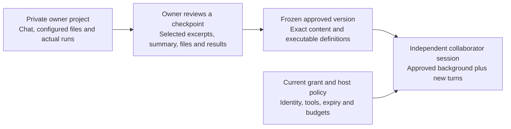

# M2.1: Owner Project Chat and Reviewed Conversation Handoff

Date: **2026-09-17 (America/Los_Angeles)**.

**Status:** After the M2.1a owner-chat delivery and a scope discussion, the owner explicitly authorized **M2.1b**. Manual reviewed-handoff preparation is now implemented and awaiting acceptance; see [its guide and evidence](m2-reviewed-handoff.md). M2.1c remains planned and unauthorized. The earlier M2.1a delivery record below is preserved. This does not retroactively accept all M1/M2 work, increase the model allowance or authorize cloud deployment. See the [roadmap](roadmap.md) for the active gate.

**Subsequent M2.1c checkpoint:** The user explicitly authorized [contextual collaborator continuation](m2-context-continuation.md), which is now implemented and awaiting review. Approved contextual versions are active and can be revoked; older statements below about blocked activation describe the prior delivery checkpoint. No broader M2 or private-pilot acceptance is implied.

## User outcome

An owner works with a project agent, reaches a useful checkpoint, and hands selected context and resources to a collaborator. The collaborator sees the approved prior work and can continue a meaningful question or verification immediately. The owner retains a separate private working conversation.

The owner project agent is a working assistant, not merely an assistant for preparing shares. It can discuss configured project evidence, perform explicitly permitted tasks and maintain project conversation history. Automatic inference of what should be shared remains deferred. Integrations that import work from external agents can later target the same reviewed-context format; they are not a prerequisite for native owner chat.

At the M1 checkpoint, the product implemented the latter half of the journey: a fixed source catalog, reviewed file versions, collaborator chat and bounded verification. Its Owner **Conversations** page read collaborator histories. M2.1a now adds distinct **Project chat**, **Project resources** and **Project runs** destinations; the earlier history page is labelled **Collaborator chats**. M2.1b now supplies explicit context preparation; actual collaborator continuation remains absent.

## Experience and default scope

The Owner landing page becomes a project workspace with **Chat** as the primary destination. **Project resources** and **Runs** support the current work; **Shares**, **Collaborator activity** and settings remain separate management destinations. Label owner conversations and collaborator conversations distinctly. Do not add every management control to the chat page.

**Prepare handoff** starts from a chosen completed conversation checkpoint. The owner selects visible message excerpts, reviews a task summary and unfinished questions, includes files and result records, and chooses permitted actions. Nothing is selected for disclosure solely because it was used by the owner agent. Preview the exact recipient-facing content before approving a frozen version.

The collaborator opens on **Shared background**, an ordered, read-only presentation of approved excerpts, task state and evidence, followed by a **Continue from here** composer. Each imported item shows its kind and approved provenance. It is not presented as something the collaborator said or as a newly executed tool result. The collaborator's new turns form a separate branch bound to that version. Further owner work does not appear automatically.

First implement this flow with the existing synthetic paired-evaluation project and fixed bootstrap action. The owner can use its explicitly configured project catalog, including a synthetic owner-only note; the collaborator receives only a reviewed subset. A second synthetic fixture supplies cross-project denial tests. This stage does not import arbitrary personal directories or provide a general coding IDE, arbitrary shell, file editing or automatic source writeback. Those limitations must be visible, and this stage must not be described as a complete coding agent.

## Context continuity and authority

A fresh session can start with substantial approved background. It has a new identity binding, mutable history, execution storage and tool authority. It never resumes the owner's provider thread, process, live agent memory or credentials. Each additional collaborator starts from the same approved background only when entitled to that version, without receiving another collaborator's subsequent conversation.

The owner agent can access more of its configured project than the collaborator can, subject to the owner's project policy and host limits. This does not grant access to the entire computer, unrelated projects or unrestricted execution. Owner and collaborator retrieval, context construction, tools and caches must have separate authorization paths.

An imported sentence such as "the owner approved this command" remains ordinary evidence. Server-held current policy determines whether a new operation is permitted. Historical tool calls are never replayed during session creation. Revoking a share blocks its subsequent reads and new work; it does not delete the owner's working session or recall delivered content. Existing M1 limitations concerning in-flight work remain until the later lifecycle increment passes its gates.

## Implementation proposal

Reuse Python, FastAPI, SQLite, PydanticAI, the configured model adapter, the fixed job executor and the React layout. No framework migration or additional hosted service is proposed. M2.1a added a separate authorized Owner service path. M2.1b reuses its pinned resources and completed history; it does not relabel a reviewer session.

| Component | Proposed change | Boundary |
| --- | --- | --- |
| Owner project and conversation service | Persist an owner-bound project catalog, resource revisions, conversations and turns; expose owner-authenticated chat/read/run endpoints | Derive owner and project scope on the server. Reviewer credentials cannot read these endpoints or select another project by ID. |
| Agent integration | Reuse model orchestration with explicit owner and collaborator scope types and separate context/tool builders | Share reusable code, not mutable history or authority. No boolean in model-supplied arguments can switch roles. |
| Reviewed context builder | Resolve selected completed messages and resources against a captured source revision; materialize the exact candidate before review | Source text is resolved server-side. Owner-edited summaries/excerpts are labelled as edited, never represented as verbatim original messages. |
| Share manifest | Add a versioned context section containing summary, ordered excerpts, approved result records and share-local references | Include exact context bytes in the approval digest. Source changes cannot alter approved context. Old M1 versions load with empty context; never fabricate past dialogue. |
| Collaborator initialization | Load the approved background once as labelled source material alongside this recipient's new history | Do not import arbitrary message roles, system prompts, raw provider messages, tool-call handles or private source locators. Reauthorize context reads and model dispatches. |
| Interface | Owner project chat, checkpoint selection, exact preview and collaborator background/continuation | Distinguish recorded findings, owner-edited summary and new runs. Keep references inspectable without exposing private source APIs. |

The source checkpoint identifies completed owner turns and the resource/result revisions used. It is an application snapshot, not process memory. Freeze a candidate from that checkpoint; later owner messages and file edits belong to later work. Editing a candidate produces a new digest and requires fresh approval. Client-supplied claims about message ownership, completion, role or run success are not authoritative.

Only materialized, approved content is sent to the collaborator or its model. Private source IDs and their mapping to share-local IDs remain owner-side. Citations must resolve to included evidence or explicitly included result records. Unselected supporting resources do not become implicitly shared through a reference. The owner must include them, revise the excerpt, or leave a clearly labelled unsupported reported statement without a private target link. Internal paths, hidden filenames and raw logs are not copied as convenience metadata.

Selecting a message discloses its actual text, including facts derived from excluded files. Excluding a file does not sanitize a selected answer or summary. Show all excerpt/summary/result text in the review and permit explicit omission or editing. Automated secret detection, if added later, cannot replace review or establish semantic privacy. Canary tests check unselected content and accidental context assembly; they cannot prove that an owner-approved summary contains no sensitive inference.

Owner run records are copied only as explicitly reviewed result evidence with executable/input/output identities. They do not grant access to the original run endpoint and are labelled as historical owner results. A collaborator rerun creates a new record, is charged to current limits and uses only the selected inputs. Historical success does not bypass runtime readiness or dependency checks.

## Provider, persistence and environment

- Use the existing development machine, local service and prepared container runtime for synthetic acceptance. No GCP start, external invitation or new package installation is needed for this plan. The local check does not establish reference Linux/Kata pilot isolation.
- Reuse the approved provider only for approved data categories. Before owner chat is enabled, disclose that owner questions, owner-session history, retrieved configured project material and permitted tool results can be sent to that provider, including material excluded from the collaborator share. Existing reviewer-route consent must not silently authorize new private project disclosures.
- Charge both owner and collaborator dispatches to the same persistent operator allowance, with separate role/session attribution. Preserve the existing authorized total and reservations; no new database, per-role allowance or restart may extend it. Check remaining allowance before real-model acceptance. If insufficient, complete no-cost checks and report the exact missing live acceptance instead of resetting usage.
- Retain finite request, turn, context and runtime limits. Explain a context limit before submission when possible; do not silently truncate selected background, drop task state, compact private history into a public summary or raise limits to make a demo pass.
- Use additive, versioned SQLite/manifest changes with migration checks against an existing M1 fixture. Preserve existing shares, collaborator sessions, audit records and budget reservations. Owner work and reviewed copies have explicit retention scopes; source deletion does not silently alter previously approved bytes.
- Optional measurements remain off by default and contain bounded counts/durations/outcomes, not raw excerpts or hidden reasoning. Record owner work time separately from handoff preparation/review time, and distinguish a historical result from a new run and a model failure from a permission denial.

## Agile implementation order

M2.1 is the first workstream within M2. The following are individually reviewable user capabilities, not a single undifferentiated implementation. M2.1a and subsequently authorized M2.1b are implemented in the synthetic local scope. The current gate is acceptance of **M2.1b**; no M2.1c work should proceed while awaiting review. The architecture and end-to-end scenario retain planned requirements for collaborator continuation, not implementation claims.

| Order | Capability and dependency | Demonstration | Required denial/failure checks |
| --- | --- | --- | --- |
| M2.1a | **Work with an owner project agent.** Reuse the existing synthetic project, model adapter and bounded executor; no handoff selection dependency. | Owner opens Chat, asks an unscripted question, follows its evidence, requests the permitted seed-7 run, and sees persisted history plus the real result after reload. Owner can discuss the configured synthetic owner-only note. | Reviewer/observer credentials and a different project cannot read owner turns, evidence or runs. Invalid actions/parameters and exhausted budget are denied by the service. Missing model/runtime remains an honest unavailable state. No source writes. |
| M2.1b | **Prepare a reviewed handoff from that work.** Requires M2.1a and the current immutable version flow. | Select a completed checkpoint, approved messages, editable summary, four evidence files and the completed result; inspect exact text and executable; approve a version with a digest covering them all. | Excluded history/notes/metadata are absent. Forged source IDs, client-authored tool outcomes, changed candidate bytes and unresolved private reference targets cannot create hidden access. Later owner changes leave the approved version unchanged. |
| M2.1c | **Continue from the approved background.** Requires M2.1b and collaborator context/tool authorization. | A fresh collaborator sees the handoff context immediately, asks a contextual follow-up, opens an approved reference and requests a real seed-23 verification. It distinguishes the original evidence, historical owner run and new collaborator run. | No raw owner history, provider handle, unselected result or other session can be loaded; imports never execute tools or promote instructions. Revocation denies subsequent context reads/dispatches. A second collaborator does not inherit the first one's new turns. |

M2.1a can be accepted as usable owner chat while handoff selection is still unavailable. M2.1b alone does not establish contextual continuation, and M2.1 is complete only after M2.1c passes. Preserve these distinctions in the interface and delivery report.

After this workstream, continue M2 with one real-project importer, the integrated reference Linux executor, authenticated remote recipients, exact grant changes, lifecycle controls and private-pilot acceptance. None of those gates is satisfied by local owner chat. Independent package export/import and M3 editing remain deferred.

## End-to-end acceptance scenario

Use synthetic paired-evaluation data and an owner-only note containing a unique canary. Prepare an owner-only chat turn discussing that note; keep that turn outside the selected handoff. The canary is synthetic, not a real secret.

1. Owner asks for the result and limitations, then explicitly requests seed 7. Check the sourced answer, actual output and preserved conversation after reload.
2. Owner selects the completed finding/verification exchanges, writes or reviews the purpose and open question, includes the four evidence files and the actual seed-7 result, and leaves the note and canary-containing turn excluded.
3. Preview exactly what the collaborator will receive. A mixed-content message must be omitted or explicitly edited; the preview must not imply that excluding a file automatically redacts its quoted contents. Approve the candidate.
4. Continue the owner's private chat after approval. Open a fresh collaborator session and verify that the approved background is present but the later owner turn is absent.
5. Ask: "Continue the shared analysis: why is the observed difference still insufficient for a real-world conclusion?" The answer should use the shared context and cite evidence, without asking the owner to paste the whole conversation again.
6. Ask for seed 23. Inspect the actual new result, compare it with seed 7, and verify that the UI and answer do not call an imported owner run a new collaborator execution.
7. Probe owner endpoints, cross-project/session IDs, search, citation targets, model request assembly and tool calls for the excluded canary. Checks must establish actual denials/absence in assembled inputs, not just a model refusal. Capture model inputs only in isolated synthetic tests, without production prompt logging.
8. Revoke the share and attempt another context read and model turn. Both are denied without an additional provider dispatch. The owner working session remains separate; previously viewed content is not recalled.

Use deterministic model/transport doubles for authorization, serialization, migrations, context assembly and failure cases. Use real model turns and actual container runs for usefulness and execution acceptance, within the existing approved allowance. Record exact sample counts, failed turns and unverified cases. UI-only demonstrations and mocked answers cannot complete the end-to-end acceptance.

## M2.1a delivery record

M2.1a adds owner-bound projects, immutable resource revisions and conversations through an additive SQLite migration. A server-derived owner/project identity authorizes every chat, evidence, search and run operation. These records do not create collaborator versions or sessions. Owner and reviewer reuse orchestration and the fixed executor with distinct scope adapters; their mutable histories remain separate. The owner agent has no self-grant, share-creation, filesystem-path or general shell tool.

The Owner landing page is now **Project chat**. Starting a chat captures the five configured synthetic files, including the owner-only note. Before enabling its model, the owner acknowledges that questions, history, retrieved project evidence and tool results can go to the configured OpenAI service. Model calls retain the existing route, request limits and one persistent aggregate allowance. Project resources expose the pinned revision; later source edits require a new chat to be captured. The root URL redirects to Owner.

Validation on 2026-09-17 local / 2026-09-18 UTC is recorded in [m2-owner-chat.json](validation/m2-owner-chat.json):

- **40 focused automated tests passed:** 11 owner, 13 sharing/API, 12 agent and 4 job tests. These use labelled model/transport doubles and mocked worker launch where appropriate. Owner/reviewer scope, cross-project IDs, private-canary absence in collaborator model inputs, strict request fields, consent, shared budget races, immutable revisions and additive migration are checked. A failed intermediate diagnostics assertion was corrected to handle the SDK's `ValidationError` cause; the final suite passed.
- **Four real model turns:** two completed and two failed structured-output validation. The first answer cited project evidence and the owner note without executing. The second requested one actual seed-7 run, which completed even though its final model answer failed. A read-only recovery attempt also failed; a later bounded follow-up successfully cited the existing run without repeating execution. Historical failures remain visible. Their exact invalid fields were not retained, so no specific cause or reliability fix is claimed. New failures retain only known schema field names, never rejected values or raw provider payloads.
- **One actual development-container run:** mean difference 0.0225, bootstrap interval approximately [0.005, 0.0425], eight synthetic pairs, 300 resamples, exit zero and container removal confirmed. All five source-file hashes were unchanged. This does not validate Linux/Kata application integration.
- **Browser checks:** disclosure and chat creation, evidence citation panel, private project search, successful run reference, persisted history after service restart/reload, draft retention across management navigation, existing shares, and the 390px navigation drawer. Frontend build and focused Ruff checks passed. No claim of full accessibility or browser compatibility coverage.
- All pre-existing M1 versions, sessions, turns, runs, access requests, events and model reservations were preserved exactly. Live checks added owner records and charged the same ledger. No cloud host was started, dependencies added, total allowance raised, work committed or content published.

Known limits: one configured synthetic project; read-only resource snapshots; one fixed bootstrap action; 12 turns per conversation; up to six runs per conversation and 24 across the local store; finite global model/runtime concurrency. Model output can fail even after successful execution, so inspect **Project runs** before requesting another run. Owner consent gates external inference; it is not approval to share owner content with collaborators. Demo capability credentials do not establish named remote identities. Reviewed conversation handoff, broad project import, edits and private-pilot readiness remain unimplemented.

## Try Owner project Chat

Reuse the [M1 build and startup instructions](m1-local-sharing.md#run-the-current-increment) and the existing state directory. On an already configured installation, preserve its explicitly authorized `--model-budget-cents` value and purpose-specific credential path when restarting; do not reset usage. Keep startup capability URLs out of repository documents.

1. Open the current authenticated Owner link. **Project chat** is the default. Choose **New chat** to inspect the five-file scope and model disclosure. Starting a model-enabled chat requires the disclosure checkbox; without a model configuration, file browsing/manual runs remain available and chat is labelled unavailable.
2. Ask: "Briefly explain this synthetic project's result and the purpose of private-notes.txt. Cite the files; do not run anything." Open a citation and check its numbered source text. Owner-only here means unavailable to collaborator routes; model-readable content can be sent to the disclosed provider.
3. Ask for a real seed-7 verification. Open **Project runs** or the returned run reference and inspect the new record, exact output and cleanup. If the answer fails, the run can still have completed: inspect it first, then ask to read that existing result without another execution. The prepared acceptance conversation already contains a real result and successful explanation, so it can be inspected without spending more allowance.
4. Return to Chat, type an unsent draft, visit **Shared projects**, then return; the draft remains. Clear it before refreshing. Reload or select the existing conversation in **Owner conversation** to recover its server-held history; browser refresh does not promise to preserve an unsent draft.
5. Open **Project resources**, search the synthetic private-note marker and inspect the pinned revision. **Shared projects**, **Access requests** and **Collaborator chats** remain separate. No automatic handoff occurs when talking to the owner agent.

Stop for acceptance of this increment. The next proposed capability is **M2.1b: prepare and review exact handoff context from completed owner work**; it has not been implemented in parallel.

## Subsequent M2.1b delivery

The owner later reviewed the distinction between manual selection and future agent-assisted boundary proposals, then explicitly authorized M2.1b. [Reviewed-handoff preparation](m2-reviewed-handoff.md) is now implemented: completed checkpoint selection, editable excerpts/summary, pinned files, real historical result copies, share-local references, exact approval and separately reviewed revisions. Fifty focused checks and a browser walkthrough passed without new model calls or runtime jobs. Saved contextual versions remain unavailable to legacy collaborator sessions until separately authorized M2.1c. This checkpoint supersedes the earlier next-step statement above, while preserving its historical results and failed model turns.
