# Prism Roadmap

Last reviewed: **2026-09-23 (America/Los_Angeles)**. This is the maintained overview of delivery status and next steps. The [product design](product-design.md) defines requirements; milestone guides and linked validation records establish what was implemented and tested. Dates in those records may use UTC.

**Current position (2026-09-23):** M2.3 reference Linux runtime integration passed real cloud acceptance at 46/46 checks; owner acceptance and pilot readiness remain false. The local order 4 identity-service implementation passed its 174-test validation. On the private Google OIDC/Tailscale HTTPS service, bounded recipient flows have been exercised on synthetic Paired and Document release handoffs. They include exact-identity invitations, fresh scoped sessions, denial of unauthorized evidence and owner APIs, model-backed evidence questions, and grant revocation followed by denied reads. An earlier recorded Document release `json-check` run completed on `io.containerd.kata.v2` in 3.979 seconds with exit 0 and confirmed cleanup. A test-recipient grant was recorded with expiry 2026-09-24 03:35:54 PDT; check the live interface for current access. The temporary aggregate model reservation ceiling is $10.00 (1,000 cents); the previous $0.80 reservation remains recorded, leaving $9.20 at that checkpoint before later demo calls; check the live interface for the current remainder. This app-side ceiling is not a hard provider billing cap and remains until the user explicitly ends the demo; lowering it again requires an explicit user request. These are bounded live evidence, not full M2 acceptance, a broad security proof, or pilot readiness; keep `pilot_ready=false`. See the [sanitized live recipient record](validation/m2-recipient-live-identity.json), [live demo SOP](live-demo-sop.md), [guest service guide](m2-recipient-guest-service.md), and [private deployment checkpoint](validation/m2-recipient-private-deployment.txt).

**Current authorized increment:** The named recipient path has now been exercised on synthetic Paired and Document release handoffs. The Document release flow used an exact issuer/subject invitation and fresh session; unauthorized evidence, owner API access, and unrelated-session evidence were denied. Its approved fixed `json-check` completed in Kata, and revoking that release's grant made its file and run unavailable and removed its review workspace. The earlier Paired grant remained unchanged. An earlier recorded live run completed on `io.containerd.kata.v2` in 3.979 seconds with exit 0 and cleanup confirmed. A test-recipient grant was recorded with expiry 2026-09-24 03:35:54 PDT; check the live interface for current access. The temporary $10.00 (1,000-cent) aggregate model reservation ceiling retains the earlier $0.80 reservation, leaving $9.20 at that checkpoint before later demo calls; check the live interface for the current remainder; this app-side ceiling is not a hard provider billing cap and remains until the user explicitly ends the demo. The VM stays running without auto-stop, with fixed on-demand IAP TCP/22 management access and no public TCP/8443 ingress. This evidence does not establish full order-4 acceptance, a broad security proof, or pilot readiness; keep `pilot_ready=false`. See the [sanitized recipient record](validation/m2-recipient-live-identity.json), [live demo SOP](live-demo-sop.md), [guest service guide](m2-recipient-guest-service.md), and [sanitized deployment evidence](validation/m2-recipient-private-deployment.txt).

**Historical M2.3 cloud acceptance status (r2 checkpoint, 2026-09-20):** The real cloud r2 attempt did not pass: `dedicated_host/initial_guest_helpers_absent` passed; `execution_completed` failed with `EngineError`; `passed=false`, `pilot_ready=false`, `model_calls=0`; and the `PRISM_M23_FAILURE` integration check exited 1. After r2, the instance was `TERMINATED`; no startup script was present; and the disk was retained. Sol is assigned to diagnosis, but the diagnosis round has not actually started because the GCP service is unavailable; the latest observed state remains stopped with no metadata. No root cause is asserted. This is a historical failed checkpoint; the later cloud acceptance is recorded below.

**Historical M2.3 control-plane status (2026-09-21):** The follow-up was cloud-control-plane blocked; no retry was ongoing. Sol's final diagnostic summary recorded 591 debug bytes and exit 124: `active_account_missing=false`, `permission_denied=false`, `service_unavailable=false`, `internal_error=false`, `saw_get_instance=true`, `saw_post_set_metadata=false`, and `saw_operation_wait=false`. The log stopped at the pre-write GET and 90-second timeout; absent POST/operation-wait is not absolute network proof. The observed instance was `TERMINATED` with no startup script, only the original four keys, and the disk retained. The original account was found and restored, but the active-account GET still timed out; r8 never ran. No account identifier or raw debug was recorded; the temporary raw log was trapped and removed (`RAW_LOG_ABSENT`). This is a historical diagnostic checkpoint; the later cloud acceptance is recorded below.

**Historical M2.3 pre-final-acceptance diagnostic and fix status (2026-09-21):** The fixed nerdctl, containerd and Kata versions were expected to pass. The Kata check matrix found product `PATH=/usr/local/bin:/usr/bin:/bin` with `HOME=/nonexistent` exit 1/not found; adding system sbin directories with the same HOME exit 0; using only `HOME=/root` exit 0; and using both exit 0. The minimal fix applies `KATA_CHECK_ENV` only to the Kata check, uses the fixed system PATH, does not inherit private environment, keeps `HOME=/nonexistent`, and leaves other command environments unchanged; parent review passed. Twenty-five focused reference tests, the full 129-test run, and targeted Ruff passed. Read-only image inspection found full, library, and short names exit 1 with `no such image`, while `images --digests` showed one exact fixed-digest row; no cloud root cause is claimed. The later real cloud acceptance and complete machine evidence are recorded below. M2.3 completion-time artifact hashes, including the local post-cloud strict-check hash, are recorded in the validation record; that strict-check hash is not a cloud-run hash.

**Conditional next-stage authorization (2026-09-20):** Successful current acceptance permits the next roadmap stage within the existing scope and budgets. M2.3 is order 3 and its success does not complete all of M2 or establish pilot readiness. After real M2.3 acceptance, the critical security review, and cloud cleanup confirmation, the next remaining M2 backlog item is order 4, **Admit a named remote collaborator**: a recipient-bound invitation over authenticated HTTPS, a fresh scoped session, a sourced question and permitted run, with another identity and direct unauthorized API access denied. Preserve dependency order; **M3: limited continuation** remains dependent on applicable M2 controls and is not the immediate M2.3 successor. This authorization does not waive technical pilot/security gates, skip failed or unverified checks, or authorize indefinite consecutive stages. No new model or cloud budget, credentials, public deployment, or major security-boundary change is authorized; a specific credential, authenticated-HTTPS/public-deployment, or major-boundary decision still pauses work. No additional start approval or repeated owner acceptance is required for the already authorized next stage once its stated conditions are satisfied.

**Current follow-up:** The narrow `fix/run-reference-answers` repair is implemented and validated for the recorded live path, awaiting owner review. It addresses current-session `new_run` references while preserving owner-context-only `historical` references, strict validation, finite output repair, and the existing request/tool/time/budget limits. See the [validation record](validation/run-reference-answers.json). The earlier three-turn walkthrough and 300-cent ledger remain historical records.

**Current refinement proposal:** The owner emphasized agent behavior as a continuing product and research focus. Review the proposed [B0/B1 behavioral baseline and refinement](#agent-behavior-workstream) before treating the M1 agent as mature. These additions are design work; no new implementation, experiment or milestone acceptance is claimed.

## Visual roadmap

The diagram shows dependencies and approval gates, not calendar commitments. Labels carry the status; color is supplementary.

```mermaid
flowchart TB
    M0["M0 · VALIDATED FEASIBILITY<br/>Host diagnostics and reference Linux/Kata spike"]
    M1["M1 · IMPLEMENTED · REVIEW NOT RECORDED<br/>Reviewed snapshots, independent reviewer chat<br/>Bounded verification and local revocation"]
    A["M2.1a · IMPLEMENTED<br/>Private project chat, evidence and actual runs<br/>Historical live-model failures retained"]
    B["M2.1b · IMPLEMENTED<br/>Manual selection, exact preview, approval and revision<br/>50 focused checks; no new model or runtime calls"]
    GB{"Review general workspace refinement<br/>Then scope the next M2 increment"}
    C["M2.1c · IMPLEMENTED<br/>Approved background, fresh agent, scoped tools<br/>54 tests; live run and answer recovery"]
    UI["IMPLEMENTED · HISTORICAL CHECKPOINT<br/>Conversation, resources, permissions and activity<br/>17 focused regressions and browser checks retained"]
    M2["M2.2 · IMPLEMENTED · LOCAL VALIDATION PASSED<br/>Explicit project import, file review, direct handoff<br/>Fixed json-check action; owner review pending"]
    G22{"M2.2 review complete<br/>and owner accepts scope"}
    M23["M2.3 · IMPLEMENTED · CLOUD ACCEPTANCE 46/46 · PILOT PENDING<br/>Reference Linux Jobs → worker → Kata runtime<br/>Fixed json-check; fail-closed readiness"]
    M2R["M2 ORDER 4 · IMPLEMENTED LOCALLY · BOUNDED LIVE E2E PASSED<br/>Named remote collaborator<br/>Second identity, scoped read, denied access and revocation<br/>Full acceptance and pilot gates pending"]
    G2{"Applicable M2 controls<br/>and pilot gates pass"}
    M3["M3 · PLANNED<br/>Scoped edits and reviewed return of changes"]
    M4["M4 · PLANNED<br/>Easier preparation and open release"]
    M5["M5 · PLANNED<br/>Additional hosts and compute"]
    H["INDEPENDENT HANDOFF · DEFERRED<br/>Reviewed export, safe import and fresh destination agent<br/>Order relative to M3–M5 remains undecided"]
    R["AGENT BEHAVIOR · PROPOSED<br/>Repeatable baseline, evidence and recovery<br/>Later controlled research experiments"]
    M0 --> M1
    M1 -- "M2.1a separately authorized" --> A
    A -- "M2.1b separately authorized" --> B
    B -- "M2.1c separately authorized" --> C --> UI --> GB
    GB -- "M2.2 separately authorized" --> M2 --> G22 --> M23 --> M2R --> G2
    G2 -. "M3 after applicable M2 controls" .-> M3 --> M4 --> M5
    G2 -. "Separate handoff approval" .-> H
    M2 -. "Scope behavior work before implementation" .-> R
    classDef validated fill:#e5f3eb,stroke:#26734d,color:#173b29;
    classDef current fill:#fff2cc,stroke:#9a6700,color:#4d3500,stroke-width:3px;
    classDef planned fill:#edf3fc,stroke:#466b9b,color:#243b56;
    classDef deferred fill:#f0edf7,stroke:#75608c,color:#443351;
    class M0 validated;
    class M1,UI current;
    class A,B,C validated;
    class M3,M4,M5,R planned;
    class M23 current;
    class M2 current;
    class H deferred;
```

- **Validated feasibility:** real checks passed on a recorded configuration; broader product readiness is not implied.
- **Owner review pending:** implemented behavior and its limitations are available to inspect; tests do not substitute for owner acceptance.
- **Planned:** requirements and proposed work, not delivered functionality or implementation authorization.
- **Deferred:** documented future work that must not displace the online-sharing gates.

Owner-local hosting and an authorized development server are two placements of **online sharing**. In both, the owner provides the running service and retains control over subsequent access. **Independent handoff** transfers reviewed resources to a collaborator-controlled environment. Inspect, Verify and Continue are capability levels, separate from these delivery modes. See the [delivery-mode design](product-design.md#delivery-modes).

## What is available now

| User capability | Implemented and exercised | Current boundary or remaining work |
| --- | --- | --- |
| Check a runtime before use | M0 host diagnostics, synthetic development runtime checks and a separate real Linux/Kata feasibility spike | The M1 application still uses the development container path. The validated Kata spike is not an integrated pilot executor. |
| Navigate a focused review workspace | Separate owner management and conversation-first reviewer views, evidence side panels, responsive navigation and explicit revoke confirmation | M1 interface revision awaiting owner review; no new backend authority or remote access capability. |
| Work with an owner project agent | Private project chat, five pinned synthetic resources, actual bootstrap runs, citation panels and persisted history | M2.1a delivered; user subsequently authorized M2.1b. No arbitrary project import, editing or unrestricted host access. |
| Prepare selected working context | Manual excerpt/summary/file/result selection, exact preview, immutable approval and separately reviewed revisions | M2.1b delivered; M2.1c separately authorized. No automatic boundary recommendation; only approved versions can start sessions. |
| Continue from handed-off context | Approved background landing, independent agent context, separate historical/new run references; real seed-23 execution and read-only recovery answer | M2.1c awaiting review. Synthetic project only; one live final answer failed. No raw owner state or arbitrary tools imported. |
| Import one explicitly supported project | Operator-configured strict manifest, manual source/file selection, immutable copied bytes, direct file-only handoff, and the fixed `json-check` capability are implemented and locally validated | M2.2 awaits owner review; acceptance uses the authorized English `document-handoff` local-project example. No private-workspace acceptance, arbitrary scripts, recursive scan, broad import format, reference-Linux integration, or pilot-readiness claim. |
| Integrate the reference Linux runtime | Trusted Jobs → worker → Kata path for the imported project's fixed `json-check`, with canonical action binding, fail-closed readiness, durable ownership, cleanup, and recovery | M2.3 is implemented with bounded reference-Linux cloud acceptance passed 46/46; owner acceptance and pilot readiness remain pending. Mac development behavior and historical records remain unchanged. |
| Prepare a finite share | Explicit selection from the synthetic catalog; freeze copied bytes, inspect content/action and approve the exact version | No arbitrary project import or general action packaging. The immutable version is an application record, not captured process memory or protection against the database administrator. |
| Enter a separate review session | Local owner/reviewer/observer credentials, fresh version-bound session, scoped evidence search and numbered citations; bounded private Google OIDC invitations exercised with a second identity | Paired and Document release invitations were exercised. The Document release grant was revoked and its session lost access; its approved fixed run completed in Kata. These flows do not establish broad security or pilot readiness. |
| Ask the agent about evidence | Real configured model, server-held session history, scoped evidence/tools and validated citation targets | In this bounded recipient flow, one focused answer succeeded with a `limitations.md` citation and one broader question failed closed without a partial answer. This does not establish reliability or general answer correctness. No owner agent memory is reused. |
| Rerun an approved check | Real fixed synthetic bootstrap evaluator with bounded seed; conversational execution; results, provenance and cleanup (manual launch UI removed in the current refinement) | One packaged CPU action in development containers. No arbitrary shell, arbitrary project code workflow or GPU support. |
| Control model allowance | Finite operator-configured total with persistent reservations and visible remaining allowance | Local application allowance, not an API-account spending cap. Increases need authorization; the roadmap is not a live balance display. |
| Ask for more access | A pending request is visible to the owner and grants nothing | No approve/deny grant-expansion workflow yet. Additional evidence currently requires a newly reviewed version. |
| Review activity and revoke | Owner activity/conversation views; version revocation blocks subsequent API access and new work | No established pilot lease, crash-reconciliation or in-flight termination guarantee. Already delivered content cannot be recalled. |
| Measure the demonstration | Bounded local security events and optional numeric measurements | Measurements default off. Full retention/deletion controls and validated usefulness metrics remain future work. |

This is real model and runtime behavior on synthetic data, with explicit limitations. Automated agent tests also use test doubles; they are not live-model evidence. External inference sends approved context, questions, session history and authorized tool results to the configured provider. Local execution does not mean local inference.

## Evidence behind the current status

These are recorded checkpoints, not checks rerun whenever this page is edited.

| Record | Observed result | What it does not establish |
| --- | --- | --- |
| [M0 reference Linux/Kata record](validation/m0-linux-kata.json) and [host guide](gcp-m0-host.md) | 33 synthetic checks passed on the recorded reference configuration | Integrated application isolation, broad platform support or private-pilot readiness |
| [M1 automated verification history](m1-local-sharing.md#verification-record-and-iteration-findings) | Initial full suite: 58 passed. Later allowance change: 12 focused agent tests and 13 sharing/API tests passed; frontend build passed | A fresh full-suite result after every later change; tests using model/transport doubles do not establish model usefulness |
| [M1 runtime record](validation/m1-development.json) | 11 real-path checks passed, including two actual container runs; no model calls | Linux/Kata application integration or pilot lifecycle guarantees |
| [M1 live record](validation/m1-live-model.json) | Five live turns: three completed, two failed; actual seed-7/seed-23 runs; 18 combined live, browser and service checks | A reliability benchmark, 18 independent model trials, semantic correctness or absolute security |
| [M1 interface refresh checks](ui-refresh.md#verification-record) | Frontend build and 13 sharing/API tests passed; browser creation/evidence/request/revoke walkthrough, one real seed-23 run and 390px layout check passed | Fresh live-model validation, a complete accessibility audit or M2 acceptance; no paid model calls were made |
| [M2.1a delivery record](m2-owner-workspace.md#current-delivery-record) and [validation evidence](validation/m2-owner-chat.json) | 40 focused automated tests; frontend build and browser checks; four live turns (two completed, two failed); one real seed-7 run; existing M1 records and reservations preserved | Stable model reliability, completed handoff-context transfer, integrated Linux/Kata execution, owner acceptance or private-pilot readiness |
| [M2.1b guide](m2-reviewed-handoff.md) and [validation record](validation/m2-reviewed-handoff.json) | 50 focused tests, exact review/approval/revision browser walkthrough and 390px layout; historical real result copied; zero new model dispatches or runtime jobs; pre-existing rows preserved | Automatic boundary selection, semantic privacy, M2.1c context execution, remote-pilot readiness or owner acceptance |
| [M2.1c guide](m2-context-continuation.md) and [validation record](validation/m2-context-continuation.json) | 54 focused tests, browser background/reference checks and 390px layout; one real new run; two live turns with one failed answer and one successful recovery; prior rows and aggregate ledger preserved | Reliable success on every model question, arbitrary tool transfer, named identity, pilot isolation or owner acceptance |
| [General workspace guide](general-handoff-workspace.md) and [validation record](validation/general-handoff-workspace.json) | Frontend build, 17 focused regression checks, real persisted activity/details and fresh-session browser checks; no new inference or execution | Arbitrary tools, new model reliability evidence, full internal traces or owner acceptance |
| [M2.2 project-import guide](m2-project-import.md) and [validation record](validation/m2-project-import.json) | 98/98 backend tests; 11/11 focused project checks; 9/9 bounded project-runtime checks; final 11/11 M1 regression; targeted Ruff and frontend checks passed; browser flow and preservation audits passed; zero model calls | Owner acceptance, reference-Linux integration, live model JSON response, or private-pilot readiness |
| [M2.3 Linux runtime guide](m2-linux-runtime.md) and [validation record](validation/m2-linux-runtime.json) | Historical baseline recorded 114 tests and 81 focused tests; final latest local evidence is 129 tests and 25 focused tests, with targeted Ruff, frontend Prettier/build, 9/9 project-runtime checks and 11/11 M1 checks; preservation audit passed; bounded reference-Linux cloud acceptance passed 46/46 | Owner acceptance, pilot readiness, OIDC, lease watchdog, remote API/SSH, public networking, or Docker/runc fallback remain unclaimed |

The live record preserves the original allowance checkpoint. The [subsequent authorized allowance adjustment](m1-local-sharing.md#authorized-allowance-adjustment-validation) did not reset usage. Preserve historical failures and results when adding newer evidence.

## Current step: M2 order 4 named remote collaborator (bounded live validation)

The private service completed bounded second-identity flows over two exact approved synthetic versions. The Paired flow included one-time identity discovery, a read-only invitation, fresh scoped session, approved-file read, denied private evidence and owner API access, a focused cited model answer, and revocation followed by denial of further reads; a broader question failed closed without partial output. The separate Document release flow denied direct unlisted evidence, owner API, and unrelated-session evidence access, completed its approved fixed Kata run, then denied file and run access after revocation. Its revocation did not affect the earlier Paired grant. An earlier recorded live `json-check` run completed in `io.containerd.kata.v2` in 3.979 seconds with exit 0 and cleanup confirmed. A test-recipient grant was recorded with expiry 2026-09-24 03:35:54 PDT; check the live interface for current access. The current temporary aggregate model reservation ceiling is $10.00 (1,000 cents); the prior $0.80 reservation remains recorded and showed $9.20 at that checkpoint before later demo calls; check the live interface for the current remainder. The app-side ceiling is not a hard provider billing cap and stays until the user explicitly ends the demo; lowering it again requires an explicit user request. See the [live recipient record](validation/m2-recipient-live-identity.json), [end-to-end demo SOP](live-demo-sop.md), [guest guide](m2-recipient-guest-service.md), [local implementation guide](m2-recipient-invitations.md), and [local validation record](validation/m2-recipient-invitations.json). Full order-4 acceptance and pilot gates remain unverified; `pilot_ready=false`. The VM stays running with no automatic stop, fixed on-demand IAP TCP/22 remains configured, and public TCP/8443 ingress remains closed.

### Completed preceding step: M2.3 reference Linux runtime integration

The current capability is **M2.3: integrate the reference Linux runtime** for the approved bounded action. It is implemented and real cloud acceptance passed 46/46 checks under the [M2.3 guide](m2-linux-runtime.md); pilot readiness remains false. Automatic preparation recommendations, arbitrary tools and broader import formats remain later work.

The [interface refresh](ui-refresh.md#try-the-refreshed-interface) and broader M1 remain unaccepted. Their existing [M1 acceptance walkthrough](m1-local-sharing.md#acceptance-walkthrough), using the [concrete researcher/supervisor scenario](m1-local-sharing.md#a-concrete-first-use-scenario), remains available:

1. Select the four synthetic evidence files, exclude the private note, inspect the frozen content/action and approve the exact version.
2. Start a fresh reviewer session, open evidence and ask a narrow sourced question through the explicitly configured model.
3. Execute the approved seed-23 verification, inspect its actual result and distinguish it from the recorded baseline.
4. Request additional access and verify that the request alone grants nothing; inspect it in the owner view.
5. Revoke the version and confirm subsequent evidence access is denied, without claiming to erase already delivered content.
6. Review the recorded failures and limits, then explicitly accept M1 or request revisions. The separately authorized M2.1a does not itself record M1 acceptance.

Use the current approved model allowance; browsing evidence and existing results does not require model dispatches. The current UI requests new work through conversation. A documentation update, model configuration, allowance increase or successful test does not count as milestone acceptance.

The proposed B0/B1 refinement below was initially suggested for M1. Following the owner's sequencing clarification, it is not a mandatory predecessor to M2. Scope relevant behavior work into the M2 proposal and obtain approval before implementation. The earlier demonstration evidence is preserved.

## Agent behavior workstream

The agent is an ongoing product component, not a completed SDK integration. The [behavior plan](agent-behavior.md) specifies desired behavior, candidate mechanisms, failure cases and fair evaluation. This work supports online sharing and does not replace its isolation or identity gates.

**Foundation:** Follow the owner's preference to reuse established agent architecture. Retain the integrated PydanticAI foundation for the proposed B0/B1 work; assess other orchestration or coding-agent components only when the relevant milestone demonstrates a need. See the [reuse assessment](agent-behavior.md#reuse-an-established-agent-foundation). The custom focus is handoff behavior and evaluation, with authority enforced independently.

| Proposed increment | Placement | Observable outcome | State |
| --- | --- | --- | --- |
| B0: Behavior baseline | Scope into the M2 proposal; originally proposed for M1 | A repeatable report distinguishes supported answers, unnecessary actions, missing evidence, recovery and boundary outcomes, with a frozen baseline and explicit test-double/live labels | Proposed; not implemented or a mandatory extra stage before M2 |
| B1: Reliable evidence review | Scope into the M2 proposal after B0 | Correct baseline/new-run provenance, evidence-only answers without execution, useful uncertainty and reuse of already completed work | Proposed; existing prompted behavior is not proof of passing these cases |
| B2: Useful bounded collaboration | M2 with its identity/grant/lifecycle controls | Precise clarification/access requests, finite recovery and continuity under actual permitted capabilities | Planned; depends on M2 controls |
| B3: Generalization and method experiments | Accepted online pilot and separately scoped research work | Controlled comparisons on held-out projects/follow-ups assess behavior, owner effort, safety outcomes and cost separately | Planned; no research contribution established |

The newly implemented synthetic [owner project-working agent](m2-owner-workspace.md) is distinct from later automatic share-preparation assistance. Owner work comes first; explicit manual review determines what is handed over. A future preparation assistant only proposes material and cannot silently grant access. Compare preparation methods with a fixed collaborator agent, and collaborator behaviors with a fixed approved package/runtime. No new model provider, training requirement, increased allowance or parallel implementation is authorized by this plan.

## M2: proposed online-sharing backlog

**Status: M2.1a, M2.1b, M2.1c and M2.2 are separately authorized and implemented; M2.2 awaits owner review. M2.3 is implemented with real cloud acceptance passed. Order 4 is implemented locally and has passed one bounded synthetic second-identity recipient flow on the private service; Kata-through-service validation, full order-4 acceptance and all remaining pilot gates remain open.** M2.1 is the first workstream, split into the three individually testable capabilities in its [detailed proposal](m2-owner-workspace.md#agile-implementation-order). Refine remaining increments before their implementation. Each needs observable normal and denial-path acceptance. The following is a dependency order, not a commitment to implement everything in one indivisible feature.

| Order | Usable increment | Acceptance to demonstrate | Dependency |
| --- | --- | --- | --- |
| 1a | M2.1a: Work with an owner project agent — implemented | Owner has a real project conversation, evidence references, an actual permitted run and persisted private history. Direct reviewer/cross-project access to owner resources fails. | Explicit M2.1a scope approval received; existing synthetic project, bounded executor and approved provider/data route. M1 acceptance is not inferred. |
| 1b | M2.1b: Review a conversation checkpoint for handoff — implemented | Select exact excerpts, task state, files and actual result evidence; approve an immutable version. Excluded history and private reference targets are absent; later owner work cannot change it. | M2.1b explicitly authorized after scope review; reuses M2.1a and the version mechanism. Context is included in the digest. M2.1c subsequently enables approved contextual versions. |
| 1c | M2.1c: Continue with approved background — implemented, awaiting acceptance | A fresh collaborator sees prior approved work, asks a contextual follow-up and completes a permitted rerun. Private owner state and other sessions remain inaccessible; imported actions never replay. | M2.1b, collaborator context authorization and current grants/budgets. Local acceptance does not establish remote-pilot readiness. |
| 2 | M2.2: Prepare one explicitly selected project beyond the fixed fixture — implemented, locally validated | On one supported project format, select files and reviewed context, review a bounded environment and one typed action, and approve exact bytes. Excluded canaries, unsafe paths and changed candidates cannot expand the share. | M2.1; validation record complete for local development. Owner review remains pending; additional importer formats remain later work. |
| 3 | M2.3: Run the approved action on the reference Linux host — implemented, real cloud acceptance passed | Integrate the trusted reference-Linux worker/Kata runtime with the application. A real job uses only approved inputs, separate writable storage and finite limits; failed readiness blocks activation. | Real cloud acceptance recorded; pilot gates remain pending. No silent Docker/runc fallback, remote API/SSH, or public networking. |
| 4 | Admit a named remote collaborator — local implementation and bounded live recipient flows exercised; full acceptance incomplete | Distinct Google OIDC sessions were scoped to exact approved Paired and Document release versions. Unauthorized evidence and owner API access were denied. The Document release's permitted `json-check` completed in Kata; revoking that release grant made its file, run, and workspace unavailable without affecting the earlier Paired grant. The current USC demo grant is active until 2026-09-24 03:35:54 PDT. | These bounded flows are not broad security evidence. Full order-4 acceptance remains unverified; `pilot_ready=false`. Temporary $10.00 app-side aggregate model reservation ceiling; $0.80 previously reserved, $9.20 remains. IAP SSH management remains fixed on-demand; no public TCP/8443 ingress. See the [sanitized live recipient record](validation/m2-recipient-live-identity.json), [demo SOP](live-demo-sop.md), and [guest service guide](m2-recipient-guest-service.md). |
| 5 | Resolve a request for additional access | Owner can approve or deny an exact request, with version, action, parameters, expiry and budget where applicable. Pending/denied requests grant nothing; content additions require review. | Named identities and server-side grant revisions; approval is not automatic replay. |
| 6 | Stop access and work reliably | Revoke or expire access during streams, queued/running jobs and downloads; exercise disconnected hosts and restarts. Leases, cancellation and reconciliation meet the product's stated targets without replaying uncertain work. | Integrated executor, grants, durable job state and finite aggregate budgets. |
| 7 | Explain and control records | Collaborator sees owner visibility, provider disclosures and retention. Owner can inspect bounded audit outcomes and apply the documented retention/deletion policy; optional research measurement can be disabled. | Stable session/job lifecycle and storage policy; no unrelated private-content collection. |
| 8 | Accept the private online pilot | A second authenticated user completes the review scenario. Record normal and adversarial results for EVAL-01 through EVAL-12 on the supported configuration, disclose remaining limitations and obtain owner acceptance. | All relevant increments above; any known boundary bypass blocks pilot release. |

The [existing evaluation gates](product-design.md#evaluation-and-release-gates) remain authoritative. Identity alone does not make the local demonstration ready for outside users. A deployment or expense still needs its applicable authorization. Model usefulness, failure recovery, unsupported claims and unnecessary refusals must be measured alongside enforcement; prompt changes are not security controls.

## Later product milestones

Existing milestone identifiers and priorities are preserved from the [product roadmap](product-design.md#roadmap). The dated conditional authorization above permits the next remaining M2 stage after its stated M2.3 gates pass; M3 follows only after applicable M2 controls are in place, and later milestones remain separately scoped and authorized.

| Milestone | Planned user outcome | Observable exit condition |
| --- | --- | --- |
| M3: limited continuation | Collaborator edits an isolated workspace with approved tools and returns a patch or result for owner review | A useful change can be inspected and accepted without automatic mutation of the source project. Scope, artifacts and denied operations have direct boundary checks. This is not full environment handoff. |
| M4: easier preparation and open release | Assisted scope proposals, additional importers and clearer setup reduce preparation effort; release material reflects actual support | Pilot comparisons show useful outcomes and preparation cost. The owner approves a license and release; setup and security claims match tested behavior. No public release is authorized by this roadmap. |
| M5: additional hosts and compute | Validated desktop host adapters, GPU scheduling and broader workflows | Each advertised platform has measured isolation/resource behavior and reproducible setup. Missing enforcement blocks the affected capability. |

Measure owner preparation time and interventions, useful questions/verifications, evidence/dependency/permission failures, blocked boundary attempts, startup/execution/model cost and repeat use. Use synthetic or explicitly approved data, keep optional measurement disableable, and distinguish observations from research hypotheses. Product value, novelty and performance advantages remain to be established.

## Deferred independent handoff

Start only after online sharing passes its relevant private-pilot gates, is accepted by the owner, and a concrete handoff stage is explicitly approved. Its order relative to M3-M5 is deliberately undecided. The rows below are work items within this separate future workstream, not new M0-M5 milestones.

| Sequence | Planned capability | Acceptance |
| --- | --- | --- |
| 1 | Reviewed export candidate | Inspect selected files, curated agent context, environment image or pinned build recipe, tool definitions, provenance and reference results. Approve the exact package separately from online access. Excluded material, embedded secrets and live authority are absent. |
| 2 | Safe import and reconstruction | On one supported destination, review inventory and transfer provenance, verify digests and check runtime/dependencies. Reject tampering and unsafe paths; importing does not automatically run host scripts or broaden permissions. |
| 3 | Fresh destination agent and verification | Recipient supplies model configuration, credentials and finite budgets. A fresh agent answers an evidence question and completes a real reference check, without inherited owner history, keys or grants. |
| 4 | Independent acceptance and lifecycle | Accepted capabilities work with the original host unavailable, with external dependencies disclosed. Updates, returned changes and local deletion are explicit separate actions. |

The package is more than a filesystem or container image, and does not claim to preserve active RAM/GPU process state. The recipient controls its destination host; the original owner cannot revoke an acquired copy or enforce tamper-resistant restrictions against its administrator. Online access revocation controls subsequent online service access. Full requirements remain in the [delivery-mode addendum](product-design.md#delivery-modes).

## Keeping this roadmap current

Update this file as part of each authorized increment or milestone handoff, and when scope, validation evidence, a blocker or owner acceptance changes. This is a development deliverable, not a scheduled background task.

1. Inspect the actual checkout and relevant evidence; update the review date, current-position statement, diagram, capability table and next action together.
2. Link the milestone acceptance record and checks actually run. State their configuration and scope; distinguish mocks, live behavior, skipped checks and historical results. Preserve failed attempts.
3. Record owner acceptance and next-stage authorization explicitly. Never infer either from test results, a new design paragraph, credential configuration or elapsed time.
4. Keep product requirements, the active milestone backlog, documentation navigation and this status overview consistent. A material scope/security change needs confirmation before dependent implementation.
5. Append a short dated entry below. Check English-only content, links and diagram/status consistency. Do not copy credentials, private transcripts, live authentication links or volatile remaining balances into the roadmap.

### Update log

| Date | Change | Next action |
| --- | --- | --- |
| 2026-09-23 | Completed the private owner-only OIDC deployment checkpoint and one bounded synthetic evidence-only owner answer using the fixed model snapshot and $1.00 aggregate reservation; 20 cents was reserved. A three-file read-only handoff draft with one answer excerpt is pending owner approval. No recipient, second-identity, Kata-through-service, or pilot acceptance is claimed. | Complete separately scoped recipient and remaining order-4 acceptance; keep the draft pending until owner review and preserve `pilot_ready=false`. |
| 2026-09-17 | Created the maintained visual roadmap from recorded M0/M1 results; preserved M1 review status and online-sharing-first priority; separated the deferred independent-handoff workstream. No application or runtime changes. | Owner reviews M1; resolve requested revisions before any separately authorized M2 work. |
| 2026-09-17 | Added the proposed agent behavior workstream following owner feedback, including B0/B1 local refinement, M2 collaboration behavior and later controlled research experiments. Implementation and historical evidence are unchanged. | Review the proposed B0/B1 acceptance scope, starting with a repeatable behavior baseline; M1 remains unaccepted and M2 unauthorized. |
| 2026-09-17 | Recorded the owner's preference for an established agent foundation and the documentation-based reuse assessment. PydanticAI remains the default for the proposed local refinement; no dependency or architecture migration was performed. | Evaluate behavior on the existing foundation before proposing additional orchestration infrastructure. |
| 2026-09-17 | Completed the requested M1 interface revision: owner management, conversation-first reviewer navigation, evidence panels and revoke confirmation. Recorded focused API/browser/runtime checks without paid model calls. Clarified that B0/B1 is not an extra mandatory stage before M2. | Present the running interface and stop for owner review. Resolve revisions, then seek authorization for the next major milestone, M2. |
| 2026-09-17 | Recorded the owner's confirmed project-chat and contextual-handoff direction. Added the product/agent addenda and M2.1 proposal with owner chat, exact checkpoint review and independent continuation. Existing M1 evidence and implementation are unchanged. | Review M2.1a scope and acceptance before authorizing implementation; do not treat direction confirmation as M1 acceptance, additional spending or approval for all M2 work. |
| 2026-09-17 | Implemented the separately authorized M2.1a owner project chat on `prototype/m2-owner-chat`. Recorded 40 focused tests, four real model turns including two failures, one actual run, browser checks and preserved M1 state/allowance. No M2.1b/c work or new cloud activity. | Owner accepts or requests changes to M2.1a; next proposed capability is M2.1b exact handoff-context review. |
| 2026-09-17 | Implemented explicitly authorized M2.1b on `prototype/m2-reviewed-handoff`: manual selection, exact disclosure, approval and revision. Recorded 50 focused tests and a browser walkthrough using an existing real result; no new inference, execution or cloud spending. Saved context remains unavailable to legacy recipients. | Owner accepts or requests changes to M2.1b; next proposed capability is M2.1c scoped collaborator continuation. |

- **2026-09-17 — M2.1c delivered for review:** Activated approved context in fresh collaborator sessions, separated background/historical/current-run provenance, retained one real failed answer and successful no-rerun recovery. Updated the next gate to M2.1c acceptance; subsequent project import remains unauthorized.

- **2026-09-19 — General-purpose interface refinement authorized:** Reorganized the UI around conversation, resources, capabilities and activity; keep the experiment as a fixture. Validation and review are tracked in the [guide](general-handoff-workspace.md). No backend permission expansion or M2.2 authorization.

- **2026-09-19 — M2.2 explicitly authorized:** The owner authorized `prototype/m2-project-import` for one strict local project-manifest format, explicit file review, direct file-only handoff, and the bounded `json-check` action. Backend/frontend implementation and validation are in progress; the earlier interface refinement's 17-check evidence remains historical and unchanged. No model call, cloud activity, validation JSON record, or private-pilot readiness is claimed here.

- **2026-09-20 — M2.2 locally validated:** Recorded 98/98 backend tests, 11/11 focused project checks, 9/9 bounded project-runtime checks, the final 11/11 M1 regression with restored program hash, targeted Ruff/frontend checks, browser acceptance, and preservation audits in the [validation record](validation/m2-project-import.json). Four unrelated formatter changes were restored byte-for-byte after an audit found they could alter an approved program hash; old database hashes then matched. No model calls or cloud activity occurred. M2.2 awaits owner review; M2.3 reference-Linux integration requires approval.

- **2026-09-20 — Bounded live walkthrough finding:** The synthetic-data real-model walkthrough connected the JSON tool and completed one cited file answer, but two final answers failed on source-reference classification, including one historical-result reference. The owner-visible session retained all three turns after revocation; reviewer access to the revoked version was denied. Priority recommendation: review and improve agent classification of current versus historical references before M2.3; this requires user approval and does not start implementation.

- **2026-09-20 — Run-reference repair authorized:** The owner approved `fix/run-reference-answers` to make current-session completed runs available to `new_run` answers while retaining the approved-context boundary for `historical` references. The one finite output-correction path disables function tools and does not rerun work. No validation or live pass is claimed yet.

- **2026-09-20 — Run-reference repair validated (historical pre-M2.3 checkpoint):** The repaired branch passed 54 focused tests with targeted Ruff and completed two real model-backed turns referencing the same completed run without rerunning it. The output correction hid function tools and preserved request/tool/time/budget limits; the existing database rows and bootstrap hash remained unchanged. The [validation record](validation/run-reference-answers.json) records the scope and limitations. M2.3 remained unstarted and separately gated at that checkpoint.

- **2026-09-20 — M2.3 authorized (historical authorization):** The owner authorized `prototype/m2-linux-runtime` for the trusted reference-Linux Jobs → worker → Kata path serving the imported project's fixed `json-check` action. The backlog covers canonical action binding, fail-closed readiness, durable ownership, cleanup, and recovery; no runtime/cloud pass was claimed at that point. Mac development behavior and historical records remain unchanged, and full pilot gates remain outside scope.

- **2026-09-20 — M2.3 cloud r2 acceptance failed (historical checkpoint):** The recorded real cloud attempt passed `dedicated_host/initial_guest_helpers_absent` but failed `execution_completed` with `EngineError`; `passed=false`, `pilot_ready=false`, `model_calls=0`, and `PRISM_M23_FAILURE` integration-check exited 1. The r2 instance was then `TERMINATED`, with no startup script and the disk retained. GCP service unavailability prevented the diagnosis round from actually starting; the latest state at that checkpoint remained stopped with no metadata. No root cause was claimed; later real cloud acceptance is recorded above.

- **2026-09-20 — Conditional next-stage authorization:** After real M2.3 acceptance, the critical security review, and cloud cleanup confirmation all pass, the owner authorizes the next remaining M2 stage, order 4: Admit a named remote collaborator. M2.3 success is not completion of all M2 or pilot readiness; M3 remains dependent on applicable M2 controls. This does not waive technical pilot/security gates, skip failed or unverified checks, add budget/credentials/public deployment, or authorize a later stage; no additional start approval or repeated owner acceptance is required for the already authorized next stage once the stated conditions are met.

- **2026-09-21 — M2.3 control-plane follow-up blocked (historical checkpoint):** The final diagnostic summary recorded 591 debug bytes and exit 124 after a pre-write GET and 90-second timeout; no POST or operation-wait was observed, without treating that absence as absolute network proof. The instance remained `TERMINATED` with no startup script, only the original four keys, and the disk retained. The original account was restored but the active-account GET still timed out; r8 never ran. Raw temporary debug was trapped and removed (`RAW_LOG_ABSENT`). M2.3 was still failed and the next stage had not started at that checkpoint; later real cloud acceptance is recorded above.

- **2026-09-21 — M2.3 local fix and cloud follow-up (historical pre-acceptance checkpoint):** The KATA_CHECK_ENV matrix fix passed its parent security review, 15 focused reference tests, the full 119-test run and targeted Ruff; image inspection and the prior RepoDigests fix remain local evidence, not cloud root-cause proof. The diagnostic script was uploaded and started, but no reliable result was obtained. After Chrome input was restored, Sol resumed the cloud follow-up; the last VM state at that checkpoint was confirmed running, current state was unknown, cleanup was unverified, and the next stage had not started. Later real cloud acceptance is recorded above.

- **2026-09-21 — M2.3 real cloud acceptance (historical checkpoint):** The later real cloud run passed 46/46 checks with `passed=true`, `pilot_ready=false`, and `model_calls=0`. Revocation required `owned_running` and ended `cancelled_after_active_revoke`; trusted cancelled/null result, fixed error, exact resource absence, final namespace/helpers, and `PRISM_CLEAN_FINAL` cleanup passed. Cleanup recorded `TERMINATED` with zero startup-script metadata keys; final namespace was empty and exact resources were absent, and the disk was retained. At that checkpoint, the next M2 stage had not started.

- **2026-09-21 — M2.3 evidence finalized (historical checkpoint):** Parent review passed; 25 focused reference tests, the full 129-test run and targeted Ruff passed. The complete 46-check machine report is transcribed in [the cloud-pass record](validation/m2-linux-runtime-cloud-pass.json), with `pilot_ready=false`, retained disk and no next-stage start at that checkpoint. M2.3 completion-time artifact hashes are recorded in the validation record; its post-cloud strict-check hash is explicitly local and is not a cloud-run hash.

- **2026-09-21 — M2 order 4 local implementation started (historical pre-interface checkpoint):** Following M2.3 runtime acceptance, the named-remote-collaborator stage began local implementation under the existing authorization. Real OIDC/HTTPS remote validation was not configured at that checkpoint; owner acceptance and pilot readiness remained pending.
- **2026-09-21 — M2 order 4 initial local validation checkpoint (historical):** The initial local suite passed 141 tests in 6.901 seconds; eight changed Python files passed Ruff check and format check; frontend Prettier for `main.jsx`/`style.css`, production build, boundary checks, independent security review, and parent code review passed. The existing `.prism-demo` data/key/300-cent ledger was untouched, with no cloud or model calls. Its mocked-Uvicorn synthetic-TLS CLI check was superseded by the later real loopback TLS follow-up; real provider/browser E2E, live model/Kata validation, owner acceptance, and pilot readiness remain unverified; see the [order 4 guide](m2-recipient-invitations.md) and [validation record](validation/m2-recipient-invitations.json).

- **2026-09-21 — M2 order 4 remote setup preparation:** The local follow-up added a zero-default identity-service reservation ceiling with independent restart-persistent reservations, a secret-free `identity-preflight` with optional fixed-host TLS handshakes, a one-shot `identity-bootstrap` that returns only a verified issuer/subject, and a private Google OIDC/Tailscale setup checklist. Google application preparation exists, but the web client and exact redirects await the final private origin. Tailscale was inspected read-only; existing devices, policy, DNS, HTTPS and enrollment were unchanged. Final follow-up counts, real Google/browser evidence, private reachability, model/Kata validation and pilot readiness remain unverified.

- **2026-09-21 — M2 order 4 local follow-up validated:** The final local suite passed 146/146 tests in 8.902 seconds; focused identity passed 17/17 in 3.653 seconds; seven changed Python files passed Ruff check and format. Real loopback HTTPS fake-IdP/Prism and identify-only bootstrap checks passed with temporary client-trusted CA, including TLS denial, fixed-deadline expiry, no post-expiry result, concurrency and graceful cleanup. The repository-wide Ruff baseline retains 11 failures in unchanged files. Google client creation, private tailnet reachability, real browser/provider E2E, model/Kata validation, owner acceptance and pilot readiness remain pending.

- **2026-09-23 — M2 order 4 bounded second-identity live validation:** A second Google OIDC identity completed the owner-mediated one-time discovery flow, then redeemed an exact-version, one-hour read-only invitation for three synthetic files and one approved answer excerpt. The owner verified the provider subject before inviting it. Replay, wrong-identity redemption, private-file evidence access and owner API access from the reviewer cookie were denied. A focused recipient question returned a citation to `limitations.md` lines 1–6; a broader question failed closed with no partial answer. The owner revoked the grant, after which the former reviewer could no longer read even previously available evidence. The $1.00 aggregate reservation has $0.50 remaining. Local validation passed 174/174 tests with targeted Ruff, Prettier and build checks. This bounded synthetic flow does not establish broad security, Kata-through-service acceptance, full order-4 completion or pilot readiness. See [the sanitized live record](validation/m2-recipient-live-identity.json).

- **2026-09-21 — Private network choice recorded:** The owner selected a new account-specific Tailscale tailnet for Prism. The existing tailnet, expired devices and policy remain unchanged; new-account login, device enrollment, policy, DNS/HTTPS and certificate setup are still pending. No private value is recorded.

- **2026-09-21 — Private tailnet account confirmed:** The selected account completed Apple login and a separate Free tailnet was confirmed with zero enrolled devices. Its displayed default allow-all policy remains unchanged and unsaved; HTTPS, device enrollment, DNS/certificate setup, client secret, VM startup, and model use remain pending. The existing Google tailnet remains untouched, and no private identifier is recorded.

- **2026-09-21 — Private tailnet policy saved:** The first policy save had a syntax rejection that was corrected. The saved control-plane policy permits only `admin` to assign the Prism client/host tags and grants client-to-host TCP 8443; default allow-all, SSH rules, auto-approver routes/services, and exit nodes are absent. Saved policy tests cover TCP 8443 acceptance, TCP 22/443 denial, UDP 8443 denial, and host-to-client TCP 8443 denial. With zero devices, this is policy evaluation evidence only; enrollment, real traffic, HTTPS/certificate setup, VM startup, and model use remain pending.

- **2026-09-21 — Prism client enrolled:** The Mac joined the new Apple-account tailnet successfully (CLI exit 0; backend Running/online) as the single connected `prism-client` device. Shields Up is enabled; route-all, SSH, exit nodes, advertised routes/services, and app connectors remain off. No `prism-host` device is enrolled. This confirms device enrollment/control-plane state only; Prism TLS/OAuth/browser E2E, real traffic, VM startup, model use, and public networking remain pending. The old Google tailnet remains untouched.

- **2026-09-21 — Bounded private setup authorization:** The owner authorized starting the existing GCP test machine to configure the private network, HTTPS, and Google login, with shutdown after completion. This does not authorize public exposure, model calls, a nonzero identity-service allowance, or full pilot acceptance; the VM start and configuration result remain pending.

- **2026-09-21 — Private setup start blocked by capacity:** The user-reported GCP start attempt for the existing `n2-standard-2` VM in `us-central1-a` failed with `ZONE_RESOURCE_POOL_EXHAUSTED` and reason `resource_availability`. This is a capacity failure, not a Prism test failure or credit/quota failure. The previously checked host/disk lifecycle remains preserved (`TERMINATED`/`STOP`, 14,400-second stop setting, no metadata keys, no additional service account); no new cloud resource or model call occurred. Any alternate-zone action remains unapproved and unexecuted.

- **2026-09-21 — Cross-zone recovery authorized, not yet executed:** The owner authorized creating a snapshot and same-spec replacement VM in `us-central1-c`, preserving the original VM/disk, using a new explicit no-auto-delete balanced 30 GiB boot disk, a four-hour STOP, no public inbound access, and fresh KVM verification. Only the snapshot command has been provided; no snapshot, disk, or replacement VM success is evidenced. The prior capacity failure remains recorded, and no model call or public deployment occurred.

- **2026-09-21 — Recovery snapshot created:** The persistent disk snapshot `prism-m0-kvm-a-20260921` was created and read-only confirmed `READY`, with `diskSizeGb=30` and storage location `us-central1`, sourced from the stopped boot disk. The original VM/disk remain preserved; replacement disk/VM creation and fresh KVM verification remain pending. This is not an in-memory snapshot, and retained snapshot storage may continue to incur cost after the source VM is stopped. No model call or public deployment occurred.

- **2026-09-21 — Replacement host created, validation pending:** Replacement attempts in `us-central1-c` and `us-central1-f` failed for capacity and left VM/disk lookups at 404 with no residuals. The same-spec `prism-m0-kvm-b` was then created successfully in `us-central1-b` as `RUNNING`, reusing the existing `READY` 30 GiB snapshot without another snapshot. Protection, STOP deadline, auto-delete, guest/KVM/Kata, HTTPS, OIDC, and host-tailnet checks remain pending; the old host's passes do not transfer. The original VM/disk remain preserved, and no model call or public deployment occurred.

- **2026-09-21 — Replacement host configured and stopped (historical transfer checkpoint):** `prism-m0-kvm-b` was configured with nested virtualization, four-hour STOP, auto-restart disabled, secure boot/vTPM/integrity enabled, no service account, and boot-disk auto-delete disabled. It was intentionally stopped and describe-confirmed `TERMINATED`; exact metadata contains only the four existing SSH/endpoint/OS-login/serial-port keys and no startup script. A remote script hash mismatch prevented startup metadata mounting and execution at that checkpoint. Later guard, cleanup, and fresh Kata revalidation records supersede that transfer checkpoint. HTTPS, OIDC, and host-tailnet verification remain pending; the original VM/disk and READY snapshot remain preserved, with storage charges potentially continuing. No model call or public deployment occurred.

- **2026-09-21 — Replacement-host guard evidence:** A local UI-transcribed sanitized serial block, sourced from GCP CloudShell output at `2026-09-21T23:00:47Z`, confirmed kernel `7.0.0-1011-gcp`, x86_64, `/dev/kvm`, API 12, VM creation support, Kata exit 0, active containerd, absent Tailscale, and no matched helper process. The transferred 33-check artifact matched 12,098 bytes and SHA-256 `af4228620de2798b77b8c50153ac3c90a8363abdef6690cbb1a475f8936d5d68`; during that earlier reset attempt, metadata attachment succeeded but the RESET command was rejected for malformed concatenation and never executed. A later controller run executed the successor workload and passed 33/33, recorded separately. Startup metadata was removed successfully and independent describe confirmed `TERMINATED` with exactly the four metadata keys and no startup script. This earlier guard remains prerequisite/inventory evidence only, not full boundary proof; see [the guard record](validation/m2-recipient-host-migration-guard.txt). HTTPS/OIDC, host-tailnet reachability, real application traffic and model use remain unverified.

- **2026-09-21 — Replacement-host cleanup confirmed:** The browser agent removed startup metadata; an independent describe confirmed `TERMINATED`, with exactly the original four metadata keys and no startup script. The earlier RESET attempt did not execute its workload; the later controller run executed and passed 33/33, as recorded in the successor Kata JSON. The basic guard remains prerequisite/inventory evidence only; HTTPS/OIDC, host-tailnet reachability, real application traffic and model use remain unverified.

- **2026-09-21 — Fresh replacement-host Kata baseline validated:** The direct native CloudShell download [record](validation/m2-recipient-host-kata-revalidation.json) reports 33/33 checks passed across 10 cleaned, distinct boots, helpers absent, `pilot_ready=false`, and the approved program hash unchanged. This is a real new-host Kata baseline and does not establish M2.3 application integration, HTTPS/OIDC, private host-tailnet reachability, or real application traffic. The separate [cleanup note](validation/m2-recipient-host-cleanup.txt) records `TERMINATED`, the four metadata keys, and no startup script; no model call or public exposure occurred.

- **2026-09-22 — Apple tailnet controller enrollment state:** The dedicated Apple-account tailnet now has two nodes, and its admin UI confirms `prism-pilot` with `tag:prism-host`. The earlier controller run ended `connect_incomplete` before authorization (summary `2026-09-22T00:26:26.109749+00:00`; SHA-256 `dd48a0e99ba74a02a2ed0fd9711ad73076e8a3822820ac288a112de5a6ddefde`), with `cleanup_failed=false` and `verified=true`; cleanup confirmed `TERMINATED`, the original four metadata keys, and no startup script. Account-side authorization exists, but server-online/preferences verification and functional host connection remain pending. Device expiry is disabled, so the retained disk may contain machine identity; revocation must be handled through Machines. The 33/33 Kata result remains separate prior evidence. No reinstall, rerun, new node, ACL change, application/certificate action, model call, or public exposure occurred.

- **2026-09-22 — Existing-identity passive diagnostic:** One passive diagnostic on the replacement guest completed with `reason=null`, `cleanup_verified=true`, and `mutation_outcome_uncertain=false`. Its backend was `NeedsLogin`: `have_node_key=false`, `auth_url_present=false`, `self_present=true`, `want_running=false`, `logged_out=true`, `approved_prefs=false`, `state_changed=false`, and `daemon_active=true`. Independent CloudShell describe confirmed `TERMINATED`, exactly the four existing metadata keys, and no startup script. Passive recovery cannot work from this persisted guest state. This does not establish the cause of the logged-out state; the earlier timeout-before-Connect chronology is verified, but causation remains unknown. The summary was transcribed from the CloudShell UI/operator report, not downloaded JSON. No raw machine/account identifiers, FQDN, IP, or URL are retained. No reinstall, login/reset/logout cycle, new node, ACL change, application/certificate action, or model call occurred. The 33/33 Kata baseline remains separate prior evidence; see the [sanitized passive diagnostic](validation/m2-recipient-passive-diagnostic.txt).

- **2026-09-22 — Recovery flow prepared for live user action (superseded checkpoint):** A new recovery flow was prepared locally and received high review before its first live attempt. It required a live user Connect; the subsequent approved run stopped with `state_mismatch` before an authorization URL, so no Connect or new node occurred. The old admin node remains. No private project, device, or link details are recorded.

- **2026-09-22 — Live recovery attempt stopped before authorization:** One approved run (`95c6c4ea912280fa00f0edb71f496684`, `2026-09-22T21:37:29Z`) failed with guest `state_mismatch` before an authorization URL was produced. No Apple Connect or new node occurred. Controller cleanup reported `cleanup_verified=true`, `cleanup_failed=false`, `mutation_outcome_uncertain=false`, `app_started=false`, and `cert_requested=false`; the VM was `TERMINATED`, startup configuration absent, and the original four metadata controls intact. Independent GCP Console inspection confirmed the VM `STOPPED`, startup configuration blank, and controls intact. A temporary CloudShell token-refresh error occurred during cleanup, but final controller and Console checks verified clean state. The cause remains unknown; targeted diagnostics are pending. The earlier passive diagnostic and 33/33 Kata baseline remain separate evidence. See the [sanitized live recovery record](validation/m2-recipient-live-recovery.txt).

- **2026-09-22 — Predicate diagnostic and recovery-fix checkpoint:** One bounded run (`2335e394e1088f89faa3da8f3462f0b5`) completed with `cleanup_verified=true` and `mutation_outcome_uncertain=false`. The guest predicates showed `NeedsLogin`, empty `AuthURL`, present `Self`, `LoggedOut=true`, `WantRunning=false`, `HaveNodeKey=MISSING`, exact `AdvertiseTags=false`, exact `Hostname=false`, `ShieldsUp=false`, `RouteAll=false`, `RunSSH=false`, empty `ExitNodeID`/`ExitNodeIP`, null `AdvertiseRoutes`, and `AppConnector.Advertise=false`; status and preferences commands succeeded. Independent GCP Console inspection confirmed `STOPPED`, blank startup configuration, and exactly the original four metadata keys. The strict recovery preflight failed on the missing key and nonmatching inactive hostname/tags; this does not establish why the persisted state became logged out. A new recovery fix is pending; no Apple login occurred. See the [sanitized predicate diagnostic](validation/m2-recipient-predicate-diagnostic.txt). Earlier baseline and diagnostic records remain unchanged.

- **2026-09-22 — Apple Connect reauthorization reached the existing identity:** Guest post-login recovery validation passed with backend `Running`, server `Online`, exact existing hostname/tag/unsafe preferences, and `ShieldsUp=true`. The controller then reported `old_admin_identity_reused` because the authenticated identity hash equaled the saved old admin identity hash. The Apple tailnet has exactly two nodes (`prism-client` and one `prism-pilot`), with no duplicate; the pilot host tag is unchanged and last-seen refreshed. This indicates same-stable-identity reauthorization and means the script's new-identity assumption rejected the run; it is not evidence that the identity is unsafe. The purpose record matched the saved hash. Controller and independent GCP Console confirmed `STOPPED`, startup configuration absent, and exactly the original four metadata controls; cleanup succeeded and outcome is certain. No certificate, HTTPS, DNS, OIDC, application, or model validation occurred. A later passive reboot acceptance matched the exact saved device-ID and normalized-DNS hashes without login or a duplicate device. See the [sanitized Apple reauthorization record](validation/m2-recipient-apple-reauth.txt) and [passive reboot acceptance](validation/m2-recipient-passive-acceptance.txt); prior failure records remain unchanged.

- **2026-09-22 — Existing-identity passive reboot acceptance:** One real passive acceptance on the exact replacement VM reported guest `accepted=true`, backend `Running`, server `Online`, matching saved device-ID and normalized-DNS hashes, and expected tag/preferences with `ShieldsUp=true`. Routes, SSH, exit node, and app connectors were absent or disabled. A project-wide read-only startup-metadata preflight found zero `startup-script` and zero `startup-script-url` keys. The controller summary was `state=complete`, `reason=null`, `cleanup_verified=true`, and `mutation_outcome_uncertain=false`; controller cleanup passed with `TERMINATED`, startup script absent, and four original metadata controls. Independent GCP Console inspection showed `STOPPED`, blank startup configuration, and the original controls. No Tailscale login, `up`, reset/logout, HTTPS/certificate/OIDC/app traffic, or model call occurred; the existing admin remains the only `prism-pilot`, and `pilot_ready=false`. Earlier failed attempts and the separate 33/33 Kata baseline remain unchanged. See [the sanitized acceptance record](validation/m2-recipient-passive-acceptance.txt).

- **2026-09-22 — Private HTTPS certificate issued:** Following explicit owner approval of HTTPS enablement and Certificate Transparency disclosure, Tailscale HTTPS was enabled and refresh-confirmed. One bounded certificate issuance on the exact replacement VM passed guest checks for the exact SAN, certificate/key match, at least seven days of remaining validity, and a root-owned mode-`0600` key; certificate and key remained on the retained guest disk, with no key export. The controller reported `ISSUED_PROVISIONAL`, `reason=null`, `cleanup_verified=true`, `cleanup_failed=false`, and `mutation_outcome_uncertain=false`. Cleanup passed with the VM terminated, startup configuration absent, and the four original metadata controls; independent GCP Console inspection confirmed `STOPPED` and blank startup configuration. Preflight found no project startup metadata and no effective ingress firewall rules. Shields Up remains enabled, so inbound tailnet traffic is blocked. No application start, OIDC, model call, or pilot readiness was established; certificate renewal is required. See the [sanitized certificate record](validation/m2-recipient-private-cert.txt).

- **2026-09-22 — Google OIDC client registered:** Google Auth Platform is configured for External Testing, with exactly one dedicated Web OAuth client. The Console accepted the exact private HTTPS origin on port `8443` and both callbacks (`/auth/oidc/identify/callback` and `/auth/oidc/callback`) without domain rejection. The one-time client JSON is stored locally with directory mode `0700` and file mode `0600`; programmatic checks confirmed expected structure and client ID/secret presence, and the downloaded copy was removed. Repository records contain no client ID, secret, account, or hostname. No VM/app/browser OIDC test, private reachability test, or model call occurred. Next, choose secure secret transport to the no-SSH/no-service-account VM and a private return channel for the identify-only URL, then run the remaining bounded end-to-end checks. Pilot readiness remains false; prior certificate and passive-host evidence remain as recorded.

- **2026-09-22/23 — Historical pre-install delivery failures:** A dedicated Tailscale HTTPS certificate and Google Web OAuth client were configured. The public-key-only KEY boot passed but did not install the app. Earlier APP delivery attempts f, g, i, and j all failed to install it; g returned metadata HTTP 503, i exhausted retries ambiguously, and j received three network exceptions. Independent checks found stopped VM state, the original four metadata controls, and no ingress. A small non-executable metadata probe demonstrated control-plane writes only. These outcomes remain part of the [sanitized private deployment checkpoint](validation/m2-recipient-private-deployment.txt); the later successful fixed install is recorded below.

- **2026-09-22/23 — Private app-install checkpoint:** On the target VM in `us-central1-b`, the first omitted-field scheduling update returned DONE but was ineffective; a second explicit-null `setScheduling` and fresh independent GET confirmed `maxRunDuration` and `terminationTime` absent. A one-boot delivery path failed before chunks (`protected_vm_drift`); the guest receiver also raised `BlockingIOError` before READY. The user rejected automatic timeout shutdown. After an authorized temporary IAP/OS Login pivot, one fixed install passed. Independent guest checks verified `installed.json`, a complete ledger, six payload-part hashes, 29 source-file hashes, Python 3.13.5 and required imports. The Python archive was not independently SHA-pinned. The app service remains stopped, no OIDC secret or live login is present, and no model or Kata integration was run. Temporary SSH sessions, OS Login key, dedicated rule/tag and API enablement were revoked/removed. The VM remains RUNNING with the original four metadata controls, no service account, Shielded VM enabled, and effective ingress zero on both VMs. `model_calls=0`; `pilot_ready=false`. The next step is separately reviewed OIDC configuration and HTTPS service deployment, followed by real browser identity, model and Kata checks. See the [sanitized deployment record](validation/m2-recipient-private-deployment.txt).

- **2026-09-23 — Historical provisional OIDC service checkpoint (superseded):** The first browser callback landing required a manual reload and a narrow fix/new immutable release was still in progress. This checkpoint also recorded temporary IAP access pending cleanup. Its historical observations and failures are preserved in the [sanitized deployment record](validation/m2-recipient-private-deployment.txt); the corrected owner-path result and retained on-demand IAP configuration are recorded in the later update below.
