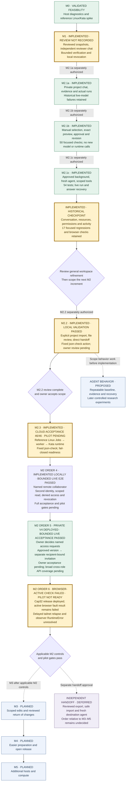

# Prism Roadmap

Last reviewed: **2026-09-29 (America/Los_Angeles)**. This is the maintained overview of delivery status and next steps. The [product design](product-design.md) defines requirements; milestone guides and linked validation records establish what was implemented and tested. Dates in those records may use UTC.

**Latest same-feature offline-close and order 6 checkpoint (2026-09-29):** The approved narrow lifecycle rule is installed locally (SHA-256 `35c9ff71ffdec528d8e1718b52ac6e67ebf9f1458802aa1c3d8472c5f9bda965`), with root-only resolver v10 and observer v3 installed separately. Attempt 9/run 30 used the approved synthetic three-file Document release under a user-approved one-hour USC Google OIDC invitation redeemed in separate Chrome incognito. Preflight passed; an authenticated same-origin DevTools diagnostic POST returned HTTP 200. Observer v3 passed all 13 checks: client/driver/worker/QEMU/shim/whole-group absence at 0.924/0.992/0.992/1.061/1.349/1.297 seconds, metadata absent at 1.467 seconds, uncertain/null at 5.558 seconds, zero reconstruction candidates, 0.174-second maximum scan gap, and 180.119-second/37-sample recovery observation. The browser still showed failed/unknown with no completed result. No model call or task network access occurred. A natural delayed event at 19:07:18 UTC logged `category=offline`, killed Prism service, and failed the watchdog; PID 1075702 logged Shields Up one second later and a netmap return at 19:08:58 UTC. This does not prove root cause or continuous daemon operation. Strict pinned recovery restored three active units and private HTTPS `/review` 200. Postcheck: Kata empty, SQLite integrity `ok`, 30 runs (1 cancelled, 10 completed, 19 failed), 16 grants, 17 invitations, 16 sessions, 77 model dispatches; the newest one-hour grant was active and not revoked. Attempt 6 remains unresolved, all three delayed relapses remain unexplained, and `pilot_ready=false`; no hard SLA or broad safety claim is established. See the [sanitized validation record](validation/m2-browser-active-disconnect.json) and [order 6 guide](m2-active-revoke.md).

**Current M2 order 6 stage:** Continue diagnosis of attempt 6's unclassified extra candidate and the three delayed offline relapses. Attempt 9 passed its bounded observer, but the browser outcome remained unknown and no completed result was shown. The installed offline-close lifecycle rule is already approved and installed; this is a bounded checkpoint, not sustained-availability evidence. Keep `pilot_ready=false`; no hard SLA or broad safety claim is established. See the [browser-active validation record](validation/m2-browser-active-disconnect.json) and [order 6 guide](m2-active-revoke.md).

**Diagnostic-only observer checkpoint (2026-09-28 America/Los_Angeles / 2026-09-29 UTC):** Observer v2 (`2455ea651136a2c53c794f153cd457d3dbefef6aa7928a9df0f61162b2a4e9ac`) is installed as a separate root-owned mode-0700 file under the existing root-private checks; the previous observer is retained unchanged. A synthetic PID-free smoke check exercised the pinned helper writer and verified private directory/file ownership, modes, single-link status, opaque reference and content match before deleting the evidence. No fault was injected, no recipient task was active, and no grant or model state changed. This does not resolve the attempt-6 cause or establish a new fault acceptance; `pilot_ready=false`. Parent verification passed 79 relevant tests and targeted Ruff, format, and diff checks. See the [browser-active record](validation/m2-browser-active-disconnect.json).

**Prior order 6 authenticated idle-browser fault checks (2026-09-27):** Two controlled idle Tailscale-down faults were observed through separate real Google OIDC Chrome sessions on the private Linux host. The first owner session and a newly invited USC recipient session loaded before their faults; the recipient received only a one-hour, three-file read-only grant. The installed watchdog stopped Prism after tailnet-backend loss, and the close hook blocked `tailscaled` when normal inbound-shield verification failed. Chrome reached a network error during the outage. Recovery restored the tailnet while shielded, then the watchdog and service. After the second fault, the same recipient session loaded its approved `baseline.json`; the grant remained active and unchanged. The owner separately signed in again after the first fault, but that sign-in state cannot be attributed to the restart because the later recipient session survived. Database integrity was `ok`, with 22 runs/zero pending, 13 grants/one active, 77 model dispatches, and an empty Kata task namespace. These idle browser checks do not combine authenticated entry with a running Kata job or prove a hard shutdown deadline, broad safety, or pilot readiness. See the [browser fault record](validation/m2-authenticated-host-disconnect.json).

**Prior order 6 diagnostic increment (2026-09-27):** Read-only journals narrowed the fourth test's delayed failure: the watchdog stopped Prism after a private-tailnet probe failure, and the close hook deliberately killed `tailscaled` after both normal inbound-shielding paths failed. The same-second `PollNetMap` EOF is not a proven cause, and the old log cannot identify the initial probe failure. Fixed, secret-free watchdog and close-path categories are now installed in a new immutable release. Local focused checks passed, and the normal private service restarted with all three units active and HTTPS `/` redirecting to login. No new fault was injected; authenticated browser/OIDC fault acceptance, a hard deadline and pilot readiness remain open. See the [host-disconnect evidence](validation/m2-host-disconnect.json).

**Prior M2 order 6 host-disconnect checkpoint (2026-09-27):** The first four active synthetic attempts remain failed and are preserved in the [validation record](validation/m2-host-disconnect.json); the fourth attempt's delayed tailnet relapse remains unexplained. The fifth controlled attempt passed its bounded 30-second observation: one synthetic RUNNING Kata job became uncertain/null at 5.661 seconds, metadata was absent at 1.982 seconds, and exact resource/namespace/service-cgroup cleanup plus automatic root-only resolution passed without fallback Shields Up. No browser, OIDC or model call occurred, and no grant was added. After restoration, a 180.13-second/37-sample check found watchdog health and tailnet status/preferences stable. Independent checks found three units active, Tailscale Running/Online with Shields Up false, HTTPS `/` redirecting to login (307), database integrity `ok`, 22 runs/zero pending, 12 grants/77 model dispatches, empty namespace, only the service main process in its cgroup and zero live processes in Kata overhead cgroups. The 0.183-second maximum scan gap and zero observed reconstructed candidates are bounded polling evidence, not proof of no transient execution. This does not establish a universal hard 30-second SLA, browser/OIDC entry, production-program execution, broad owner acceptance or pilot readiness. The fourth attempt's relapse cause remains unresolved; `pilot_ready=false`. See the [host-disconnect record](validation/m2-host-disconnect.json).

**Prior uncertain-run helper checkpoint (2026-09-26):** The order 6 root-only `inspect`/`resolve` helper was installed separately from immutable v7 on the existing private reference-Linux host (installed-file SHA-256 `85bb030f23189398f0b7956367c440cc04938670c92ffc7b8fa709a0dfd9a97c`). Production CLI inspection while the app was active denied on the occupied shared lock, with no change. With the app stopped, pinned-unit and host prechecks passed; a production inspect for a nonexistent ID was denied at exact-row lookup. The positive inspect/resolve path used an isolated temporary database with full live schema and one synthetic uncertain row, the exact installed helper with a test-only DB-path override, and real unit/systemd/tailnet/watchdog/namespace/process checks. Inspect was ready/read-only; an exact-resource process caused resolution denial; after it exited, synthetic resolution produced failed/null with original error in audit and unknown outcome, while repeat resolution was denied. No real production uncertain row was resolved, and the live database hash was unchanged. Afterward both units were active, Shields Up was false in the active-state check, private HTTPS returned 200, namespace empty, database integrity passed, and live counts were 12 runs, 0 uncertain/active, 11 grants, and 77 model dispatches. A later read-only recheck confirmed the installed file, active services, private HTTPS 200, empty namespace, database integrity and the same live counts; production inspect again denied on the occupied lock without change. The owner delegated acceptance of this helper to the agent, whose bounded feature self-acceptance passed. No model calls or demo-grant changes occurred; VM remained running. The 2026-09-25 v7 watchdog probes still do not establish a hard 30-second guarantee, host-disconnect handling, or broad security assurance. Broader order 6 owner acceptance remains pending and `pilot_ready=false`. See the [order 6 guide](m2-active-revoke.md), [v7 host-watchdog validation](validation/m2-host-watchdog.json), [uncertain-resolution validation](validation/m2-uncertain-resolution.json), and [guest service guide](m2-recipient-guest-service.md).

**Prior service-cgroup result:** A root-only check placed one isolated synthetic Kata worker and client in the installed identity-service cgroup, observed the exact resource RUNNING, and invoked the pinned v7 watchdog algorithm with its real systemd kill function. The service main and test client died, the exact resource was reconciled within the test window, and both units and private HTTPS were restored. Live counts stayed at 12 runs, zero pending, 11 grants, and 77 model dispatches. The installed watchdog socket, live Jobs submission, watchdog-triggered Shields Up transition, and a hard termination SLA remain unproven; see the [service-cgroup validation](validation/m2-systemd-cgroup.json) and earlier [observed-resource rehearsal](validation/m2-observed-watchdog.json).

**Prior position (2026-09-26):** The subsequent [watchdog-induced Shields Up transition check](validation/m2-watchdog-shield-transition.json) passed all 20 bounded checks on the private Linux/Kata host. The trusted root driver observed Shields Up false while the service was serving and again at fault injection, after seeing the exact Kata resource RUNNING with worker/client in the installed service cgroup. Lease loss led the installed watchdog to stop the service; the installed lifecycle close hook made Shields Up true without the diagnostic fallback. The exact resource was absent within the test's 30-second poll with no recreation; the real synthetic run became uncertain/null and was inspected and resolved to failed/null with unknown outcome. Independent postchecks found both units active, private HTTPS 200, Shields Up false while serving, an empty namespace, only the service main process in its cgroup, database integrity `ok`, and 17 runs/zero pending/11 grants/77 model dispatches. The immutable production v7 release was unchanged; only a private test copy of the synthetic JSON fixture was delayed. This does not establish a hard fail-close deadline, host-disconnect behavior, OIDC/browser authorization for this fault, broader order 6 owner acceptance, or pilot readiness. No model calls or grant changes occurred; the VM remains running.

**Deployed v7 increment before the latest live-DB check:** Immutable v7 places the root host watchdog in a separate systemd cgroup/socket and binds the identity unit to the watchdog. The Jobs controller registers and receives acknowledgment for the exact run before Kata execution and renews the watchdog lease; the worker maintains a separate colocated pipe lease. A watchdog crash stops the identity unit, while its separate stop hook protects Shields Up before watcher restart. Bounded Linux/Kata checks exercised a normal job, worker SIGKILL, and watchdog crash. The version-specific root-only uncertain-run helper was installed separately from v7 and host-validated with an isolated synthetic database. The production CLI denied while the app held the shared lock and denied a nonexistent exact ID after the app stopped and pinned-v7/host prechecks passed. In the synthetic database, inspect was read-only, a matching-process check denied resolution, then resolution recorded failed/null and preserved the original error in the audit event after that process exited; repeat resolution was denied. The execution outcome remained unknown, the temporary database was removed, and the live database hash stayed unchanged. A later isolated real-Kata watchdog rehearsal observed the exact owned resource and client RUNNING before fault injection and still present at expiry. It proved worker-loss grace, then observed exact client/resource absence within the test's 30-second poll, no recreation, uncertain/null state, confirmed cleanup, and an empty namespace. Only the service-cgroup kill boundary was replaced with pidfd termination of the test client. The rehearsal used synthetic SQLite and made no live database, grant, or model calls. Final checks restored both services active, Shields Up false while serving, private HTTPS 200, database integrity, empty namespace, and unchanged live counts of 12 runs, 0 uncertain/active runs, 11 grants, and 77 model dispatches. No model calls or demo grant changes occurred. The `local-root-operator` event actor is a generic label, not a named/authenticated human identity. That earlier rehearsal replaced the cgroup kill; the later [service-cgroup check](validation/m2-systemd-cgroup.json) exercised the real systemd kill boundary after observing an owned resource. A subsequent bounded live-DB test [passed the combined installed Jobs/socket active-fault path](validation/m2-watchdog-socket-active.json) and resolved one real synthetic uncertain row after inspection. A further bounded [transition check](validation/m2-watchdog-shield-transition.json) observed Shields Up change from false to true after an installed watchdog-induced service stop, with no diagnostic fallback. Host disconnect, a hard fail-close deadline, broad safety, and non-synthetic recovery remain unverified. Broader order 6 owner acceptance remains pending and `pilot_ready=false`. See the [behavior guide](m2-active-revoke.md), [v7 validation](validation/m2-host-watchdog.json), [observed-resource validation](validation/m2-observed-watchdog.json), and [uncertain-resolution record](validation/m2-uncertain-resolution.json).

**Historical M2.3 cloud acceptance status (r2 checkpoint, 2026-09-20):** The real cloud r2 attempt did not pass: `dedicated_host/initial_guest_helpers_absent` passed; `execution_completed` failed with `EngineError`; `passed=false`, `pilot_ready=false`, `model_calls=0`; and the `PRISM_M23_FAILURE` integration check exited 1. After r2, the instance was `TERMINATED`; no startup script was present; and the disk was retained. Sol is assigned to diagnosis, but the diagnosis round has not actually started because the GCP service is unavailable; the latest observed state remains stopped with no metadata. No root cause is asserted. This is a historical failed checkpoint; the later cloud acceptance is recorded below.

**Historical M2.3 control-plane status (2026-09-21):** The follow-up was cloud-control-plane blocked; no retry was ongoing. Sol's final diagnostic summary recorded 591 debug bytes and exit 124: `active_account_missing=false`, `permission_denied=false`, `service_unavailable=false`, `internal_error=false`, `saw_get_instance=true`, `saw_post_set_metadata=false`, and `saw_operation_wait=false`. The log stopped at the pre-write GET and 90-second timeout; absent POST/operation-wait is not absolute network proof. The observed instance was `TERMINATED` with no startup script, only the original four keys, and the disk retained. The original account was found and restored, but the active-account GET still timed out; r8 never ran. No account identifier or raw debug was recorded; the temporary raw log was trapped and removed (`RAW_LOG_ABSENT`). This is a historical diagnostic checkpoint; the later cloud acceptance is recorded below.

**Historical M2.3 pre-final-acceptance diagnostic and fix status (2026-09-21):** The fixed nerdctl, containerd and Kata versions were expected to pass. The Kata check matrix found product `PATH=/usr/local/bin:/usr/bin:/bin` with `HOME=/nonexistent` exit 1/not found; adding system sbin directories with the same HOME exit 0; using only `HOME=/root` exit 0; and using both exit 0. The minimal fix applies `KATA_CHECK_ENV` only to the Kata check, uses the fixed system PATH, does not inherit private environment, keeps `HOME=/nonexistent`, and leaves other command environments unchanged; parent review passed. Twenty-five focused reference tests, the full 129-test run, and targeted Ruff passed. Read-only image inspection found full, library, and short names exit 1 with `no such image`, while `images --digests` showed one exact fixed-digest row; no cloud root cause is claimed. The later real cloud acceptance and complete machine evidence are recorded below. M2.3 completion-time artifact hashes, including the local post-cloud strict-check hash, are recorded in the validation record; that strict-check hash is not a cloud-run hash.

**Conditional next-stage authorization (2026-09-20):** Successful current acceptance permits the next roadmap stage within the existing scope and budgets. M2.3 is order 3 and its success does not complete all of M2 or establish pilot readiness. After real M2.3 acceptance, the critical security review, and cloud cleanup confirmation, the next remaining M2 backlog item is order 4, **Admit a named remote collaborator**: a recipient-bound invitation over authenticated HTTPS, a fresh scoped session, a sourced question and permitted run, with another identity and direct unauthorized API access denied. Preserve dependency order; **M3: limited continuation** remains dependent on applicable M2 controls and is not the immediate M2.3 successor. This authorization does not waive technical pilot/security gates, skip failed or unverified checks, or authorize indefinite consecutive stages. No new model or cloud budget, credentials, public deployment, or major security-boundary change is authorized; a specific credential, authenticated-HTTPS/public-deployment, or major-boundary decision still pauses work. No additional start approval or repeated owner acceptance is required for the already authorized next stage once its stated conditions are satisfied.

**Historical follow-up checkpoint:** The narrow `fix/run-reference-answers` repair is implemented and validated for the recorded live path, awaiting owner review at that checkpoint. It addresses current-session `new_run` references while preserving owner-context-only `historical` references, strict validation, finite output repair, and the existing request/tool/time/budget limits. See the [validation record](validation/run-reference-answers.json). The earlier three-turn walkthrough and 300-cent ledger remain historical records.

**Current refinement proposal:** The owner emphasized agent behavior as a continuing product and research focus. Review the proposed [B0/B1 behavioral baseline and refinement](#agent-behavior-workstream) before treating the M1 agent as mature. These additions are design work; no new implementation, experiment or milestone acceptance is claimed.

## Visual roadmap

The diagram shows dependencies and approval gates, not calendar commitments. Labels carry the status; color is supplementary.

```mermaid
flowchart TB
    M0["M0 · VALIDATED FEASIBILITY<br/>Host diagnostics and reference Linux/Kata spike"]
    M1["M1 · IMPLEMENTED · REVIEW NOT RECORDED<br/>Reviewed snapshots, independent reviewer chat<br/>Bounded verification and local revocation"]
    A["M2.1a · IMPLEMENTED<br/>Private project chat, evidence and actual runs<br/>Historical live-model failures retained"]
    B["M2.1b · IMPLEMENTED<br/>Manual selection, exact preview, approval and revision<br/>50 focused checks; no new model or runtime calls"]
    GB{"Review general workspace refinement<br/>Then scope the next M2 increment"}
    C["M2.1c · IMPLEMENTED<br/>Approved background, fresh agent, scoped tools<br/>54 tests; live run and answer recovery"]
    UI["IMPLEMENTED · HISTORICAL CHECKPOINT<br/>Conversation, resources, permissions and activity<br/>17 focused regressions and browser checks retained"]
    M2["M2.2 · IMPLEMENTED · LOCAL VALIDATION PASSED<br/>Explicit project import, file review, direct handoff<br/>Fixed json-check action; owner review pending"]
    G22{"M2.2 review complete<br/>and owner accepts scope"}
    M23["M2.3 · IMPLEMENTED · CLOUD ACCEPTANCE 46/46 · PILOT PENDING<br/>Reference Linux Jobs → worker → Kata runtime<br/>Fixed json-check; fail-closed readiness"]
    M2R["M2 ORDER 4 · IMPLEMENTED LOCALLY · BOUNDED LIVE E2E PASSED<br/>Named remote collaborator<br/>Second identity, scoped read, denied access and revocation<br/>Full acceptance and pilot gates pending"]
    M2A["M2 ORDER 5 · PRIVATE V4 DEPLOYED · BOUNDED LIVE ACCEPTANCE PASSED<br/>Owner decides named access requests<br/>Approved version → separate recipient-bound invitation<br/>Owner acceptance pending; broad cross-role API coverage pending"]
    M2B["M2 ORDER 6 · BROWSER-ACTIVE CHECK FAILED · PILOT NOT READY<br/>Cap32 release deployed; active browser fault result remains failed<br/>Delayed tailnet relapse and observer RuntimeError unresolved"]
    G2{"Applicable M2 controls<br/>and pilot gates pass"}
    M3["M3 · PLANNED<br/>Scoped edits and reviewed return of changes"]
    M4["M4 · PLANNED<br/>Easier preparation and open release"]
    M5["M5 · PLANNED<br/>Additional hosts and compute"]
    H["INDEPENDENT HANDOFF · DEFERRED<br/>Reviewed export, safe import and fresh destination agent<br/>Order relative to M3–M5 remains undecided"]
    R["AGENT BEHAVIOR · PROPOSED<br/>Repeatable baseline, evidence and recovery<br/>Later controlled research experiments"]
    M0 --> M1
    M1 -- "M2.1a separately authorized" --> A
    A -- "M2.1b separately authorized" --> B
    B -- "M2.1c separately authorized" --> C --> UI --> GB
    GB -- "M2.2 separately authorized" --> M2 --> G22 --> M23 --> M2R --> M2A --> M2B --> G2
    G2 -. "M3 after applicable M2 controls" .-> M3 --> M4 --> M5
    G2 -. "Separate handoff approval" .-> H
    M2 -. "Scope behavior work before implementation" .-> R
    classDef validated fill:#e5f3eb,stroke:#26734d,color:#173b29;
    classDef current fill:#fff2cc,stroke:#9a6700,color:#4d3500,stroke-width:3px;
    classDef planned fill:#edf3fc,stroke:#466b9b,color:#243b56;
    classDef deferred fill:#f0edf7,stroke:#75608c,color:#443351;
    class M0 validated;
    class M1,UI current;
    class A,B,C validated;
    class M3,M4,M5,R planned;
    class M23 current;
    class M2 current;
    class M2A validated;
    class M2B current;
    class H deferred;
```

- **Validated feasibility:** real checks passed on a recorded configuration; broader product readiness is not implied.
- **Owner review pending:** implemented behavior and its limitations are available to inspect; tests do not substitute for owner acceptance.
- **Planned:** requirements and proposed work, not delivered functionality or implementation authorization.
- **Deferred:** documented future work that must not displace the online-sharing gates.

Owner-local hosting and an authorized development server are two placements of **online sharing**. In both, the owner provides the running service and retains control over subsequent access. **Independent handoff** transfers reviewed resources to a collaborator-controlled environment. Inspect, Verify and Continue are capability levels, separate from these delivery modes. See the [delivery-mode design](product-design.md#delivery-modes).

## What is available now

| User capability | Implemented and exercised | Current boundary or remaining work |
| --- | --- | --- |
| Check a runtime before use | M0 host diagnostics, synthetic development runtime checks and a separate real Linux/Kata feasibility spike | The M1 application still uses the development container path. The validated Kata spike is not an integrated pilot executor. |
| Navigate a focused review workspace | Separate owner management and conversation-first reviewer views, evidence side panels, responsive navigation and explicit revoke confirmation | M1 interface revision awaiting owner review; no new backend authority or remote access capability. |
| Work with an owner project agent | Private project chat, five pinned synthetic resources, actual bootstrap runs, citation panels and persisted history | M2.1a delivered; user subsequently authorized M2.1b. No arbitrary project import, editing or unrestricted host access. |
| Prepare selected working context | Manual excerpt/summary/file/result selection, exact preview, immutable approval and separately reviewed revisions | M2.1b delivered; M2.1c separately authorized. No automatic boundary recommendation; only approved versions can start sessions. |
| Continue from handed-off context | Approved background landing, independent agent context, separate historical/new run references; real seed-23 execution and read-only recovery answer | M2.1c awaiting review. Synthetic project only; one live final answer failed. No raw owner state or arbitrary tools imported. |
| Import one explicitly supported project | Operator-configured strict manifest, manual source/file selection, immutable copied bytes, direct file-only handoff, and the fixed `json-check` capability are implemented and locally validated | M2.2 awaits owner review; acceptance uses the authorized English `document-handoff` local-project example. No private-workspace acceptance, arbitrary scripts, recursive scan, broad import format, reference-Linux integration, or pilot-readiness claim. |
| Integrate the reference Linux runtime | Trusted Jobs → worker → Kata path for the imported project's fixed `json-check`, with canonical action binding, fail-closed readiness, durable ownership, cleanup, and recovery | M2.3 is implemented with bounded reference-Linux cloud acceptance passed 46/46; owner acceptance and pilot readiness remain pending. Mac development behavior and historical records remain unchanged. |
| Prepare a finite share | Explicit selection from the synthetic catalog; freeze copied bytes, inspect content/action and approve the exact version | No arbitrary project import or general action packaging. The immutable version is an application record, not captured process memory or protection against the database administrator. |
| Enter a separate review session | Local owner/reviewer/observer credentials, fresh version-bound session, scoped evidence search and numbered citations; bounded private Google OIDC invitations exercised with a second identity | Paired and Document release invitations were exercised. The Document release grant was revoked and its session lost access; its approved fixed run completed in Kata. These flows do not establish broad security or pilot readiness. |
| Ask the agent about evidence | Real configured model, server-held session history, scoped evidence/tools and validated citation targets | In this bounded recipient flow, one focused answer succeeded with a `limitations.md` citation and one broader question failed closed without a partial answer. This does not establish reliability or general answer correctness. No owner agent memory is reused. |
| Rerun an approved check | Real fixed synthetic bootstrap evaluator with bounded seed; conversational execution; results, provenance and cleanup (manual launch UI removed in the current refinement) | One packaged CPU action in development containers. No arbitrary shell, arbitrary project code workflow or GPU support. |
| Control model allowance | Finite operator-configured total with persistent reservations and visible remaining allowance | Local application allowance, not an API-account spending cap. Increases need authorization; the roadmap is not a live balance display. |
| Ask for more access | A named recipient's request is visible to the owner; denial is terminal, while approval selects an approved version with matching immutable project provenance and creates a separate single-use invitation for the verified recipient | Installed as immutable v4 on the private service; archive/source hashes, service health and private TLS self-check verified. Two-identity live flow confirmed denial of an unauthorized shell/private-file request, approval and redemption of an inspect-only follow-up grant, unchanged original grant/session, and replay denial. A separate direct invitation was rejected by the wrong identity without consuming it, then redeemed by the recipient. Unauthenticated owner state returned 401; a decision POST without Origin returned 403 from the same-origin guard; the same-origin decision POST without a session cookie returned 401. These are not authenticated cross-role tests and do not establish broad API coverage. The 205-test suite and targeted Ruff were rerun for release; frontend checks passed in the prior implementation stage. Static review is not an audit. No new model/Kata run. Owner acceptance and `pilot_ready` remain pending. Legacy unmapped versions are restricted to the exact source version. A redeemed follow-up grant has a separate revocation lifecycle. See [release validation](validation/m2-access-decisions-release.json). |
| Review activity, revoke and lease loss | Grant revocation denies later access and cancels affected work; the private browser/Kata path confirmed active revoke. V6 adds a colocated parent-to-worker lease for the reference-Linux fixed-job path; the isolated real Jobs `json-check` completed and a separate test-only Kata sleeper check confirmed bounded lease-loss cleanup. | The test-only lease check does not prove Jobs controller-crash behavior, systemd cgroup cleanup, remote-host disconnect, worker SIGKILL, or termination within 30 seconds during stalled runtime operations. Restarts, streams, downloads and live provider-call cancellation remain untested or unimplemented. Already-sent provider requests and already-delivered content cannot be recalled. Owner acceptance pending; `pilot_ready=false`. See [guide](m2-active-revoke.md) and [lease validation](validation/m2-worker-lease.json). |
| Measure the demonstration | Bounded local security events and optional numeric measurements | Measurements default off. Full retention/deletion controls and validated usefulness metrics remain future work. |

This is real model and runtime behavior on synthetic data, with explicit limitations. Automated agent tests also use test doubles; they are not live-model evidence. External inference sends approved context, questions, session history and authorized tool results to the configured provider. Local execution does not mean local inference.

## Evidence behind the current status

These are recorded checkpoints, not checks rerun whenever this page is edited.

| Record | Observed result | What it does not establish |
| --- | --- | --- |
| [M0 reference Linux/Kata record](validation/m0-linux-kata.json) and [host guide](gcp-m0-host.md) | 33 synthetic checks passed on the recorded reference configuration | Integrated application isolation, broad platform support or private-pilot readiness |
| [M1 automated verification history](m1-local-sharing.md#verification-record-and-iteration-findings) | Initial full suite: 58 passed. Later allowance change: 12 focused agent tests and 13 sharing/API tests passed; frontend build passed | A fresh full-suite result after every later change; tests using model/transport doubles do not establish model usefulness |
| [M1 runtime record](validation/m1-development.json) | 11 real-path checks passed, including two actual container runs; no model calls | Linux/Kata application integration or pilot lifecycle guarantees |
| [M1 live record](validation/m1-live-model.json) | Five live turns: three completed, two failed; actual seed-7/seed-23 runs; 18 combined live, browser and service checks | A reliability benchmark, 18 independent model trials, semantic correctness or absolute security |
| [M1 interface refresh checks](ui-refresh.md#verification-record) | Frontend build and 13 sharing/API tests passed; browser creation/evidence/request/revoke walkthrough, one real seed-23 run and 390px layout check passed | Fresh live-model validation, a complete accessibility audit or M2 acceptance; no paid model calls were made |
| [M2.1a delivery record](m2-owner-workspace.md#current-delivery-record) and [validation evidence](validation/m2-owner-chat.json) | 40 focused automated tests; frontend build and browser checks; four live turns (two completed, two failed); one real seed-7 run; existing M1 records and reservations preserved | Stable model reliability, completed handoff-context transfer, integrated Linux/Kata execution, owner acceptance or private-pilot readiness |
| [M2.1b guide](m2-reviewed-handoff.md) and [validation record](validation/m2-reviewed-handoff.json) | 50 focused tests, exact review/approval/revision browser walkthrough and 390px layout; historical real result copied; zero new model dispatches or runtime jobs; pre-existing rows preserved | Automatic boundary selection, semantic privacy, M2.1c context execution, remote-pilot readiness or owner acceptance |
| [M2.1c guide](m2-context-continuation.md) and [validation record](validation/m2-context-continuation.json) | 54 focused tests, browser background/reference checks and 390px layout; one real new run; two live turns with one failed answer and one successful recovery; prior rows and aggregate ledger preserved | Reliable success on every model question, arbitrary tool transfer, named identity, pilot isolation or owner acceptance |
| [General workspace guide](general-handoff-workspace.md) and [validation record](validation/general-handoff-workspace.json) | Frontend build, 17 focused regression checks, real persisted activity/details and fresh-session browser checks; no new inference or execution | Arbitrary tools, new model reliability evidence, full internal traces or owner acceptance |
| [M2.2 project-import guide](m2-project-import.md) and [validation record](validation/m2-project-import.json) | 98/98 backend tests; 11/11 focused project checks; 9/9 bounded project-runtime checks; final 11/11 M1 regression; targeted Ruff and frontend checks passed; browser flow and preservation audits passed; zero model calls | Owner acceptance, reference-Linux integration, live model JSON response, or private-pilot readiness |
| [M2.3 Linux runtime guide](m2-linux-runtime.md) and [validation record](validation/m2-linux-runtime.json) | Historical baseline recorded 114 tests and 81 focused tests; final latest local evidence is 129 tests and 25 focused tests, with targeted Ruff, frontend Prettier/build, 9/9 project-runtime checks and 11/11 M1 checks; preservation audit passed; bounded reference-Linux cloud acceptance passed 46/46 | Owner acceptance, pilot readiness, OIDC, lease watchdog, remote API/SSH, public networking, or Docker/runc fallback remain unclaimed |
| [M2 v7 host-watchdog validation](validation/m2-host-watchdog.json) | Local 247 backend tests passed; installed v7 normal fixed `json-check`, worker-SIGKILL and watchdog-crash probes recorded fail-closed run states and post-event resource absence; final host state and private HTTPS checks passed | Probes did not observe the resource before worker/watchdog fault injection, so do not claim its removal. Manual uncertain-row resolution was required. No absolute 30-second guarantee, host-disconnect handling, broad security assurance or pilot readiness. Owner acceptance pending. |
| [M2 observed-resource watchdog validation](validation/m2-observed-watchdog.json) | Approved immutable v7 passed a bounded real-Kata rehearsal after exact resource and client observation; lease renewal and worker-loss grace were proven, then exact client/resource absence was observed within the test's 30-second poll, with no recreation and confirmed cleanup | Synthetic SQLite; only the service-cgroup kill was replaced by exact-client pidfd termination. Does not establish systemd/cgroup behavior, watchdog-triggered Shields Up, host disconnect, a hard 30-second SLA, or broader order 6 acceptance. `pilot_ready=false`. |
| [M2 installed service-cgroup validation](validation/m2-systemd-cgroup.json) | Pinned v7 algorithm killed the installed service cgroup after an isolated owned Kata resource and client were observed RUNNING; service main and exact client died, isolated row became uncertain/null, resource disappeared within the test window, and independent postchecks found services/HTTPS restored with unchanged live counts | Direct algorithm invocation with synthetic SQLite; installed watchdog socket and live Jobs submission not tested. Shields Up was set before fault injection, so its watchdog-triggered transition is unproven. No hard SLA, pilot readiness, or broader order 6 acceptance. |
| [M2 installed Jobs/socket follow-up](validation/m2-watchdog-socket-jobs.json) | A trusted root driver submitted one fixed synthetic owner `json-check` through installed v7 Jobs; the 5.02-second task completed with Kata result and cleanup fields. Services, HTTPS, private-network state, database integrity, and empty namespace were independently rechecked. | The action ended before RUNNING resource observation; no fault was injected. Socket messages were not independently traced, and OIDC/browser entry was bypassed. The active installed-watchdog cleanup path and pilot readiness remain unverified. |
| [M2 installed Jobs/socket active fault](validation/m2-watchdog-socket-active.json) | All 19 bounded checks passed after exact RUNNING resource and worker/client observation. Installed watchdog stopped the service and removed the exact resource; a real synthetic uncertain/null row was inspected and resolved to failed/null with unknown outcome. Independent host and private HTTPS checks passed. | Root-only driver bypassed OIDC/browser authorization; only a private test copy of the fixed JSON fixture was delayed. Shields Up was true before fault, socket packets were not separately traced, and no hard SLA, host-disconnect proof, broad security assurance, owner acceptance or pilot readiness follows. |
| [M2 host-disconnect follow-up](validation/m2-host-disconnect.json) | Fifth controlled synthetic attempt passed bounded 30-second checks; exact cleanup and automatic resolution passed, with 180.13 seconds/37 samples of stable watchdog and tailnet observations and clean independent postchecks | Bounded polling does not prove zero transient execution or a universal 30-second SLA. The fourth attempt's delayed tailnet relapse is unresolved. No browser/OIDC or production-program test, broad owner acceptance, or pilot readiness. |
| [M2 watchdog-induced Shields Up transition](validation/m2-watchdog-shield-transition.json) | All 20 bounded checks passed: Shields Up was false at fault, installed watchdog stopped the service, and the installed lifecycle close hook made Shields Up true without diagnostic fallback. Exact Kata resource cleanup, uncertain/null handling, root-only resolution, independent restoration and private HTTPS checks passed. | One trusted root-driver synthetic run with a test-only delayed fixture; no OIDC/browser test, hard fail-close deadline, host-disconnect proof, broad security assurance, owner acceptance or pilot readiness. |
| [Historical M2 v6 worker-lease validation](validation/m2-worker-lease.json) | At the v6 checkpoint, local 52 focused and 226 backend tests passed; fixed `json-check` completed in Kata; a test-only lease-loss check observed bounded cleanup | The fixed Jobs controller-loss observation was inconclusive because the short action completed before observation. V6 did not establish systemd cgroup proof, remote-host disconnect, worker-SIGKILL handling, a hard timing guarantee under stalls, or pilot readiness. Superseded as current release status by v7. |

The live record preserves the original allowance checkpoint. The [subsequent authorized allowance adjustment](m1-local-sharing.md#authorized-allowance-adjustment-validation) did not reset usage. Preserve historical failures and results when adding newer evidence.

## Current step: M2 order 6 — active revoke, worker lease, and host watchdog

The owner can revoke a named grant while its job is running; this denies later access and cancels the affected job. The current immutable v7 release adds an independent root watchdog in its own systemd cgroup/socket. The Jobs controller registers the exact run and receives acknowledgment before Kata starts, then renews the watchdog lease. The worker uses a separate colocated pipe lease. Worker death or lease loss causes the watchdog to kill the identity cgroup and reconcile the exact resource. The watchdog is bound to the identity unit, and its separate stop hook protects Shields Up before watcher restart.

The normal fixed `json-check` completed through `io.containerd.kata.v2`, recorded guest-kernel evidence, cleaned up, and left the namespace empty. Bounded worker-SIGKILL and watchdog-crash probes observed fail-closed `uncertain`/null runs, with the exact resource absent afterward; neither had observed the resource before fault injection. After one pre-Kata verification failure, two isolated real-Kata executions passed. The final pass used the exact installed formatted script, verified by SHA-256 in the [observed-resource validation record](validation/m2-observed-watchdog.json). It observed the exact owned resource and client RUNNING before fault injection and present at expiry, proved lease renewal and worker-loss grace, then observed exact client/resource absence within the test's 30-second poll, no recreation, and an empty namespace at cleanup. Only the service-cgroup kill boundary was replaced by pidfd termination of the exact test client. The run used synthetic SQLite and no live database, grant, or model calls. The separate root-only `inspect`/`resolve` helper was installed and received bounded host validation as detailed above. It requires the app stopped, Shields Up, healthy independent watchdog, exclusive shared service lock, no queued/running tasks, a private exact uncertain reference-Linux row with null result, an empty fixed namespace, and no matching process; pinned v7 unit/release identity must match. Production checks confirmed denial on an occupied lock and denial of a nonexistent row after host prechecks. The positive resolution path used an isolated synthetic database and test-only database override, producing failed/null with original error preserved in audit and unknown outcome. No real production uncertain row was resolved. Final host checks confirmed both units active, private HTTPS 200, database integrity, no uncertain/active work, empty namespace and Shields Up false while serving. A later isolated [service-cgroup check](validation/m2-systemd-cgroup.json) exercised the real systemd kill boundary, and the subsequent [installed Jobs/socket active-fault check](validation/m2-watchdog-socket-active.json) combined live Jobs submission with installed watchdog cleanup of an observed RUNNING Kata resource. A separate bounded [transition check](validation/m2-watchdog-shield-transition.json) observed Shields Up rise from false to true after watchdog-induced service stop without fallback. The later [bounded synthetic host-disconnect check](validation/m2-host-disconnect.json) passed on its fifth attempt; broader host-disconnect assurance and a universal hard fail-close deadline remain unverified. See the [focused guide](m2-active-revoke.md), [sanitized v7 validation](validation/m2-host-watchdog.json), [observed-resource validation](validation/m2-observed-watchdog.json), and [uncertain-resolution record](validation/m2-uncertain-resolution.json).

The local backend passed 247/247; targeted Ruff and diff checks passed. Independent high static review found no code-level blocker; it was not a security audit. `model_dispatches` is 77 (64 before this validation), grants total 11, the application model ceiling remains 1,000 cents, and the VM has no automatic stop. Host disconnect, an absolute 30-second guarantee, broad security assurance, and owner acceptance remain unproven; `pilot_ready=false`.

**Immediate next action:** Present the bounded installed active-fault and Shields Up transition evidence for owner review. Remaining pilot gates include host-disconnect behavior, authenticated cross-role API coverage, and failure behavior under runtime stalls. Broader order 6 owner acceptance and `pilot_ready=false` remain pending.

**Historical v6 checkpoint:** The colocated worker-lease result and its limitations are preserved in the [v6 validation record](validation/m2-worker-lease.json). At that checkpoint, a fixed Jobs controller-loss observation was inconclusive because the action completed before its running state was observed; a separate test-only lease-loss check passed 12/12 bounded checks. That result did not establish systemd cgroup proof, remote-host disconnect, worker-SIGKILL handling, or a hard timing guarantee under runtime stalls. V7 is the current release status.

### Completed preceding step: M2 order 5 owner decisions on access requests

M2 order 5 remains recorded as deployed immutable v4 with its bounded two-identity acceptance. The implementation bound approval to a reviewed version and verified recipient, created a separate single-use invitation, and left the original session unchanged. Local release validation, private service checks, and limitations remain in the [order 5 guide](m2-access-decisions.md), [release record](validation/m2-access-decisions-release.json), and preserved [local record](validation/m2-access-decisions.json). Its focused independent review was static, not an audit; its unauthenticated probes did not exercise authenticated cross-role API authorization. No new model or Kata call occurred in that order 5 acceptance.

### Completed preceding step: M2.3 reference Linux runtime integration

The current capability is **M2.3: integrate the reference Linux runtime** for the approved bounded action. It is implemented and real cloud acceptance passed 46/46 checks under the [M2.3 guide](m2-linux-runtime.md); pilot readiness remains false. Automatic preparation recommendations, arbitrary tools and broader import formats remain later work.

The [interface refresh](ui-refresh.md#try-the-refreshed-interface) and broader M1 remain unaccepted. Their existing [M1 acceptance walkthrough](m1-local-sharing.md#acceptance-walkthrough), using the [concrete researcher/supervisor scenario](m1-local-sharing.md#a-concrete-first-use-scenario), remains available:

1. Select the four synthetic evidence files, exclude the private note, inspect the frozen content/action and approve the exact version.
2. Start a fresh reviewer session, open evidence and ask a narrow sourced question through the explicitly configured model.
3. Execute the approved seed-23 verification, inspect its actual result and distinguish it from the recorded baseline.
4. Request additional access and verify that the request alone grants nothing; inspect it in the owner view.
5. Revoke the version and confirm subsequent evidence access is denied, without claiming to erase already delivered content.
6. Review the recorded failures and limits, then explicitly accept M1 or request revisions. The separately authorized M2.1a does not itself record M1 acceptance.

Use the current approved model allowance; browsing evidence and existing results does not require model dispatches. The current UI requests new work through conversation. A documentation update, model configuration, allowance increase or successful test does not count as milestone acceptance.

The proposed B0/B1 refinement below was initially suggested for M1. Following the owner's sequencing clarification, it is not a mandatory predecessor to M2. Scope relevant behavior work into the M2 proposal and obtain approval before implementation. The earlier demonstration evidence is preserved.

## Agent behavior workstream

The agent is an ongoing product component, not a completed SDK integration. The [behavior plan](agent-behavior.md) specifies desired behavior, candidate mechanisms, failure cases and fair evaluation. This work supports online sharing and does not replace its isolation or identity gates.

**Foundation:** Follow the owner's preference to reuse established agent architecture. Retain the integrated PydanticAI foundation for the proposed B0/B1 work; assess other orchestration or coding-agent components only when the relevant milestone demonstrates a need. See the [reuse assessment](agent-behavior.md#reuse-an-established-agent-foundation). The custom focus is handoff behavior and evaluation, with authority enforced independently.

| Proposed increment | Placement | Observable outcome | State |
| --- | --- | --- | --- |
| B0: Behavior baseline | Scope into the M2 proposal; originally proposed for M1 | A repeatable report distinguishes supported answers, unnecessary actions, missing evidence, recovery and boundary outcomes, with a frozen baseline and explicit test-double/live labels | Proposed; not implemented or a mandatory extra stage before M2 |
| B1: Reliable evidence review | Scope into the M2 proposal after B0 | Correct baseline/new-run provenance, evidence-only answers without execution, useful uncertainty and reuse of already completed work | Proposed; existing prompted behavior is not proof of passing these cases |
| B2: Useful bounded collaboration | M2 with its identity/grant/lifecycle controls | Precise clarification/access requests, finite recovery and continuity under actual permitted capabilities | Planned; depends on M2 controls |
| B3: Generalization and method experiments | Accepted online pilot and separately scoped research work | Controlled comparisons on held-out projects/follow-ups assess behavior, owner effort, safety outcomes and cost separately | Planned; no research contribution established |

The newly implemented synthetic [owner project-working agent](m2-owner-workspace.md) is distinct from later automatic share-preparation assistance. Owner work comes first; explicit manual review determines what is handed over. A future preparation assistant only proposes material and cannot silently grant access. Compare preparation methods with a fixed collaborator agent, and collaborator behaviors with a fixed approved package/runtime. No new model provider, training requirement, increased allowance or parallel implementation is authorized by this plan.

## M2: proposed online-sharing backlog

**Status: M2.1a, M2.1b, M2.1c and M2.2 are separately authorized and implemented; M2.2 awaits owner review. M2.3 is implemented with real cloud acceptance passed. Order 4 is implemented locally and has passed one bounded synthetic second-identity recipient flow on the private service; Kata-through-service validation, full order-4 acceptance and all remaining pilot gates remain open.** M2.1 is the first workstream, split into the three individually testable capabilities in its [detailed proposal](m2-owner-workspace.md#agile-implementation-order). Refine remaining increments before their implementation. Each needs observable normal and denial-path acceptance. The following is a dependency order, not a commitment to implement everything in one indivisible feature.

| Order | Usable increment | Acceptance to demonstrate | Dependency |
| --- | --- | --- | --- |
| 1a | M2.1a: Work with an owner project agent — implemented | Owner has a real project conversation, evidence references, an actual permitted run and persisted private history. Direct reviewer/cross-project access to owner resources fails. | Explicit M2.1a scope approval received; existing synthetic project, bounded executor and approved provider/data route. M1 acceptance is not inferred. |
| 1b | M2.1b: Review a conversation checkpoint for handoff — implemented | Select exact excerpts, task state, files and actual result evidence; approve an immutable version. Excluded history and private reference targets are absent; later owner work cannot change it. | M2.1b explicitly authorized after scope review; reuses M2.1a and the version mechanism. Context is included in the digest. M2.1c subsequently enables approved contextual versions. |
| 1c | M2.1c: Continue with approved background — implemented, awaiting acceptance | A fresh collaborator sees prior approved work, asks a contextual follow-up and completes a permitted rerun. Private owner state and other sessions remain inaccessible; imported actions never replay. | M2.1b, collaborator context authorization and current grants/budgets. Local acceptance does not establish remote-pilot readiness. |
| 2 | M2.2: Prepare one explicitly selected project beyond the fixed fixture — implemented, locally validated | On one supported project format, select files and reviewed context, review a bounded environment and one typed action, and approve exact bytes. Excluded canaries, unsafe paths and changed candidates cannot expand the share. | M2.1; validation record complete for local development. Owner review remains pending; additional importer formats remain later work. |
| 3 | M2.3: Run the approved action on the reference Linux host — implemented, real cloud acceptance passed | Integrate the trusted reference-Linux worker/Kata runtime with the application. A real job uses only approved inputs, separate writable storage and finite limits; failed readiness blocks activation. | Real cloud acceptance recorded; pilot gates remain pending. No silent Docker/runc fallback, remote API/SSH, or public networking. |
| 4 | Admit a named remote collaborator — local implementation and bounded live recipient flows exercised; full acceptance incomplete | Distinct Google OIDC sessions were scoped to exact approved Paired and Document release versions. Unauthorized evidence and owner API access were denied. The Document release's permitted `json-check` completed in Kata; revoking that release grant made its file, run, and workspace unavailable without affecting the earlier Paired grant. See the [sanitized live recipient record](validation/m2-recipient-live-identity.json), [demo SOP](live-demo-sop.md), and [guest service guide](m2-recipient-guest-service.md). | These bounded flows are not broad security evidence. Full order-4 acceptance remains unverified; `pilot_ready=false`. Recorded invitation expiry and budget balances are historical checkpoints only; see the linked records. IAP management and network details also remain time-bound deployment evidence. |
| 5 | Resolve a request for additional access — bounded release acceptance passed; v4 lineage is preserved in the current v7 service | Deny a request with no invitation, or approve it against an approved version with matching immutable project provenance and create a one-use invite bound to the request's verified recipient; the original session remains unchanged and redemption opens a fresh scoped session. Unmapped legacy versions are restricted to the exact source version. Local checks cover invalid versions and revoked/expired source grants; live acceptance covered replay of the decision invite and rejection of a separate direct invite under the wrong identity, without consuming that second invite. A later local authenticated-session regression covers owner/reviewer and cross-recipient API denials without domain mutations. | 205 full tests and targeted Ruff rerun during release; frontend checks/build passed during the preceding implementation stage. Focused static review, package/source hash verification, service health/TLS self-check, and two-identity browser/API acceptance passed. Unauthenticated owner-state and decision probes returned 401/403 under the tested request conditions; the later local regression passed 22 identity tests using fake OIDC. A later two-identity private-service follow-up observed own-state 200, cross-role state denial and cross-role JSON POST 401 in both directions, then revoked its one-hour inspect-only synthetic test grant; the recipient could no longer enter the workspace. POST targets were nonexistent IDs, no live cross-recipient session was tested, and broad authorization coverage remains unverified. This is not an audit. The later v7 order 6 checkpoint is the current owner-acceptance gate. See [guide](m2-access-decisions.md), [release validation](validation/m2-access-decisions-release.json), [cross-role validation](validation/m2-cross-role-api.json), and preserved [local validation](validation/m2-access-decisions.json). |
| 6 | Stop access and work reliably — active-revoke behavior deployed in immutable v5; colocated worker lease in v6; independent host watchdog in v7; uncertain-run helper and bounded real service-cgroup validation completed; owner acceptance pending | Revoke during a running job, deny later access and confirm cancellation/cleanup. Synthetic Linux/Kata acceptance passed 13/13; private OIDC/HTTPS browser/API acceptance observed active revoke. V7 fixed `json-check`, worker-SIGKILL, and watchdog-crash checks observed fail-closed uncertain/null outcomes and resource absence after events. A separate bounded real-Kata rehearsal observed the exact resource/client before fault and at expiry, proved worker-loss grace, and observed cleanup within the test's 30-second poll without recreation; only the service-cgroup kill was replaced with exact-client pidfd termination. A later isolated test exercised that real service-cgroup kill after observing the exact resource/client and restored the service with unchanged live counts. The root-only helper passed production lock/missing-row denials and isolated synthetic inspect/process-denial/resolve checks. The later installed active-fault test resolved one real synthetic uncertain row only after inspecting the stopped service and absent resource. Final host checks confirmed both units active, private HTTPS 200, integrity passed, no uncertain/active runs, and empty Kata namespace. | The later [installed Jobs/socket active-fault check](validation/m2-watchdog-socket-active.json) exercised live Jobs submission and installed watchdog cleanup of an observed RUNNING resource, with a real synthetic uncertain row manually resolved after inspection. It bypassed OIDC/browser entry and changed only a private test copy of the fixed JSON fixture. A separate bounded [transition check](validation/m2-watchdog-shield-transition.json) observed Shields Up rise from false to true after watchdog-induced service stop without fallback. The [bounded synthetic host-disconnect check](validation/m2-host-disconnect.json) passed on its fifth attempt; the first four failures and an unexplained delayed relapse remain recorded. A universal hard fail-close deadline and broader host-disconnect assurance remain unverified. The earlier helper's positive resolution used a test-only database override; the later real synthetic row was resolved only after inspected cleanup, with unknown execution outcome and no recovered result. Restarts, response races, and provider-call cancellation remain untested; streaming/downloads are not implemented. Owner acceptance pending; `pilot_ready=false`. See [guide](m2-active-revoke.md), [service-cgroup validation](validation/m2-systemd-cgroup.json), [observed-resource validation](validation/m2-observed-watchdog.json), [host-watchdog validation](validation/m2-host-watchdog.json), [uncertain-resolution validation](validation/m2-uncertain-resolution.json), [lease validation](validation/m2-worker-lease.json), [synthetic record](validation/m2-active-revoke.json), and [live record](validation/m2-active-revoke-live.json). |
| 7 | Explain and control records | Collaborator sees owner visibility, provider disclosures and retention. Owner can inspect bounded audit outcomes and apply the documented retention/deletion policy; optional research measurement can be disabled. | Stable session/job lifecycle and storage policy; no unrelated private-content collection. |
| 8 | Accept the private online pilot | A second authenticated user completes the review scenario. Record normal and adversarial results for EVAL-01 through EVAL-12 on the supported configuration, disclose remaining limitations and obtain owner acceptance. | All relevant increments above; any known boundary bypass blocks pilot release. |

The [existing evaluation gates](product-design.md#evaluation-and-release-gates) remain authoritative. Identity alone does not make the local demonstration ready for outside users. A deployment or expense still needs its applicable authorization. Model usefulness, failure recovery, unsupported claims and unnecessary refusals must be measured alongside enforcement; prompt changes are not security controls.

## Later product milestones

Existing milestone identifiers and priorities are preserved from the [product roadmap](product-design.md#roadmap). The dated conditional authorization above permits the next remaining M2 stage after its stated M2.3 gates pass; M3 follows only after applicable M2 controls are in place, and later milestones remain separately scoped and authorized.

| Milestone | Planned user outcome | Observable exit condition |
| --- | --- | --- |
| M3: limited continuation | Collaborator edits an isolated workspace with approved tools and returns a patch or result for owner review | A useful change can be inspected and accepted without automatic mutation of the source project. Scope, artifacts and denied operations have direct boundary checks. This is not full environment handoff. |
| M4: easier preparation and open release | Assisted scope proposals, additional importers and clearer setup reduce preparation effort; release material reflects actual support | Pilot comparisons show useful outcomes and preparation cost. The owner approves a license and release; setup and security claims match tested behavior. No public release is authorized by this roadmap. |
| M5: additional hosts and compute | Validated desktop host adapters, GPU scheduling and broader workflows | Each advertised platform has measured isolation/resource behavior and reproducible setup. Missing enforcement blocks the affected capability. |

Measure owner preparation time and interventions, useful questions/verifications, evidence/dependency/permission failures, blocked boundary attempts, startup/execution/model cost and repeat use. Use synthetic or explicitly approved data, keep optional measurement disableable, and distinguish observations from research hypotheses. Product value, novelty and performance advantages remain to be established.

## Deferred independent handoff

Start only after online sharing passes its relevant private-pilot gates, is accepted by the owner, and a concrete handoff stage is explicitly approved. Its order relative to M3-M5 is deliberately undecided. The rows below are work items within this separate future workstream, not new M0-M5 milestones.

| Sequence | Planned capability | Acceptance |
| --- | --- | --- |
| 1 | Reviewed export candidate | Inspect selected files, curated agent context, environment image or pinned build recipe, tool definitions, provenance and reference results. Approve the exact package separately from online access. Excluded material, embedded secrets and live authority are absent. |
| 2 | Safe import and reconstruction | On one supported destination, review inventory and transfer provenance, verify digests and check runtime/dependencies. Reject tampering and unsafe paths; importing does not automatically run host scripts or broaden permissions. |
| 3 | Fresh destination agent and verification | Recipient supplies model configuration, credentials and finite budgets. A fresh agent answers an evidence question and completes a real reference check, without inherited owner history, keys or grants. |
| 4 | Independent acceptance and lifecycle | Accepted capabilities work with the original host unavailable, with external dependencies disclosed. Updates, returned changes and local deletion are explicit separate actions. |

The package is more than a filesystem or container image, and does not claim to preserve active RAM/GPU process state. The recipient controls its destination host; the original owner cannot revoke an acquired copy or enforce tamper-resistant restrictions against its administrator. Online access revocation controls subsequent online service access. Full requirements remain in the [delivery-mode addendum](product-design.md#delivery-modes).

## Keeping this roadmap current

Update this file as part of each authorized increment or milestone handoff, and when scope, validation evidence, a blocker or owner acceptance changes. This is a development deliverable, not a scheduled background task.

1. Inspect the actual checkout and relevant evidence; update the review date, current-position statement, diagram, capability table and next action together.
2. Link the milestone acceptance record and checks actually run. State their configuration and scope; distinguish mocks, live behavior, skipped checks and historical results. Preserve failed attempts.
3. Record owner acceptance and next-stage authorization explicitly. Never infer either from test results, a new design paragraph, credential configuration or elapsed time.
4. Keep product requirements, the active milestone backlog, documentation navigation and this status overview consistent. A material scope/security change needs confirmation before dependent implementation.
5. Append a short dated entry below. Check English-only content, links and diagram/status consistency. Do not copy credentials, private transcripts, live authentication links or volatile remaining balances into the roadmap.

### Update log

| Date | Change | Next action |
| --- | --- | --- |
| 2026-09-28 | Deployed no-restart watchdog lifecycle behavior (`Restart=no`, lifecycle SHA-256 `542465aedc1316f67edbae398407f0bb80de91bb4d800db547d3791d59b2d143`), root-only uncertain resolver v9 (`cd6bcba09e394184bfe2121e24c7a6974ebc39678d33df026199f5140a51be88`), and browser-active observer (`67c04b7ba05d25138909251b0d5a630b93942b983762c60b542fb509476f89b9`). An idle tailnet-down fail-close check passed and was manually recovered. In browser-active attempts 6–8, run 27/attempt 6 failed strict group checks after an unclassified candidate (cause unknown; raw evidence unavailable), while runs 28 and 29/attempts 7 and 8 passed their 30-second observer checks and 180.12-second/37-sample windows. The separate one-hour USC invitation was user-approved. Final host checks found three active units, watchdog `Restart=no`/`NRestarts=0`, Tailscale Running/Online with Shields Up false, HTTPS `/review` 200, empty task list, integrity `ok`, 29 runs/zero pending/77 model dispatches. Chrome Activity & results showed three failed/unknown records, not a completed result. No model calls or task-network access occurred; `pilot_ready=false`. See [browser-active validation](validation/m2-browser-active-disconnect.json). | Diagnose the unresolved attempt-6 candidate and retain the delayed-relapse cause as unknown; keep the hard SLA and pilot-readiness gates open. |
| 2026-09-27 | The browser-active order 6 validation remained failed overall. The recipient used a DevTools diagnostic POST against the same-origin app, not the conversation UI. Attempt 4/run 25 recorded worker/client/driver absence at 0.332 seconds, QEMU/shim at 0.791, metadata at 0.905, and uncertain/null at 4.984; automatic recovery failed with `RuntimeError` after already-dead `tailscaled` was mishandled, then manual recovery/root resolution ran. Attempt 5/run 26 observed the exact RUNNING fault, tailnet stop, uncertain resolution, final absence and service restoration with 180.114 seconds/37 stable samples, but its original observer raised `RuntimeError` before the 30-second summary, so it has no recorded disappearance timings or complete fail-close checks. The prior two attempts completed before exact RUNNING observation or hit the 24-run HTTP 429 cap. The cap32 immutable release was installed with per-session cap 6, global one-active-job, authorization and model budget unchanged. After attempt 5, a delayed offline relapse occurred at 2026-09-28 02:15:06 UTC; the `PollNetMap` EOF is not a proven cause. Final checks confirmed `/review` HTTPS 200, Tailscale Running/Online with Shields Up false, three active units, empty namespace, database integrity `ok`, and 26 runs/zero pending/77 model dispatches. The one-hour grant expired naturally; the recipient's later `/review` reload showed the expected invitation landing page, with no attempt-5 result visibility checked after expiry. No model call, task network access, grant renewal/revocation, or pilot acceptance occurred. See [browser-active validation](validation/m2-browser-active-disconnect.json) and [order 6 guide](m2-active-revoke.md). | Diagnose the delayed relapse and observer `RuntimeError`; any new recipient test requiring a fresh invitation needs user approval. Keep `pilot_ready=false`; no hard SLA or broad safety claim. |
| 2026-09-27 | Read-only journals showed that the fourth host-disconnect attempt's delayed `tailscaled` SIGKILL was Prism's emergency inbound block after the watchdog stopped the service; the initial probe failure remains unknown. The reviewed immutable diagnostic release reports fixed watchdog and close-path categories without raw output; the first diagnostic release was superseded after review found and fixed two issues. 121 focused local tests, targeted Ruff/format, systemd verification, normal private HTTPS, 30 seconds/seven stable samples, empty Kata namespace and unchanged 22 runs/12 grants/77 model dispatches passed. No new fault, browser/OIDC, or model call was used. See [the sanitized record](validation/m2-host-disconnect.json). | Observe a future fault with the new category before attributing a cause; separately validate authenticated browser/OIDC disconnect behavior and broader order 6 gates. Keep `pilot_ready=false`. |
| 2026-09-26 | The bounded installed watchdog-induced Shields Up transition check passed 20/20 after observing an exact RUNNING Kata resource and confirming Shields Up false at fault. The watchdog stopped the service and its lifecycle close hook made Shields Up true without diagnostic fallback; the resource was absent within the test's 30-second poll without recreation. The real synthetic uncertain/null row was inspected and resolved to failed/null with unknown outcome. Independent postchecks found active units, private HTTPS 200, Shields Up false while serving, empty namespace, integrity `ok`, and 17 runs/zero pending/11 grants/77 model dispatches. The immutable release was unchanged; see [the sanitized transition record](validation/m2-watchdog-shield-transition.json). | Present the bounded evidence for owner review. Host disconnect, authenticated cross-role API checks, stalled-runtime behavior and a hard fail-close deadline remain separate gates; `pilot_ready=false`. |
| 2026-09-26 | A bounded installed Jobs/socket active-fault check passed 19/19 after observing the exact Kata resource RUNNING and the worker/client in the installed service cgroup. The installed watchdog stopped the service; the resource was absent within the test's 30-second poll without recreation, the real synthetic run became uncertain/null, and root-only inspected resolution recorded failed/null with unknown outcome. Independent postchecks found active units, private HTTPS 200, Shields Up false while serving, empty namespace, database integrity, and 16 runs/zero pending/11 grants/77 model dispatches. The immutable v7 release was unchanged; only a private test copy of the JSON fixture had a delay. See [the sanitized active-fault record](validation/m2-watchdog-socket-active.json). | Present this bounded result for owner review. Separately scope remaining pilot gates: watchdog-triggered Shields Up from false, host disconnect, authenticated cross-role API checks and stalled-runtime behavior. Do not claim a hard SLA or pilot readiness. |
| 2026-09-26 | The installed Jobs/socket follow-up passed preflight but did not complete its active-fault acceptance: two test-driver environment errors occurred before submission; the corrected trusted driver then created one live synthetic owner run that completed in 5.02 seconds before RUNNING resource observation. No fault was injected. Independent postchecks found both units and private HTTPS healthy, Shields Up false, empty namespace, 13 runs/zero pending/11 grants/77 model dispatches, and no model calls. See the [sanitized record](validation/m2-watchdog-socket-jobs.json). | Review this inconclusive boundary result. Scope a test-only long-running approved synthetic action or equivalent deterministic observation method before another active socket/watchdog fault test; do not claim pilot readiness. |
| 2026-09-26 | The pinned v7 algorithm was exercised against the installed identity-service cgroup with one isolated synthetic Kata run observed RUNNING before fault. Real systemd kill stopped the service and exact test client; the resource was reconciled, the isolated row became uncertain/null, and independent postchecks found active services, private HTTPS 200, empty namespace, and unchanged live counts. See the [sanitized record](validation/m2-systemd-cgroup.json). | Present this bounded result for owner review; installed watchdog socket/live Jobs behavior, Shields Up transition, hard timing guarantee, and pilot readiness remain pending. |
| 2026-09-26 | The isolated real-Kata observed-resource watchdog rehearsal passed twice after one pre-Kata script-preflight failure. The final passing run used the exact installed formatted test script and observed the owned resource and client before fault injection and at expiry, then cleanup without recreation. Synthetic SQLite and exact-client pidfd termination replaced the live database and service-cgroup kill boundary. Live data stayed unchanged and the app, watchdog, private HTTPS, and empty namespace were verified afterward. See the [sanitized record](validation/m2-observed-watchdog.json). | Present for owner review; installed systemd/cgroup end-to-end behavior, a hard 30-second SLA, and broader order 6 acceptance remain pending. |
| 2026-09-26 | At the owner's request, the agent self-accepted the bounded uncertain-run helper after a read-only recheck on the existing Linux host. Installed file identity and root-only properties matched; app/watchdog were active, private HTTPS returned 200, namespace was empty, database integrity passed, counts remained 12 runs/0 uncertain/0 active/11 grants/77 model dispatches, and production inspect denied on the occupied service lock without change. Earlier isolated synthetic positive-path evidence remains the only successful resolution evidence. See [sanitized record](validation/m2-uncertain-resolution.json). | Keep broader order 6 owner acceptance and `pilot_ready=false` pending; present a separate scope for the next feature before implementation. |
| 2026-09-26 | Installed the root-only uncertain-run helper separately from immutable v7 and performed bounded host validation. Production `inspect` denied while the app held the lock; after stop and pinned-unit/host prechecks, nonexistent-row inspection denied at exact lookup. An isolated full-schema synthetic DB with test-only DB-path override exercised read-only inspect, matching-process denial, failed/null resolution with original error preserved in audit, unknown execution outcome, repeat denial, and cleanup. Live database hash and counts were unchanged; app/watchdog, HTTPS, namespace and integrity checks were restored/passed afterward. No real production uncertain row was resolved; no model calls or grant changes occurred. See [sanitized record](validation/m2-uncertain-resolution.json). | Present this bounded evidence for owner review; keep `pilot_ready=false` and do not infer success of any uncertain production execution. |
| 2026-09-26 (local checkpoint) | Added the root-only local uncertain-run `inspect`/`resolve` helper for one exact reference-Linux run. The helper fails closed unless the installed v7 unit/release identity, loaded unit state, empty drop-in configuration, and service/watchdog close hooks match the pinned installation, in addition to the stopped-service, Shields Up, shared lock, exact private row, no-active-work, empty namespace, and no-matching-process checks. Local validation passed 12 focused tests, 259 backend tests, targeted Ruff/diff checks, and an independent high static review with no code-level blocker for bounded host validation; this was not a security audit. The atomic resolution records failed/null, preserves original provenance in an audit event, and reports execution outcome unknown; its actor is a generic label, not human identity evidence. At this point host installation/validation had not yet occurred; the later same-day row below records the bounded host check. See [guide](m2-active-revoke.md#local-handling-of-an-uncertain-reference-linux-row) and [sanitized record](validation/m2-uncertain-resolution.json). | See the subsequent host-validation row; present the bounded evidence for review and keep `pilot_ready=false`. |
| 2026-09-25 | First M2 order 6 active-revoke increment implemented and installed as immutable v5. Full backend suite passed 212, focused release suite 18, targeted Ruff and frontend build passed; synthetic Linux/Kata acceptance passed 13/13 with isolated temporary state. Database integrity passed, model dispatches remained 64 and grants remained 9. No new model call or user/demo grant revocation occurred. Real OIDC/HTTPS browser revoke, provider cancellation, crash/disconnect lease, streams/downloads and 30-second lease remain untested or unimplemented as recorded. Owner acceptance and pilot readiness remain pending. See [focused guide](m2-active-revoke.md) and [validation](validation/m2-active-revoke.json). | Present bounded evidence for owner review; resolve feedback and keep `pilot_ready=false`. |
| 2026-09-25 (local implementation checkpoint) | Completed local implementation of M2 order 5 owner decisions. The original checkpoint recorded 57 focused tests, 202 full tests, targeted Ruff and frontend Prettier/build. A focused independent read-only review found two issues; both were fixed and re-reviewed, with no further high-severity findings. At that point no browser, live OIDC, model or cloud acceptance had occurred and the private service still ran the previous release. This is a preserved point-in-time record; see [initial validation](validation/m2-access-decisions.json). | Extend/review release packaging, deploy privately and perform two-identity acceptance. This was completed in the later row below; owner acceptance and pilot readiness remain pending. |
| 2026-09-25 | M2 order 5 v4 package installed on the private Linux service. Transfer and full-source hashes, running service and private TLS self-check passed. Two-identity browser/API acceptance covered unauthorized-shell/private-files denial, approval/redemption of an inspect-only follow-up invitation, distinct fresh grant/session, unchanged original verify grant/session, replay denial, and a separate direct invitation rejected under the wrong Google identity then redeemed by the bound recipient. Unauthenticated owner-state and decision endpoints returned 401/403 under the recorded request conditions; no authenticated cross-role API test was made. Local suite passed 205 tests and targeted Ruff was rerun; frontend Prettier/build passed in the preceding implementation stage. Focused static review had no remaining high-severity finding and was not an audit. No new model/Kata run. Owner acceptance and pilot readiness remain pending. See [release record](validation/m2-access-decisions-release.json). | Present this bounded evidence for owner review. Address feedback; keep `pilot_ready=false` and order 6 gated pending acceptance/scope. |
| 2026-09-23 | Completed the private owner-only OIDC deployment checkpoint and one bounded synthetic evidence-only owner answer using the fixed model snapshot and $1.00 aggregate reservation; 20 cents was reserved. A three-file read-only handoff draft with one answer excerpt is pending owner approval. No recipient, second-identity, Kata-through-service, or pilot acceptance is claimed. | Complete separately scoped recipient and remaining order-4 acceptance; keep the draft pending until owner review and preserve `pilot_ready=false`. |
| 2026-09-25 | M2 order 6 live active-revoke E2E completed on the approved synthetic Document version using two distinct verified identities. A same-origin owner browser poll observed `owned_running=true`, posted revoke (HTTP 200), and host state confirmed the exact Kata run `cancelled` with null result, worker exit and cleanup. The grant reached revoked revision 2 with one revocation event; the exact resource was absent, reference namespace count was zero, recipient run/review-state requests returned 403, and model dispatches remained 64. A previous browser attempt remains inconclusive because its revoke followed completion. The immutable v5 release transfer and source hashes, private TLS/service state, local checks, and limits are recorded in the [sanitized live record](validation/m2-active-revoke-live.json). | Present both the inconclusive earlier attempt and successful active-revoke evidence for owner acceptance; retain `pilot_ready=false` until accepted. |
| 2026-09-25 | Immutable v6 added the colocated reference-Linux Jobs-parent/worker lease. Local validation passed 52 focused and 226 backend tests, targeted Ruff/diff checks, with no remaining code-level blocker in high review. On Linux, the fixed Jobs `json-check` completed in Kata and cleaned up, while its controller-loss observation was inconclusive because the short action completed before the observer saw it running. A separate test-only 12-second sleeper check passed 12/12 checks: exact resource absent by the 30-second deadline, worker/client terminated, no recreation over five seconds, empty namespace and cleanup confirmed. The first direct lease attempt failed with `EngineError` during pre-observation; its exact cause was not captured. The passing rerun retried one precise transient inspect-during-creation condition; no exact termination latency was measured. Service was restored active with private TLS passing, zero active runs, 64 model dispatches and no VM auto-stop. No model calls. The check does not prove Jobs-controller crash handling, systemd cgroups, host disconnect, worker SIGKILL, or a hard 30-second bound under runtime stalls. See [lease validation](validation/m2-worker-lease.json). | Present v5/v6 evidence for owner acceptance; retain `pilot_ready=false` and wait for feedback before another feature. |
| 2026-09-17 | Created the maintained visual roadmap from recorded M0/M1 results; preserved M1 review status and online-sharing-first priority; separated the deferred independent-handoff workstream. No application or runtime changes. | Owner reviews M1; resolve requested revisions before any separately authorized M2 work. |
| 2026-09-17 | Added the proposed agent behavior workstream following owner feedback, including B0/B1 local refinement, M2 collaboration behavior and later controlled research experiments. Implementation and historical evidence are unchanged. | Review the proposed B0/B1 acceptance scope, starting with a repeatable behavior baseline; M1 remains unaccepted and M2 unauthorized. |
| 2026-09-17 | Recorded the owner's preference for an established agent foundation and the documentation-based reuse assessment. PydanticAI remains the default for the proposed local refinement; no dependency or architecture migration was performed. | Evaluate behavior on the existing foundation before proposing additional orchestration infrastructure. |
| 2026-09-17 | Completed the requested M1 interface revision: owner management, conversation-first reviewer navigation, evidence panels and revoke confirmation. Recorded focused API/browser/runtime checks without paid model calls. Clarified that B0/B1 is not an extra mandatory stage before M2. | Present the running interface and stop for owner review. Resolve revisions, then seek authorization for the next major milestone, M2. |
| 2026-09-17 | Recorded the owner's confirmed project-chat and contextual-handoff direction. Added the product/agent addenda and M2.1 proposal with owner chat, exact checkpoint review and independent continuation. Existing M1 evidence and implementation are unchanged. | Review M2.1a scope and acceptance before authorizing implementation; do not treat direction confirmation as M1 acceptance, additional spending or approval for all M2 work. |
| 2026-09-17 | Implemented the separately authorized M2.1a owner project chat on `prototype/m2-owner-chat`. Recorded 40 focused tests, four real model turns including two failures, one actual run, browser checks and preserved M1 state/allowance. No M2.1b/c work or new cloud activity. | Owner accepts or requests changes to M2.1a; next proposed capability is M2.1b exact handoff-context review. |
| 2026-09-17 | Implemented explicitly authorized M2.1b on `prototype/m2-reviewed-handoff`: manual selection, exact disclosure, approval and revision. Recorded 50 focused tests and a browser walkthrough using an existing real result; no new inference, execution or cloud spending. Saved context remains unavailable to legacy recipients. | Owner accepts or requests changes to M2.1b; next proposed capability is M2.1c scoped collaborator continuation. |

- **2026-09-17 — M2.1c delivered for review:** Activated approved context in fresh collaborator sessions, separated background/historical/current-run provenance, retained one real failed answer and successful no-rerun recovery. Updated the next gate to M2.1c acceptance; subsequent project import remains unauthorized.

- **2026-09-19 — General-purpose interface refinement authorized:** Reorganized the UI around conversation, resources, capabilities and activity; keep the experiment as a fixture. Validation and review are tracked in the [guide](general-handoff-workspace.md). No backend permission expansion or M2.2 authorization.

- **2026-09-19 — M2.2 explicitly authorized:** The owner authorized `prototype/m2-project-import` for one strict local project-manifest format, explicit file review, direct file-only handoff, and the bounded `json-check` action. Backend/frontend implementation and validation are in progress; the earlier interface refinement's 17-check evidence remains historical and unchanged. No model call, cloud activity, validation JSON record, or private-pilot readiness is claimed here.

- **2026-09-20 — M2.2 locally validated:** Recorded 98/98 backend tests, 11/11 focused project checks, 9/9 bounded project-runtime checks, the final 11/11 M1 regression with restored program hash, targeted Ruff/frontend checks, browser acceptance, and preservation audits in the [validation record](validation/m2-project-import.json). Four unrelated formatter changes were restored byte-for-byte after an audit found they could alter an approved program hash; old database hashes then matched. No model calls or cloud activity occurred. M2.2 awaits owner review; M2.3 reference-Linux integration requires approval.

- **2026-09-20 — Bounded live walkthrough finding:** The synthetic-data real-model walkthrough connected the JSON tool and completed one cited file answer, but two final answers failed on source-reference classification, including one historical-result reference. The owner-visible session retained all three turns after revocation; reviewer access to the revoked version was denied. Priority recommendation: review and improve agent classification of current versus historical references before M2.3; this requires user approval and does not start implementation.

- **2026-09-20 — Run-reference repair authorized:** The owner approved `fix/run-reference-answers` to make current-session completed runs available to `new_run` answers while retaining the approved-context boundary for `historical` references. The one finite output-correction path disables function tools and does not rerun work. No validation or live pass is claimed yet.

- **2026-09-20 — Run-reference repair validated (historical pre-M2.3 checkpoint):** The repaired branch passed 54 focused tests with targeted Ruff and completed two real model-backed turns referencing the same completed run without rerunning it. The output correction hid function tools and preserved request/tool/time/budget limits; the existing database rows and bootstrap hash remained unchanged. The [validation record](validation/run-reference-answers.json) records the scope and limitations. M2.3 remained unstarted and separately gated at that checkpoint.

- **2026-09-20 — M2.3 authorized (historical authorization):** The owner authorized `prototype/m2-linux-runtime` for the trusted reference-Linux Jobs → worker → Kata path serving the imported project's fixed `json-check` action. The backlog covers canonical action binding, fail-closed readiness, durable ownership, cleanup, and recovery; no runtime/cloud pass was claimed at that point. Mac development behavior and historical records remain unchanged, and full pilot gates remain outside scope.

- **2026-09-20 — M2.3 cloud r2 acceptance failed (historical checkpoint):** The recorded real cloud attempt passed `dedicated_host/initial_guest_helpers_absent` but failed `execution_completed` with `EngineError`; `passed=false`, `pilot_ready=false`, `model_calls=0`, and `PRISM_M23_FAILURE` integration-check exited 1. The r2 instance was then `TERMINATED`, with no startup script and the disk retained. GCP service unavailability prevented the diagnosis round from actually starting; the latest state at that checkpoint remained stopped with no metadata. No root cause was claimed; later real cloud acceptance is recorded above.

- **2026-09-20 — Conditional next-stage authorization:** After real M2.3 acceptance, the critical security review, and cloud cleanup confirmation all pass, the owner authorizes the next remaining M2 stage, order 4: Admit a named remote collaborator. M2.3 success is not completion of all M2 or pilot readiness; M3 remains dependent on applicable M2 controls. This does not waive technical pilot/security gates, skip failed or unverified checks, add budget/credentials/public deployment, or authorize a later stage; no additional start approval or repeated owner acceptance is required for the already authorized next stage once the stated conditions are met.

- **2026-09-21 — M2.3 control-plane follow-up blocked (historical checkpoint):** The final diagnostic summary recorded 591 debug bytes and exit 124 after a pre-write GET and 90-second timeout; no POST or operation-wait was observed, without treating that absence as absolute network proof. The instance remained `TERMINATED` with no startup script, only the original four keys, and the disk retained. The original account was restored but the active-account GET still timed out; r8 never ran. Raw temporary debug was trapped and removed (`RAW_LOG_ABSENT`). M2.3 was still failed and the next stage had not started at that checkpoint; later real cloud acceptance is recorded above.

- **2026-09-21 — M2.3 local fix and cloud follow-up (historical pre-acceptance checkpoint):** The KATA_CHECK_ENV matrix fix passed its parent security review, 15 focused reference tests, the full 119-test run and targeted Ruff; image inspection and the prior RepoDigests fix remain local evidence, not cloud root-cause proof. The diagnostic script was uploaded and started, but no reliable result was obtained. After Chrome input was restored, Sol resumed the cloud follow-up; the last VM state at that checkpoint was confirmed running, current state was unknown, cleanup was unverified, and the next stage had not started. Later real cloud acceptance is recorded above.

- **2026-09-21 — M2.3 real cloud acceptance (historical checkpoint):** The later real cloud run passed 46/46 checks with `passed=true`, `pilot_ready=false`, and `model_calls=0`. Revocation required `owned_running` and ended `cancelled_after_active_revoke`; trusted cancelled/null result, fixed error, exact resource absence, final namespace/helpers, and `PRISM_CLEAN_FINAL` cleanup passed. Cleanup recorded `TERMINATED` with zero startup-script metadata keys; final namespace was empty and exact resources were absent, and the disk was retained. At that checkpoint, the next M2 stage had not started.

- **2026-09-21 — M2.3 evidence finalized (historical checkpoint):** Parent review passed; 25 focused reference tests, the full 129-test run and targeted Ruff passed. The complete 46-check machine report is transcribed in [the cloud-pass record](validation/m2-linux-runtime-cloud-pass.json), with `pilot_ready=false`, retained disk and no next-stage start at that checkpoint. M2.3 completion-time artifact hashes are recorded in the validation record; its post-cloud strict-check hash is explicitly local and is not a cloud-run hash.

- **2026-09-21 — M2 order 4 local implementation started (historical pre-interface checkpoint):** Following M2.3 runtime acceptance, the named-remote-collaborator stage began local implementation under the existing authorization. Real OIDC/HTTPS remote validation was not configured at that checkpoint; owner acceptance and pilot readiness remained pending.
- **2026-09-21 — M2 order 4 initial local validation checkpoint (historical):** The initial local suite passed 141 tests in 6.901 seconds; eight changed Python files passed Ruff check and format check; frontend Prettier for `main.jsx`/`style.css`, production build, boundary checks, independent security review, and parent code review passed. The existing `.prism-demo` data/key/300-cent ledger was untouched, with no cloud or model calls. Its mocked-Uvicorn synthetic-TLS CLI check was superseded by the later real loopback TLS follow-up; real provider/browser E2E, live model/Kata validation, owner acceptance, and pilot readiness remain unverified; see the [order 4 guide](m2-recipient-invitations.md) and [validation record](validation/m2-recipient-invitations.json).

- **2026-09-21 — M2 order 4 remote setup preparation:** The local follow-up added a zero-default identity-service reservation ceiling with independent restart-persistent reservations, a secret-free `identity-preflight` with optional fixed-host TLS handshakes, a one-shot `identity-bootstrap` that returns only a verified issuer/subject, and a private Google OIDC/Tailscale setup checklist. Google application preparation exists, but the web client and exact redirects await the final private origin. Tailscale was inspected read-only; existing devices, policy, DNS, HTTPS and enrollment were unchanged. Final follow-up counts, real Google/browser evidence, private reachability, model/Kata validation and pilot readiness remain unverified.

- **2026-09-21 — M2 order 4 local follow-up validated:** The final local suite passed 146/146 tests in 8.902 seconds; focused identity passed 17/17 in 3.653 seconds; seven changed Python files passed Ruff check and format. Real loopback HTTPS fake-IdP/Prism and identify-only bootstrap checks passed with temporary client-trusted CA, including TLS denial, fixed-deadline expiry, no post-expiry result, concurrency and graceful cleanup. The repository-wide Ruff baseline retains 11 failures in unchanged files. Google client creation, private tailnet reachability, real browser/provider E2E, model/Kata validation, owner acceptance and pilot readiness remain pending.

- **2026-09-23 — M2 order 4 bounded second-identity live validation:** A second Google OIDC identity completed the owner-mediated one-time discovery flow, then redeemed an exact-version, one-hour read-only invitation for three synthetic files and one approved answer excerpt. The owner verified the provider subject before inviting it. Replay, wrong-identity redemption, private-file evidence access and owner API access from the reviewer cookie were denied. A focused recipient question returned a citation to `limitations.md` lines 1–6; a broader question failed closed with no partial answer. The owner revoked the grant, after which the former reviewer could no longer read even previously available evidence. The $1.00 aggregate reservation has $0.50 remaining. Local validation passed 174/174 tests with targeted Ruff, Prettier and build checks. This bounded synthetic flow does not establish broad security, Kata-through-service acceptance, full order-4 completion or pilot readiness. See [the sanitized live record](validation/m2-recipient-live-identity.json).

- **2026-09-21 — Private network choice recorded:** The owner selected a new account-specific Tailscale tailnet for Prism. The existing tailnet, expired devices and policy remain unchanged; new-account login, device enrollment, policy, DNS/HTTPS and certificate setup are still pending. No private value is recorded.

- **2026-09-21 — Private tailnet account confirmed:** The selected account completed Apple login and a separate Free tailnet was confirmed with zero enrolled devices. Its displayed default allow-all policy remains unchanged and unsaved; HTTPS, device enrollment, DNS/certificate setup, client secret, VM startup, and model use remain pending. The existing Google tailnet remains untouched, and no private identifier is recorded.

- **2026-09-21 — Private tailnet policy saved:** The first policy save had a syntax rejection that was corrected. The saved control-plane policy permits only `admin` to assign the Prism client/host tags and grants client-to-host TCP 8443; default allow-all, SSH rules, auto-approver routes/services, and exit nodes are absent. Saved policy tests cover TCP 8443 acceptance, TCP 22/443 denial, UDP 8443 denial, and host-to-client TCP 8443 denial. With zero devices, this is policy evaluation evidence only; enrollment, real traffic, HTTPS/certificate setup, VM startup, and model use remain pending.

- **2026-09-21 — Prism client enrolled:** The Mac joined the new Apple-account tailnet successfully (CLI exit 0; backend Running/online) as the single connected `prism-client` device. Shields Up is enabled; route-all, SSH, exit nodes, advertised routes/services, and app connectors remain off. No `prism-host` device is enrolled. This confirms device enrollment/control-plane state only; Prism TLS/OAuth/browser E2E, real traffic, VM startup, model use, and public networking remain pending. The old Google tailnet remains untouched.

- **2026-09-21 — Bounded private setup authorization:** The owner authorized starting the existing GCP test machine to configure the private network, HTTPS, and Google login, with shutdown after completion. This does not authorize public exposure, model calls, a nonzero identity-service allowance, or full pilot acceptance; the VM start and configuration result remain pending.

- **2026-09-21 — Private setup start blocked by capacity:** The user-reported GCP start attempt for the existing `n2-standard-2` VM in `us-central1-a` failed with `ZONE_RESOURCE_POOL_EXHAUSTED` and reason `resource_availability`. This is a capacity failure, not a Prism test failure or credit/quota failure. The previously checked host/disk lifecycle remains preserved (`TERMINATED`/`STOP`, 14,400-second stop setting, no metadata keys, no additional service account); no new cloud resource or model call occurred. Any alternate-zone action remains unapproved and unexecuted.

- **2026-09-21 — Cross-zone recovery authorized, not yet executed:** The owner authorized creating a snapshot and same-spec replacement VM in `us-central1-c`, preserving the original VM/disk, using a new explicit no-auto-delete balanced 30 GiB boot disk, a four-hour STOP, no public inbound access, and fresh KVM verification. Only the snapshot command has been provided; no snapshot, disk, or replacement VM success is evidenced. The prior capacity failure remains recorded, and no model call or public deployment occurred.

- **2026-09-21 — Recovery snapshot created:** The persistent disk snapshot `prism-m0-kvm-a-20260921` was created and read-only confirmed `READY`, with `diskSizeGb=30` and storage location `us-central1`, sourced from the stopped boot disk. The original VM/disk remain preserved; replacement disk/VM creation and fresh KVM verification remain pending. This is not an in-memory snapshot, and retained snapshot storage may continue to incur cost after the source VM is stopped. No model call or public deployment occurred.

- **2026-09-21 — Replacement host created, validation pending:** Replacement attempts in `us-central1-c` and `us-central1-f` failed for capacity and left VM/disk lookups at 404 with no residuals. The same-spec `prism-m0-kvm-b` was then created successfully in `us-central1-b` as `RUNNING`, reusing the existing `READY` 30 GiB snapshot without another snapshot. Protection, STOP deadline, auto-delete, guest/KVM/Kata, HTTPS, OIDC, and host-tailnet checks remain pending; the old host's passes do not transfer. The original VM/disk remain preserved, and no model call or public deployment occurred.

- **2026-09-21 — Replacement host configured and stopped (historical transfer checkpoint):** `prism-m0-kvm-b` was configured with nested virtualization, four-hour STOP, auto-restart disabled, secure boot/vTPM/integrity enabled, no service account, and boot-disk auto-delete disabled. It was intentionally stopped and describe-confirmed `TERMINATED`; exact metadata contains only the four existing SSH/endpoint/OS-login/serial-port keys and no startup script. A remote script hash mismatch prevented startup metadata mounting and execution at that checkpoint. Later guard, cleanup, and fresh Kata revalidation records supersede that transfer checkpoint. HTTPS, OIDC, and host-tailnet verification remain pending; the original VM/disk and READY snapshot remain preserved, with storage charges potentially continuing. No model call or public deployment occurred.

- **2026-09-21 — Replacement-host guard evidence:** A local UI-transcribed sanitized serial block, sourced from GCP CloudShell output at `2026-09-21T23:00:47Z`, confirmed kernel `7.0.0-1011-gcp`, x86_64, `/dev/kvm`, API 12, VM creation support, Kata exit 0, active containerd, absent Tailscale, and no matched helper process. The transferred 33-check artifact matched 12,098 bytes and SHA-256 `af4228620de2798b77b8c50153ac3c90a8363abdef6690cbb1a475f8936d5d68`; during that earlier reset attempt, metadata attachment succeeded but the RESET command was rejected for malformed concatenation and never executed. A later controller run executed the successor workload and passed 33/33, recorded separately. Startup metadata was removed successfully and independent describe confirmed `TERMINATED` with exactly the four metadata keys and no startup script. This earlier guard remains prerequisite/inventory evidence only, not full boundary proof; see [the guard record](validation/m2-recipient-host-migration-guard.txt). HTTPS/OIDC, host-tailnet reachability, real application traffic and model use remain unverified.

- **2026-09-21 — Replacement-host cleanup confirmed:** The browser agent removed startup metadata; an independent describe confirmed `TERMINATED`, with exactly the original four metadata keys and no startup script. The earlier RESET attempt did not execute its workload; the later controller run executed and passed 33/33, as recorded in the successor Kata JSON. The basic guard remains prerequisite/inventory evidence only; HTTPS/OIDC, host-tailnet reachability, real application traffic and model use remain unverified.

- **2026-09-21 — Fresh replacement-host Kata baseline validated:** The direct native CloudShell download [record](validation/m2-recipient-host-kata-revalidation.json) reports 33/33 checks passed across 10 cleaned, distinct boots, helpers absent, `pilot_ready=false`, and the approved program hash unchanged. This is a real new-host Kata baseline and does not establish M2.3 application integration, HTTPS/OIDC, private host-tailnet reachability, or real application traffic. The separate [cleanup note](validation/m2-recipient-host-cleanup.txt) records `TERMINATED`, the four metadata keys, and no startup script; no model call or public exposure occurred.

- **2026-09-22 — Apple tailnet controller enrollment state:** The dedicated Apple-account tailnet now has two nodes, and its admin UI confirms `prism-pilot` with `tag:prism-host`. The earlier controller run ended `connect_incomplete` before authorization (summary `2026-09-22T00:26:26.109749+00:00`; SHA-256 `dd48a0e99ba74a02a2ed0fd9711ad73076e8a3822820ac288a112de5a6ddefde`), with `cleanup_failed=false` and `verified=true`; cleanup confirmed `TERMINATED`, the original four metadata keys, and no startup script. Account-side authorization exists, but server-online/preferences verification and functional host connection remain pending. Device expiry is disabled, so the retained disk may contain machine identity; revocation must be handled through Machines. The 33/33 Kata result remains separate prior evidence. No reinstall, rerun, new node, ACL change, application/certificate action, model call, or public exposure occurred.

- **2026-09-22 — Existing-identity passive diagnostic:** One passive diagnostic on the replacement guest completed with `reason=null`, `cleanup_verified=true`, and `mutation_outcome_uncertain=false`. Its backend was `NeedsLogin`: `have_node_key=false`, `auth_url_present=false`, `self_present=true`, `want_running=false`, `logged_out=true`, `approved_prefs=false`, `state_changed=false`, and `daemon_active=true`. Independent CloudShell describe confirmed `TERMINATED`, exactly the four existing metadata keys, and no startup script. Passive recovery cannot work from this persisted guest state. This does not establish the cause of the logged-out state; the earlier timeout-before-Connect chronology is verified, but causation remains unknown. The summary was transcribed from the CloudShell UI/operator report, not downloaded JSON. No raw machine/account identifiers, FQDN, IP, or URL are retained. No reinstall, login/reset/logout cycle, new node, ACL change, application/certificate action, or model call occurred. The 33/33 Kata baseline remains separate prior evidence; see the [sanitized passive diagnostic](validation/m2-recipient-passive-diagnostic.txt).

- **2026-09-22 — Recovery flow prepared for live user action (superseded checkpoint):** A new recovery flow was prepared locally and received high review before its first live attempt. It required a live user Connect; the subsequent approved run stopped with `state_mismatch` before an authorization URL, so no Connect or new node occurred. The old admin node remains. No private project, device, or link details are recorded.

- **2026-09-22 — Live recovery attempt stopped before authorization:** One approved run (`95c6c4ea912280fa00f0edb71f496684`, `2026-09-22T21:37:29Z`) failed with guest `state_mismatch` before an authorization URL was produced. No Apple Connect or new node occurred. Controller cleanup reported `cleanup_verified=true`, `cleanup_failed=false`, `mutation_outcome_uncertain=false`, `app_started=false`, and `cert_requested=false`; the VM was `TERMINATED`, startup configuration absent, and the original four metadata controls intact. Independent GCP Console inspection confirmed the VM `STOPPED`, startup configuration blank, and controls intact. A temporary CloudShell token-refresh error occurred during cleanup, but final controller and Console checks verified clean state. The cause remains unknown; targeted diagnostics are pending. The earlier passive diagnostic and 33/33 Kata baseline remain separate evidence. See the [sanitized live recovery record](validation/m2-recipient-live-recovery.txt).

- **2026-09-22 — Predicate diagnostic and recovery-fix checkpoint:** One bounded run (`2335e394e1088f89faa3da8f3462f0b5`) completed with `cleanup_verified=true` and `mutation_outcome_uncertain=false`. The guest predicates showed `NeedsLogin`, empty `AuthURL`, present `Self`, `LoggedOut=true`, `WantRunning=false`, `HaveNodeKey=MISSING`, exact `AdvertiseTags=false`, exact `Hostname=false`, `ShieldsUp=false`, `RouteAll=false`, `RunSSH=false`, empty `ExitNodeID`/`ExitNodeIP`, null `AdvertiseRoutes`, and `AppConnector.Advertise=false`; status and preferences commands succeeded. Independent GCP Console inspection confirmed `STOPPED`, blank startup configuration, and exactly the original four metadata keys. The strict recovery preflight failed on the missing key and nonmatching inactive hostname/tags; this does not establish why the persisted state became logged out. A new recovery fix is pending; no Apple login occurred. See the [sanitized predicate diagnostic](validation/m2-recipient-predicate-diagnostic.txt). Earlier baseline and diagnostic records remain unchanged.

- **2026-09-22 — Apple Connect reauthorization reached the existing identity:** Guest post-login recovery validation passed with backend `Running`, server `Online`, exact existing hostname/tag/unsafe preferences, and `ShieldsUp=true`. The controller then reported `old_admin_identity_reused` because the authenticated identity hash equaled the saved old admin identity hash. The Apple tailnet has exactly two nodes (`prism-client` and one `prism-pilot`), with no duplicate; the pilot host tag is unchanged and last-seen refreshed. This indicates same-stable-identity reauthorization and means the script's new-identity assumption rejected the run; it is not evidence that the identity is unsafe. The purpose record matched the saved hash. Controller and independent GCP Console confirmed `STOPPED`, startup configuration absent, and exactly the original four metadata controls; cleanup succeeded and outcome is certain. No certificate, HTTPS, DNS, OIDC, application, or model validation occurred. A later passive reboot acceptance matched the exact saved device-ID and normalized-DNS hashes without login or a duplicate device. See the [sanitized Apple reauthorization record](validation/m2-recipient-apple-reauth.txt) and [passive reboot acceptance](validation/m2-recipient-passive-acceptance.txt); prior failure records remain unchanged.

- **2026-09-22 — Existing-identity passive reboot acceptance:** One real passive acceptance on the exact replacement VM reported guest `accepted=true`, backend `Running`, server `Online`, matching saved device-ID and normalized-DNS hashes, and expected tag/preferences with `ShieldsUp=true`. Routes, SSH, exit node, and app connectors were absent or disabled. A project-wide read-only startup-metadata preflight found zero `startup-script` and zero `startup-script-url` keys. The controller summary was `state=complete`, `reason=null`, `cleanup_verified=true`, and `mutation_outcome_uncertain=false`; controller cleanup passed with `TERMINATED`, startup script absent, and four original metadata controls. Independent GCP Console inspection showed `STOPPED`, blank startup configuration, and the original controls. No Tailscale login, `up`, reset/logout, HTTPS/certificate/OIDC/app traffic, or model call occurred; the existing admin remains the only `prism-pilot`, and `pilot_ready=false`. Earlier failed attempts and the separate 33/33 Kata baseline remain unchanged. See [the sanitized acceptance record](validation/m2-recipient-passive-acceptance.txt).

- **2026-09-22 — Private HTTPS certificate issued:** Following explicit owner approval of HTTPS enablement and Certificate Transparency disclosure, Tailscale HTTPS was enabled and refresh-confirmed. One bounded certificate issuance on the exact replacement VM passed guest checks for the exact SAN, certificate/key match, at least seven days of remaining validity, and a root-owned mode-`0600` key; certificate and key remained on the retained guest disk, with no key export. The controller reported `ISSUED_PROVISIONAL`, `reason=null`, `cleanup_verified=true`, `cleanup_failed=false`, and `mutation_outcome_uncertain=false`. Cleanup passed with the VM terminated, startup configuration absent, and the four original metadata controls; independent GCP Console inspection confirmed `STOPPED` and blank startup configuration. Preflight found no project startup metadata and no effective ingress firewall rules. Shields Up remains enabled, so inbound tailnet traffic is blocked. No application start, OIDC, model call, or pilot readiness was established; certificate renewal is required. See the [sanitized certificate record](validation/m2-recipient-private-cert.txt).

- **2026-09-22 — Google OIDC client registered:** Google Auth Platform is configured for External Testing, with exactly one dedicated Web OAuth client. The Console accepted the exact private HTTPS origin on port `8443` and both callbacks (`/auth/oidc/identify/callback` and `/auth/oidc/callback`) without domain rejection. The one-time client JSON is stored locally with directory mode `0700` and file mode `0600`; programmatic checks confirmed expected structure and client ID/secret presence, and the downloaded copy was removed. Repository records contain no client ID, secret, account, or hostname. No VM/app/browser OIDC test, private reachability test, or model call occurred. Next, choose secure secret transport to the no-SSH/no-service-account VM and a private return channel for the identify-only URL, then run the remaining bounded end-to-end checks. Pilot readiness remains false; prior certificate and passive-host evidence remain as recorded.

- **2026-09-22/23 — Historical pre-install delivery failures:** A dedicated Tailscale HTTPS certificate and Google Web OAuth client were configured. The public-key-only KEY boot passed but did not install the app. Earlier APP delivery attempts f, g, i, and j all failed to install it; g returned metadata HTTP 503, i exhausted retries ambiguously, and j received three network exceptions. Independent checks found stopped VM state, the original four metadata controls, and no ingress. A small non-executable metadata probe demonstrated control-plane writes only. These outcomes remain part of the [sanitized private deployment checkpoint](validation/m2-recipient-private-deployment.txt); the later successful fixed install is recorded below.

- **2026-09-22/23 — Private app-install checkpoint:** On the target VM in `us-central1-b`, the first omitted-field scheduling update returned DONE but was ineffective; a second explicit-null `setScheduling` and fresh independent GET confirmed `maxRunDuration` and `terminationTime` absent. A one-boot delivery path failed before chunks (`protected_vm_drift`); the guest receiver also raised `BlockingIOError` before READY. The user rejected automatic timeout shutdown. After an authorized temporary IAP/OS Login pivot, one fixed install passed. Independent guest checks verified `installed.json`, a complete ledger, six payload-part hashes, 29 source-file hashes, Python 3.13.5 and required imports. The Python archive was not independently SHA-pinned. The app service remains stopped, no OIDC secret or live login is present, and no model or Kata integration was run. Temporary SSH sessions, OS Login key, dedicated rule/tag and API enablement were revoked/removed. The VM remains RUNNING with the original four metadata controls, no service account, Shielded VM enabled, and effective ingress zero on both VMs. `model_calls=0`; `pilot_ready=false`. The next step is separately reviewed OIDC configuration and HTTPS service deployment, followed by real browser identity, model and Kata checks. See the [sanitized deployment record](validation/m2-recipient-private-deployment.txt).

- **2026-09-23 — Historical provisional OIDC service checkpoint (superseded):** The first browser callback landing required a manual reload and a narrow fix/new immutable release was still in progress. This checkpoint also recorded temporary IAP access pending cleanup. Its historical observations and failures are preserved in the [sanitized deployment record](validation/m2-recipient-private-deployment.txt); the corrected owner-path result and retained on-demand IAP configuration are recorded in the later update below.
